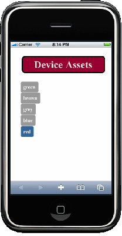

===========================================
Dynamically Adding CSS to Different Devices
===========================================

**Time Estimate:** 15 minutes

**Difficulty:** Intermediate

.. _code_exs_dynamic_css-summary:

Summary
=======

This example shows how to dynamically include assets (CSS) in the rendered template of a 
mojit. The assets in this example are included in the rendered default template and 
device-specific templates.

The following topics will be covered:

- configuring an application to dynamically include assets
- using the ``addAssets`` method in the controller to dynamically add assets to both the
  rendered default and device-specific templates

.. _code_exs_dynamic_css-notes:

Implementation Notes
====================

The screenshot below shows the rendered iPhone template with dynamically included CSS and 
JavaScript.

The ``application.json`` in this code example configures Mojito to deploy mojit code to 
the client and to use the ``HTMLFrameMojit``. To deploy mojit code to the client, you 
assign ``true`` to the ``deploy`` property as seen in the ``application.json`` below. The 
``frame`` instance of ``HTMLFrameMojit`` becomes the parent mojit of the ``child`` 
instance of type ``device``. The configurations for the context ``"device:iphone"`` 
define the identifier ``"iphone"`` for file resources with the ``selector`` property, 
so Mojito will know to use the template ``index.iphone.hb.html`` if the context is 
``"device:iphone"``.

.. code-block:: javascript

   [
     {
       "settings": [ "master" ],
       "specs": {
         "frame" : {
           "type" : "HTMLFrameMojit",
           "deploy": true,
           "config": {
             "child" : {
               "type" : "device"
             }
           }
         }
       }
     },
     { 
       "settings": [ "device:iphone" ], 
       "selector": "iphone" 
     }
   ]

In the controller for the ``device`` mojit, the ``index`` function has to determine what 
device is making the request and then attach the appropriate meta data and CSS. To 
determine the calling device, you use the ``ActionContext`` object to access the 
``device`` property of the ``context`` object. Below is a partial ``ActionContext`` 
object that contains the ``context`` object:

.. code-block:: javascript

   "ac"{
    ...
    context:
    {
       site: '',
       device: 'iphone',
       lang: 'en',
       region: '',
       jurisdiction: '',
       bucket: '',
       flavor: '',
       tz: ''
     },
     ...
   }

To dynamically add CSS and meta data from the controller, you use methods from the 
`Assets addon <../../api/classes/Assets.common.html>`_. In the ``controller.server.js`` 
below, the ``index`` function determines the calling device using the ``context`` object 
seen above. To add metadata for the iPhone, the ``addBlob`` method is called from the 
``Assets`` addon. The appropriate CSS file is dynamically attached to the template with 
``ac.assets.addCss``.

.. code-block:: javascript

   YUI.add('device', function(Y, NAME){
     Y.namespace('mojito.controllers')[NAME] = {   

       index: function(ac) {
         var device = ac.context.device, css = '/static/device/assets/simple';
         if (device === 'iphone') {
           // Attach viewport meta-data
           ac.assets.addBlob('<meta name = "viewport" content = "width = device-width">', 'top');
           ac.assets.addBlob('<meta name = "viewport" content = "initial-scale = 1.0">', 'top');
           // Modify the style sheet name.
           css += '.' + device;
         }
         // Attach the style sheet.
         css += '.css';
         ac.assets.addCss(css, 'top');
         // Push data to the template.
         ac.done({
           title: "Device Assets",
           colors: [
             {id: "green", rgb: "#616536"},
             {id: "brown", rgb: "#593E1A"},
             {id: "grey",  rgb: "#777B88"},
             {id: "blue",  rgb: "#3D72A4"},
             {id: "red",   rgb: "#990033"}
           ]
         });
       }
     };
   }, '0.0.1', {requires: ['mojito-assets-addon']});

The ``index.iphone`` template below contains CSS for controlling the orientation of the 
page, which is needed for displaying the page correctly on an iPhone. When the template is 
rendered, the CSS is dynamically added, and the Handlebars expressions are replaced with 
values. If the device making the call is an iPhone, the ``viewport`` meta data will also 
be added dynamically.

.. code-block:: html

   
   
   

     <h2 id="header">{{title}}</h2>
     <ul class="toolbar">
     {{#colors}}
       <li><a href="#" onClick="setColor('header','{{rgb}}');">{{id}}</a></li>
     {{/colors}}
     </ul>
   

.. _code_exs_dynamic_css-exs:

Setting Up this Example
=======================

To create and run ``device_assets``:

#. Create your application.

   ``$ mojito create app device_assets``
#. Change to the application directory.
#. Create your mojit.

   ``$ mojito create mojit device``
#. To configure your application to use ``HTMLFrameMojit`` and include JavaScript, 
   replace the code in ``application.json`` with the following:

   .. code-block:: javascript

      [
        {
          "settings": [ "master" ],
          "specs": {
            "frame" : {
              "type" : "HTMLFrameMojit",
              "deploy": true,
              "config": {
                "child" : {
                  "type" : "device"
                }
              }
            }
          }
        },
        { 
          "settings": [ "device:iphone" ], 
          "selector": "iphone" 
        }
      ]

#. Update your ``app.js`` with the following to use Mojito's middleware, configure routing and the port, and 
   have your application listen for requests:

   .. code-block:: javascript

      'use strict';

      var debug = require('debug')('app'),
          express = require('express'),
          libmojito = require('mojito'),
          app;

          app = express();
          app.set('port', process.env.PORT || 8666);
          libmojito.extend(app);

          app.use(libmojito.middleware());

          app.get('/status', function (req, res) {
              res.send('200 OK');
          });
          app.get('/', libmojito.dispatch('frame.index'));

          app.listen(app.get('port'), function () {
              debug('Server listening on port ' + app.get('port') + ' ' +
              'in ' + app.get('env') + ' mode');
          });
          module.exports = app;

#. Confirm that your ``package.json`` has the correct dependencies as show below. If not,
   update ``package.json``.

   .. code-block:: javascript

      "dependencies": {
          "debug": "*",
           "mojito": "~0.9.0"
      },
      "devDependencies": {
          "mojito-cli": ">= 0.2.0"
      },

#. From the application directory, install the application dependencies:

   ``$ npm install``
#. Change to ``mojits/device``.
#. Modify your controller to dynamically add assets to the rendered template by replacing 
   the code in ``controller.server.js`` with the following:

   .. code-block:: javascript

      YUI.add('device', function(Y, NAME){
        Y.namespace('mojito.controllers')[NAME] = {   

          index: function(ac) {
            var device = ac.context.device, css = '/static/device/assets/simple';
            if (device === 'iphone') {
              // Attach viewport meta-data
              ac.assets.addBlob('<meta name = "viewport" content = "width = device-width">', 'top');
              ac.assets.addBlob('<meta name = "viewport" content = "initial-scale = 1.0">', 'top');
              // Modify the style sheet name.
              css += '.' + device;
            }
            // Attach the style sheet.
            css += '.css';
            ac.assets.addCss(css, 'top');
            // Push data to the template.
            ac.done({
              title: "Device Assets",
              colors: [
                {id: "green", rgb: "#616536"},
                {id: "brown", rgb: "#593E1A"},
                {id: "grey",  rgb: "#777B88"},
                {id: "blue",  rgb: "#3D72A4"},
                {id: "red",   rgb: "#990033"}
              ]
            });
          }
        };
      }, '0.0.1', {requires: ['mojito-assets-addon']});

#. To create the default ``index`` template, replace the code in ``views/index.hb.html`` 
   with the following:

   .. code-block:: html

      <html>
        <head>
          
        </head>
        <body>
          

            <h2 id="header">{{title}}</h2>
            <ul class="toolbar">
            {{#colors}}
              <li><a href="#" onClick="setColor('header','{{rgb}}');">{{id}}</a></li>
            {{/colors}}
            </ul>
          

        </body>
      </html>

#. To create the default iPhone template, create the file ``views/index.iphone.hb.html`` 
   with the following:

   .. code-block:: html

      
      
      

        <h2 id="header">{{title}}</h2>
        <ul class="toolbar">
          {{#colors}}
          <li><a href="#" onClick="setColor('header','{{rgb}}');">{{id}}</a></li>
          {{/colors}}
        </ul>
      

#. Create the file ``assets/simple.css`` for the CSS that is included in ``index.hb.html`` 
   with the following:

   .. code-block:: css

      body {
        margin:auto;
        width: 40%;
      }
      h2 {
        text-align: center;
        padding: 10px 0px;
      }
      ul.toolbar {
        text-align: center;
        display: block;
      }
      .toolbar li { display:inline; }

#. Create the file ``assets/simple.iphone.css`` for the CSS that is included in 
   ``index.iphone.hb.html`` with the following:

   .. code-block:: css

      body {
        margin:auto;
        width: 40%;
      }
      h2 {
        text-align: center;
        padding: 5px 0px;
        width: 8.0em;
      }
      ul.toolbar {
        display: block;
        width: 17.0em;
      }
      .toolbar li {
        display:block;
        padding:.6em 0em .6em 0em;
      }
    

#. From the application directory, run the server.

   ``$ node app.js``
#. To view your application, go to the URL:

   http://localhost:8666
#. To see the page rendered for the iPhone, view the above URL from an iPhone or use the 
   URL below with the device parameter:

   http://localhost:8666?device=iphone

.. _code_exs_dynamic_css-src:

Source Code
===========

- `Assets <http://github.com/yahoo/mojito/tree/master/examples/developer-guide/device_assets/mojits/device/assets/>`_
- `Views <http://github.com/yahoo/mojito/tree/master/examples/developer-guide/device_assets/mojits/device/views/>`_
- `Mojit Controller <http://github.com/yahoo/mojito/tree/master/examples/developer-guide/device_assets/mojits/device/controller.server.js>`_
- `Device Assets Application <http://github.com/yahoo/mojito/tree/master/examples/developer-guide/device_assets/>`_

