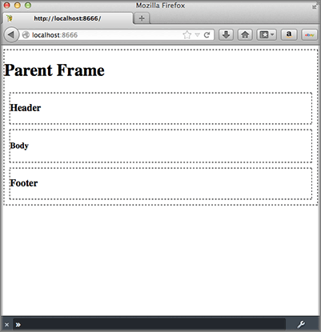

=====================
Using Multiple Mojits
=====================

**Time Estimate:** 15 minutes

**Difficulty Level:** Intermediate

.. _code_exs_multiple_mojits-summary:

Summary
=======

This example shows how to use a parent mojit with multiple child mojits to create an HTML 
page.

The following topics will be covered:

- configuring the application to use multiple mojits
- including the output from different mojits in one template
- embedding the rendered template into the HTML frame

.. tip:: 
         To learn how to use the Mojito built-in mojit ``HTMLFrameMojit`` to aggregate 
         and display the output from child mojits, see 
         `Using the HTML Frame Mojit <./htmlframe_view.html>`_.

.. _code_exs_multiple_mojits-notes:

Implementation Notes
====================

In the screenshot below, you see an HTML page divided into header, body, and footer 
sections that were created by individual mojits.

In the ``application.json`` below that is used for this code example, you see that this 
application is using the ``frame`` instance of type ``Frame``. The ``Frame`` 
forms a skeleton page of ``div`` tags that use content created by the child mojits 
``Header``, ``Body``, and ``Footer``.

.. code-block:: javascript

   [
     {
       "settings": [ "master" ],
       "specs": {
         "parent": {
           "type": "Frame",
           "config" : {
             "children": {
               "header": {
                 "type": "Header"
               },
               "body": {
                 "type": "Body"
               },
               "footer": {
                 "type": "Footer"
               }
             }
           }
         }
       }
     }
   ]

In ``controller.server.js`` of the ``Frame``, the ``Composite`` addon allows the 
parent mojit to execute the child mojits defined in ``application.json`` that we looked at 
earlier. After the children mojits are executed, the data that is passed to the ``done`` 
method in the children mojits becomes accessible in the ``index.hb.html`` template of 
``Frame``, which we will take a look at next.

.. code-block:: javascript

   YUI.add('frame', function(Y, NAME) {
     Y.namespace('mojito.controllers')[NAME] = {   

       index: function(actionContext) {
           actionContext.composite.done({title: "Parent Frame"});
         }
       };
     }
   }, '0.0.1', {requires: ['mojito-composite-addon']});

The ``index.hb.html`` template of ``Framed``, shown below, has variables from the 
children mojits in different ``div`` tags. The variables ``header``, ``body``, and 
``footer`` are in triple braces, which allows you to return unescaped HTML.

.. code-block:: html

   

     <h1>{{title}}</h1>
     

       {{{header}}}
     

     

       {{{body}}}
     

     

       {{{footer}}}
     

   

.. _code_exs_multiple_mojits-setup:

Setting Up this Example
=======================

To set up and run ``multiple_mojits``:

#. Create your application.

   ``$ mojito create app multiple_mojits``
#. Change to the application directory.
#. Create the mojits for the HTML frame, body, header, and footer.

   ``$ mojito create mojit Frame``

   ``$ mojito create mojit Body``

   ``$ mojito create mojit Header``

   ``$ mojito create mojit Footer``

#. To configure your application to use the mojits you created, replace the code in 
   ``application.json`` with the following:

   .. code-block:: javascript

      [
        {
          "settings": [ "master" ],
          "specs": {
            "frame": {
              "type": "Frame",
              "config": {
                "children": {
                  "header": {
                    "type": "Header"
                  },
                  "body": {
                    "type": "Body"
                  },
                  "footer": {
                    "type": "Footer"
                  }
                }
              }
            }
          }
        }
      ]

#. Update your ``app.js`` with the following to use Mojito's middleware, configure routing and the port, and 
   have your application listen for requests:

   .. code-block:: javascript

      'use strict';

      var debug = require('debug')('app'),
          express = require('express'),
          libmojito = require('mojito'),
          app;

          app = express();
          app.set('port', process.env.PORT || 8666);
          libmojito.extend(app);

          app.use(libmojito.middleware());

          app.get('/status', function (req, res) {
              res.send('200 OK');
          });
          app.get('/', libmojito.dispatch('parent.index'));

          app.listen(app.get('port'), function () {
              debug('Server listening on port ' + app.get('port') + ' ' +
              'in ' + app.get('env') + ' mode');
          });
          module.exports = app;

#. Confirm that your ``package.json`` has the correct dependencies as show below. If not,
   update ``package.json``.

   .. code-block:: javascript

      "dependencies": {
          "debug": "*",
           "mojito": "~0.9.0"
      },
      "devDependencies": {
          "mojito-cli": ">= 0.2.0"
      },

#. From the application directory, install the application dependencies:

   ``$ npm install``

#. Change to ``mojits/Frame``.
#. To allow the ``Frame`` to execute its child mojits, replace the code in 
   ``controller.server.js`` with the following:

   .. code-block:: javascript

      YUI.add('frame', function(Y, NAME) {
        Y.namespace('mojito.controllers')[NAME] = {   

          index: function(actionContext) {
              actionContext.composite.done({title: "Parent Frame"});
          }
        };
      }, '0.0.1', {requires: ['mojito-composite-addon']});

#. Modify the default template to use Handlebars expressions from the child mojits by 
   replacing the code in ``views/index.hb.html`` with the following:

   .. code-block:: javascript

      

        <h1>{{title}}</h1>
        

          {{{header}}}
        

        

          {{{body}}}
        

        

          {{{footer}}}
        

      

#. Change to ``Header`` directory.

   ``$ cd ../Header``

#. Replace the code in ``controller.server.js`` with the following:

   .. code-block:: javascript

      YUI.add('header', function(Y, NAME) {
        Y.namespace('mojito.controllers')[NAME] = {   

          index: function(actionContext) {
            actionContext.done({title: "Header"});
          }
        };
      }, '0.0.1', {requires: []});

   The ``done`` method will make its parameters available to the template.

#. Replace the code in ``views/index.hb.html`` with the following:

   .. code-block:: html

      

        <h3>{{title}}</h3>
      

   This HTML fragment will be included in the header section of the default template of 
   ``Frame``.

#. Change to ``Body`` directory.

   ``$ cd ../Body``

#. Replace the code in ``controller.server.js`` with the following:

   .. code-block:: javascript

      YUI.add('body', function(Y, NAME) {
        Y.namespace('mojito.controllers')[NAME] = {   

          index: function(actionContext) {
            actionContext.done({title: "Body"});
          }
        };
      }, '0.0.1', {requires: []});

#. Replace the code in ``views/index.hb.html`` with the following:

   .. code-block:: html

      

        <h4>{{title}}</h4>
      

   This HTML fragment will be included in the body section of the default template of 
   ``Frame``.

#. Change to the ``Footer`` directory.

   ``$ cd ../Footer``

#. Replace the code in ``controller.server.js`` with the following:

   .. code-block:: javascript

      YUI.add('footer', function(Y, NAME) {
        Y.namespace('mojito.controllers')[NAME] = {   

          index: function(actionContext) {
            actionContext.done({title: "Footer"});
          }
        };
      }, '0.0.1', {requires: ['mojito']});

#. Replace the code in ``views/index.hb.html`` with the following:

   .. code-block:: html

      

        <h3>{{title}}</h3>
      

   This HTML fragment will be included in the footer section of the default template of 
   ``Frame``.

#. From the application directory, run the server.

   ``$ node app.js``
#. To view your application, go to the URL:

   http://localhost:8666

.. _code_exs_multiple_mojits-src:

Source Code
===========

- `Application Configuration <http://github.com/yahoo/mojito/tree/master/examples/developer-guide/multiple_mojits/application.json>`_
- `Multiple Mojit Application <http://github.com/yahoo/mojito/tree/master/examples/developer-guide/multiple_mojits/>`_

