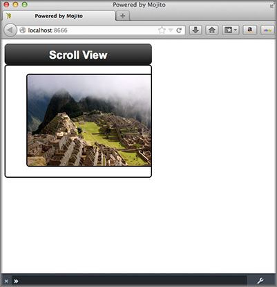

==============================
Including YUI Modules in Views
==============================

**Time Estimate:** 15 minutes

**Difficulty Level:** Intermediate

.. _code_exs_yui_views-summary:

Summary
=======

This example shows how to include the 
`YUI ScrollView Module <https://developer.yahoo.com/yui/3/scrollview/>`_ 
in your view.

The following topics will be covered:

- embedding the YUI ScrollView Module in the template
- implementing a scrolling content widget

.. _code_exs_yui_views-notes:

Implementation Notes
====================

The following screenshots show you how the application appears on different 
devices.

In the ``application.json`` file for this code example, the customized 
CSS is specified in the ``assets`` array as seen below.

.. code-block:: javascript

   [
     {
       "settings": [ "master" ],
       "specs": {
         "frame" : {
           "type" : "HTMLFrameMojit",
           "config": {
             "deploy": true,
             "child" : {
               "type" : "scroll"
             },
             "assets": {
               "top": {
                 "css":[
                   "/static/scroll/assets/index.css"
                 ]
               }
             }
           }
         }
       }
     },
     { 
       "settings": [ "device:iphone" ], 
       "selector": "iphone" 
     }
   ]

The mojit controller provides the photo URLs for the scrollable content widget. 
In the ``controller.server.js`` below, the ``photos`` array that contains the 
photo URLs and the text for the image ``alt`` attribute is passed to the 
``index`` template.

.. code-block:: javascript

   YUI.add('scroll', function (Y, NAME) {
     Y.namespace('mojito.controllers')[NAME] = {
       index: function (ac) {
         // Populate Template
         ac.done({
           title: 'Scroll View',
           photos: [
             {
               url: 'http://farm5.static.flickr.com/4136/4802088086_c621e0b501.jpg',
               alt: 'Above The City II'
             },
             { 
               url: 'http://farm5.static.flickr.com/4114/4801461321_1373a0ef89.jpg',
               alt: 'Walls and Canyon'
             },
             {
               url: 'http://farm5.static.flickr.com/4100/4801614015_4303e8eaea.jpg',
               alt: 'Stairs Using In Situ Stone'
             },
             {
               url: 'http://farm5.static.flickr.com/4076/4801368583_854e8c0ef3.jpg',
               alt: 'Tree Silhouette'
             }
           ]
         });
       }
     };
   }, '0.0.1', {requires: []});

In the binder ``index.js`` below, the YUI ScrollView module is required
by adding the string ``scrollview`` to the ``required`` array. To create the scrolling 
content widget, you need to instantiate a ScrollView object by passing an object 
containing parameters for the container (``srcNode``), an ID, dimensions, and 
scroll behavior (``flick``) and then use the method ``render`` to attach the scroll
view to the HTML DOM. 

.. code-block:: javascript

   YUI.add('scroll-binder-index', function (Y, NAME) {

     Y.namespace('mojito.binders')[NAME] = {
       init: function (mojitProxy) {
         this.mojitProxy = mojitProxy;
       },
       bind: function (node) {
         var scrollView = new Y.ScrollView({
             id: 'scrollview',
             srcNode: node.one('#scrollview-content'),
             width: 320,
             flick: {
               minDistance:10,
               minVelocity:0.3,
               axis: "x"
             }
           });
           scrollView.render();

           // Prevent default image drag behavior
           scrollView.get("contentBox").delegate("mousedown", function(e) {
             e.preventDefault();
           }, "img");
         }
       };
     }, '0.0.1', {requires: ['scrollview']});

The container (value for ``srcNode``) for the scroll view must be an existing HTML
node, so the template ``index.hb.html`` must have a ``div`` element with the
``id`` attribute of ``scrollview-content`` as shown below.

.. code-block:: html

   

     

       

         <h1>{{title}}</h1>
       

       

         <ul>
         {{#photos}}
           <li></li>
         {{/photos}}
         </ul>
       

     

   

For detailed instructions about YUI ScrollView, see 
`ScrollView: Getting Started <https://developer.yahoo.com/yui/3/scrollview/#start>`_.

.. _code_exs_yui_views-setup:

Setting Up this Example
=======================

To set up and run ``scroll_views``:

#. Create your application.

   ``$ mojito create app scroll_views``
#. Change to the application directory.
#. Create your mojit.

   ``$ mojito create mojit scroll``
#. To configure you application, replace the code in ``application.json`` with the 
   following:

   .. code-block:: javascript

      [
        {
          "settings": [ "master" ],
          "specs": {
            "frame" : {
              "type" : "HTMLFrameMojit",
              "config": {
                "deploy": true,
                "child" : {
                  "type" : "scroll"
                },
                "assets": {
                  "top": {
                    "css":[
                      "/static/scroll/assets/index.css"
                    ]
                  }
                }
              }
            }
          }
        },
        { 
          "settings": [ "device:iphone" ], 
          "selector": "iphone"
        }
      ]

#. Update your ``app.js`` with the following to use Mojito's middleware, configure routing and the port, and 
   have your application listen for requests:

   .. code-block:: javascript

      'use strict';

      var debug = require('debug')('app'),
          express = require('express'),
          libmojito = require('mojito'),
          app;

          app = express();
          app.set('port', process.env.PORT || 8666);
          libmojito.extend(app);

          app.use(libmojito.middleware());

          app.get('/status', function (req, res) {
              res.send('200 OK');
          });
          app.get('/', libmojito.dispatch('frame.index'));

          app.listen(app.get('port'), function () {
              debug('Server listening on port ' + app.get('port') + ' ' +
              'in ' + app.get('env') + ' mode');
          });
          module.exports = app;

#. Confirm that your ``package.json`` has the correct dependencies as show below. If not,
   update ``package.json``.

   .. code-block:: javascript

      "dependencies": {
          "debug": "*",
           "mojito": "~0.9.0"
      },
      "devDependencies": {
          "mojito-cli": ">= 0.2.0"
      },

#. From the application directory, install the application dependencies:

   ``$ npm install``

#. Change to ``mojits/scroll``.
#. To have the controller send image data to the template for the scrolling 
   widget, replace the code in ``controller.server.js`` with the following:

   .. code-block:: javascript

      YUI.add('scroll', function (Y, NAME) {

        Y.namespace('mojito.controllers')[NAME] = {
          index: function (ac) {
            // Populate Template
            ac.done({
              title: 'Scroll View',
              photos: [
                {
                  url: 'http://farm5.static.flickr.com/4136/4802088086_c621e0b501.jpg',
                  alt: 'Above The City II'
                },
                {
                  url: 'http://farm5.static.flickr.com/4114/4801461321_1373a0ef89.jpg',
                  alt: 'Walls and Canyon'
                },
                {
                  url: 'http://farm5.static.flickr.com/4100/4801614015_4303e8eaea.jpg',
                  alt: 'Stairs Using In Situ Stone'
                },
                {
                  url: 'http://farm5.static.flickr.com/4076/4801368583_854e8c0ef3.jpg',
                  alt: 'Tree Silhouette'
                }
              ]
            });
          }
        };
      }, '0.0.1', {requires: []});

#. To instantiate a ScrollView and have it rendered in the DOM, replace the
    code in ``binders/index.js`` with the following:

   .. code-block:: javascript

      YUI.add('scroll-binder-index', function (Y, NAME) {

        Y.namespace('mojito.binders')[NAME] = {
          init: function (mojitProxy) {
            this.mojitProxy = mojitProxy;
          },
          bind: function (node) {
            var scrollView = new Y.ScrollView({
                id: 'scrollview',
                srcNode: node.one('#scrollview-content'),
                width: 320,
                flick: {
                    minDistance:10,
                    minVelocity:0.3,
                    axis: "x"
                }
            });
            scrollView.render();

            // Prevent default image drag behavior
            scrollView.get("contentBox").delegate("mousedown", function(e) {
                e.preventDefault();
            }, "img");
          }
        };
      }, '0.0.1', {requires: ['scrollview']});

#. To modify the ``index`` template, replace the code in ``views/index.hb.html`` with the 
   following:

   .. code-block:: html

      
      

        

          

            <h1>{{title}}</h1>
          

          

            <ul>
            {{#photos}}
                <li></li>
            {{/photos}}
            </ul>
          

        

      

#. To add CSS for the ``index`` template, replace the contents of ``assets/index.css`` 
   with the following:

   .. code-block:: css

      html, body {
        margin:0;
        padding:0;
        font-family: arial,helvetica,clean,sans-serif;
      }
      #scrollview {
        border:2px solid #000;
        -webkit-border-radius:6px;
        -moz-border-radius:6px;
        border-radius:6px;
      }
      #scrollview-content img {
        border:2px solid;
        -webkit-border-radius:6px;
        -moz-border-radius:6px;
        border-radius:6px;
        width: 300px;
        margin: 2px -1px 2px 6px;
        -webkit-transform: translate3d(0, 0, 0);
      }
      /* To layout horizontal LIs */
      #scrollview-content {
        white-space:nowrap;
      }
      #scrollview-content li {
        display:inline-block;
        background-color:#fff;
      }
      /* For IE 6/7 - needs inline block hack */
      #scrollview-content li {
        *display:inline;
        *zoom:1;
      }
      /* === scrollview container and header styles === */
      #scrollview-container {
        float:left;
        margin:10px;
      }
      #scrollview-header {
        height:44px;
        *width:320px;
        border: 1px solid #9c9c9c;
        /* Fallback style */
        border: 1px solid rgba(0, 0, 0, 0.3);
        -webkit-border-radius: .5em;
        -webkit-border-top-left-radius: .5em;
        -webkit-border-top-right-radius: .5em;
        -webkit-border-bottom-left-radius: .5em;
        -webkit-border-bottom-right-radius: .5em;
        -moz-border-radius: .5em;
        border-radius: .5em;
        background: #141414;
        background: -webkit-gradient(linear, left top, left bottom, from(#656565), to(#141414) );
        background: -moz-linear-gradient(-90deg, #656565, #141414);
        filter: progid:DXImageTransform.Microsoft.Gradient(GradientType=0, StartColorStr='#656565', EndColorStr='#141414');
      }
      #scrollview-header h1 {
        color: #fff;
        margin:0;
        padding:10px 0;
        text-align:center;
        font-size:150%;
        font-weight:bold;
        text-shadow: 0 -1px 0 rgba(0,0,0,0.7);    }
      #scrollview-pager {
        padding:5px;
      }

#. From the application directory, run the server.

   ``$ node app.js``
#. To view your application, go to the URL:

   http://localhost:8666

.. _code_exs_yui_views-src:

Source Code
===========

- `Index Template <http://github.com/yahoo/mojito/tree/master/examples/developer-guide/scroll_views/mojits/scroll/views/index.hb.html>`_
- `Scroll Views Application <http://github.com/yahoo/mojito/tree/master/examples/developer-guide/scroll_views/>`_

