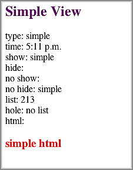

======================================
Creating a Simple View with Handlebars
======================================

**Time Estimate:** 10 minutes

**Difficulty Level:** Beginning

.. _code_exs_view-summary:

Summary
=======

This example shows how to create a simple view for Mojito applications with 
`Handlebars <http://handlebarsjs.com/>`_. Note that because Handlebars is a 
superset of `Mustache <http://mustache.github.com/>`_, there is an overlap 
of some syntax and nomenclature.

Mojito views are template files that are rendered into HTML and served to a 
device. These template files are simply called *templates* in this example 
and throughout the Mojito documentation.

The following topics will be covered:

- adding a simple template
- Handlebars template basics
- passing data to the template

.. _code_exs_view-notes:

Implementation Notes
====================

In the following screenshot, you see the HTML page that was rendered from 
the template.

In Mojito applications, the controller is responsible for passing data to 
the template. From the below code snippet taken from ``controller.server.js``, 
you see the ``index`` function creating a ``data`` object and passing it to the 
``done`` method. The ``done`` method called on ``ac``, the 
`ActionContext <../../api/classes/ActionContext.html>`_ object, sends the 
``data`` object to the template ``index.hb.html``.

.. code-block:: javascript

   ...
     index: function(ac) {
       var today = new Date(),
         data = {
           type : 'simple',
           time : { hours: today.getHours()%12, minutes: today.getMinutes()<10 ? "0" + today.getMinutes() : today.getMinutes(), period: today.getHours()>=12 ? "p.m." : "a.m."},
           show : true,
           hide : false,
           list : [{id: 2}, {id: 1}, {id: 3}],
           hole : null,
           html : "<h3 style='color:red;'>simple html</h3>"
         };
         ac.done(data);
       }
     };
   ...

In the ``index`` template of this code example, the properties of the ``data`` 
object are placed in Handlebars expressions that are evaluated by Mojito when 
the template is rendered. In Handlebars templates, the property names in double 
braces, such as ``{{type}}``, are expressions.

The double braces with a pound are used for lists or conditional 
expression, such as ``{{#show}...{{/show}``. Handlebars also has a built-in 
conditional structure that allow you to form the same conditional expression 
in the following way: ``{{#if show}}...{{/if}}``

You also use double braces with a pound to access properties within an object, 
which is how the ``hours`` property of the ``time`` object is accessed here.

.. code-block:: html

   

     <h2 style="color: #606; font-weight:bold;">Simple View</h2>
     
type: {{type}}

     
time: {{#time}}{{hours}}:{{minutes}} {{period}}{{/time}}

     
show: {{#show}}{{type}}{{/show}}

     
hide: {{#hide}}{{type}}{{/hide}}

     
no show: {{^show}}{{type}}{{/show}}

     
no hide: {{^hide}}{{type}}{{/hide}}

     
list: {{#list}}{{id}}{{/list}}

     
hole: {{^hole}}no list{{/hole}}

     
html: {{{html}}}

   

See the `Handlebars expressions <http://handlebarsjs.com/expressions.html>`_ 
in the Handlebars documentation for more information.

.. _code_exs_view-setup:

Setting Up This Example
=======================

To set up and run ``simple_view``:

#. Create your application.

   ``$ mojito create app simple_view``
#. Change to the application directory.
#. Create your mojit.

   ``$ mojito create mojit simple``
#. To specify that your application use the ``simple`` mojit, replace the 
   code in ``application.json`` with the following:

   .. code-block:: javascript

      [
        {
          "settings": [ "master" ],
          "specs": {
            "simple" : {
              "type": "simple"
            }
          }
        }
      ]

#. Update your ``app.js`` with the following to use Mojito's middleware, configure routing and the port, and 
   have your application listen for requests:

   .. code-block:: javascript

      'use strict';

      var debug = require('debug')('app'),
          express = require('express'),
          libmojito = require('mojito'),
          app;

          app = express();
          app.set('port', process.env.PORT || 8666);
          libmojito.extend(app);

          app.use(libmojito.middleware());

          app.get('/status', function (req, res) {
              res.send('200 OK');
          });
          app.get('/', libmojito.dispatch('simple.index'));

          app.listen(app.get('port'), function () {
              debug('Server listening on port ' + app.get('port') + ' ' +
              'in ' + app.get('env') + ' mode');
          });
          module.exports = app;

#. Confirm that your ``package.json`` has the correct dependencies as show below. If not,
   update ``package.json``.

   .. code-block:: javascript

      "dependencies": {
          "debug": "*",
           "mojito": "~0.9.0"
      },
      "devDependencies": {
          "mojito-cli": ">= 0.2.0"
      },

#. From the application directory, install the application dependencies:

   ``$ npm install``

#. Change to ``mojits/simple``.
#. Modify the mojit controller to pass data to the view by replacing the 
   code in ``controller.server.js`` with the following:

   .. code-block:: javascript

      YUI.add('simple', function(Y, NAME) {
        Y.namespace('mojito.controllers')[NAME] = {   

          index: function(ac) {
            var today = new Date(),
            data = {
              type : 'simple',
              time : { hours: today.getHours()%12, minutes: today.getMinutes()<10 ? "0" + today.getMinutes() : today.getMinutes(), period: today.getHours()>=12 ? "p.m." : "a.m."},
              show : true,
              hide : false,
              list : [{id: 2}, {id: 1}, {id: 3} ],
              hole : null,
              html : "<h3 style='color:red;'>simple html</h3>"
            };
            ac.done(data);
          }
        };
      }, '0.0.1', {requires: []});

#. Modify your ``index`` template by replacing the code in ``views/index.hb.html`` 
   with the following:

   .. code-block:: html

      

        <h2 style="color: #606; font-weight:bold;">Simple View</h2>
        
type: {{type}}

        
time: {{#time}}{{hours}}:{{minutes}} {{period}}{{/time}}

        
show: {{#show}}{{type}}{{/show}}

        
hide: {{#hide}}{{type}}{{/hide}}

        
no show: {{^show}}{{type}}{{/show}}

        
no hide: {{^hide}}{{type}}{{/hide}}

        
list: {{#list}}{{id}}{{/list}}

        
hole: {{^hole}}no list{{/hole}}

        
html: {{{html}}}

      

#. From the application directory, run the server.

   ``$ node app.js``
#. To view your application, go to the URL below:

   http://localhost:8666

.. _code_exs_view-src:

Source Code
===========

- `Mojit Controller <http://github.com/yahoo/mojito/tree/master/examples/developer-guide/simple_view/mojits/simple/controller.server.js>`_
- `Simple View Application <http://github.com/yahoo/mojito/tree/master/examples/developer-guide/simple_view/>`_
