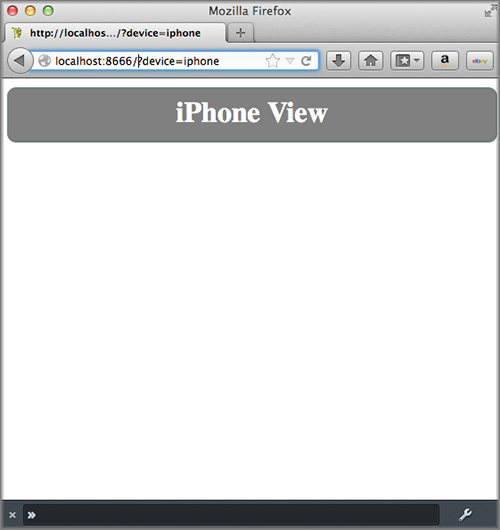
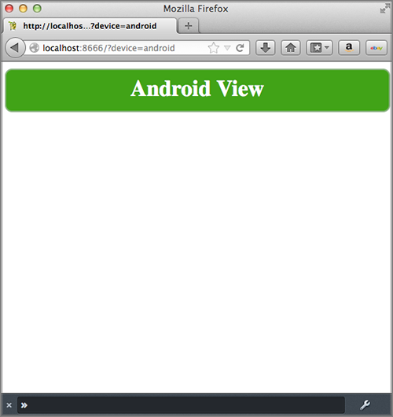
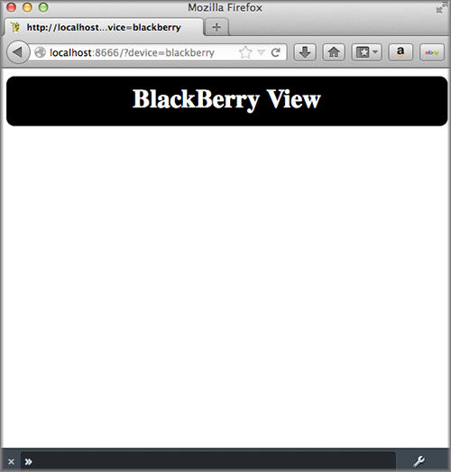

====================================
Creating Views for Different Devices
====================================

**Time Estimate:** 15 minutes

**Difficulty Level:** Intermediate

.. _code_exs_device_views-summary:

Summary
=======

This example shows how to create specialized views for different wireless
devices, such as iPhones, BlackBerries, and Android phones. Each device 
uses different templates but the same data from the controller.

The following topics will be covered:

- configuring application to recognize device-associated templates
- creating specialized views for wireless devices
- using query parameters to select the device view
- using the user agent to select the device view

.. _code_exs_device_views-notes:

Implementation Notes
====================

The following screenshots show you how the application appears on different 
devices.

.. _device_views_notes-config:

Configuring Application to Use Device-Specific Templates
--------------------------------------------------------

.. _device_views-device_contexts:

Context Configurations
######################

Mojito allows you to map contexts to a set of configurations based on runtime 
factors. The context is defined by the ``setting`` property in the JSON 
configuration files. The default value for ``setting`` is ``master``. 
Mojito will first look to see if a base context was set on the command line 
with the ``--context`` option, then at the HTTP headers and query string. 
In this example, we want contexts defined for different devices, so, in 
the ``application.json`` file, we'll define contexts for Android, Blackberry, 
and iPhone with the following:

.. code-block:: javascript

   [
     {
       "settings": [ "master" ],
       ...
     },
     { 
       "settings": [ "device:android" ],
       ...
     },
     { 
       "settings": [ "device:blackberry" ], 
       ...
     },
     { 
       "settings": [ "device:iphone" ],
       ...  
     }
   ]
   
You can also have contexts for environment, language, and region configurations, 
or create custom contexts. 
See `Using Context Configurations <../topics/mojito_using_contexts.html>`_.

.. _device_context-select:

selector Property
#################

How does Mojito know which template file to use for a device? Mojito identifies 
files resources using the ``selector`` property in configuration files. In the 
``application.json`` file, we can use the contexts for our devices with the 
``selector`` property so Mojito knows what file resources to use for contexts 
associated with devices.

.. code-block:: javascript

   { 
     "settings": [ "device:android" ], 
     "selector": "android" 
   },
   { 
     "settings": [ "device:blackberry" ], 
     "selector": "blackberry" 
   },
   { 
     "settings": [ "device:iphone" ], 
     "selector": "iphone" 
   }

For example, when given the context ``device:iphone``, Mojito will look for 
file resources that have the identifier ``iphone``. For more information about 
the ``selector`` property, 
see `Resource Store: selector Property <../topics/mojito_resource_store.html#selector-property>`_.

.. _device_context-determine:

Determining Context
###################

Mojito uses two ways to determine which device is making an HTTP request for a 
page. The first way is to use the value assigned to the query string parameter 
``device``. For example, if Mojito received an HTTP GET request on the URL 
below, it would render the iPhone view into HTML and serve the page to the 
device.

::

   http://localhost:8666?device=iphone

Mojito also uses the HTTP User-Agent header field to decide which view to 
render and serve. In this example HTTP header, the User-Agent field indicates 
that the HTTP request is coming from an Android device, so Mojito would use 
the Android template and serve the rendered HTML to the device.

::

   Host: learnto.mobi
   Accept-Encoding: gzip
   Referer: http://learnto.mobi/
   Accept-Language: en-US
   User-Agent: Mozilla/5.0 (Linux; U; Android 2.2; en-us; PC36100 Build/FRF91) AppleWebKit/533.1 (KHTML, like Gecko) Version/4.0 Mobile Safari/533.1
   Accept: application/xml,application/xhtml+xml,text/html;q=0.9,text/plain;q=0.8,image/png,*/*;q=0.5
   Accept-Charset: utf-8, iso-8859-1, utf-16, *;q=0.7

.. _device_views_notes-create_templates:

Creating Templates for Devices
------------------------------

For each device's customized view, you need to create a template. 
This code example uses the templates to create customized views for 
iPhones, Android phones, and BlackBerries. 

.. _device_views_templates-naming:

Naming Convention for Templates
###############################

The naming convention for template files has the following syntax, where 
``{selector}``is the string identifier (defined by the ``selector`` property) 
of a device, such as "iphone":

``{action}.{selector}.{rendering_engine}.html``

.. _device_views_templates-ex:

Templates for This Example
##########################

This code example uses the following template files, where ``hb`` 
represents the Handlebars rendering engine:

- ``index.iphone.hb.html``
- ``index.android.hb.html``
- ``index.blackberry.hb.html`` 

Thus, if an iPhone was making an HTTP GET request on the ``index`` (action) 
file and the template was being rendered by the Handlebars rendering engine, 
Mojito would use ``index.iphone.hb.html`` and serve the rendered view to the 
iPhone.

.. _code_exs_device_views-setup:

Setting Up this Example
=======================

To set up and run ``device_views``:

#. Create your application.

   ``$ mojito create app device_views``
#. Change to the application directory.
#. Create your mojit.

   ``$ mojito create mojit device``
#. To configure you application, replace the code in ``application.json`` 
   with the following:

   .. code-block:: javascript

      [
        {
          "settings": [ "master" ],
          "specs": {
            "device": {
              "type" : "device"
            }
          }
        },
        { 
          "settings": [ "device:android" ], 
          "selector": "android" 
        },
        { 
          "settings": [ "device:blackberry" ], 
          "selector": "blackberry" 
        },
        { 
          "settings": [ "device:iphone" ], 
          "selector": "iphone" 
        }
      ]

#. Update your ``app.js`` with the following to use Mojito's middleware, configure routing and the port, and 
   have your application listen for requests:

   .. code-block:: javascript

      'use strict';

      var debug = require('debug')('app'),
          express = require('express'),
          libmojito = require('mojito'),
          app;

          app = express();
          app.set('port', process.env.PORT || 8666);
          libmojito.extend(app);

          app.use(libmojito.middleware());

          app.get('/status', function (req, res) {
              res.send('200 OK');
          });
          app.get('/', libmojito.dispatch('device.index'));

          app.listen(app.get('port'), function () {
              debug('Server listening on port ' + app.get('port') + ' ' +
              'in ' + app.get('env') + ' mode');
          });
          module.exports = app;

#. Confirm that your ``package.json`` has the correct dependencies as show below. If not,
   update ``package.json``.

   .. code-block:: javascript

      "dependencies": {
          "debug": "*",
           "mojito": "~0.9.0"
      },
      "devDependencies": {
          "mojito-cli": ">= 0.2.0"
      },

#. From the application directory, install the application dependencies:

   ``$ npm install``

#. Change to ``mojits/device``.
#. Replace the code in ``controller.server.js`` with the following:

   .. code-block:: javascript

      YUI.add('device', function(Y, NAME) {
        Y.namespace('mojito.controllers')[NAME] = {   

          /* Method corresponding to the 'index' action.
          *
          * @param ac {Object} The action context that
          * provides access to the Mojito API.
          */
          index: function(ac) {
            ac.done({title: 'Device Views'});
          }
        };
      }, '0.0.1', {requires: []});

#. To modify the default template, replace the code in ``views/index.hb.html`` 
   with the following:

   .. code-block:: html

      <html>
        <head>
          
        </head>
        <body>
          

            <h2>Default View</h2>
          

        </body>
      </html>

#. For the iPhone view, create the ``views/index.iphone.hb.html`` file with the 
   following:
   
   .. code-block:: html
   
      <html>
        <head>
          
        </head>
        <body>
          

            <h2>iPhone View</h2>
          

        </body>
      </html>

#. For the Android view, create the ``views/index.android.hb.html`` file with
   the following:

   .. code-block:: html

      <html>
        <head>
          
        </head>
        <body>
          

            <h2>Android View</h2>
          

        </body>
      </html>

#. For the BlackBerry view, create the ``views/index.blackberry.hb.html`` file 
   with the following:

   .. code-block:: html

      <html>
        <head>
          
        </head>
        <body>
          

             <h2>BlackBerry View</h2>
          

        </body>
      </html>

#. From the application directory, run the server.

   ``$ node app.js``
#. To view your application, go to the URL:

   http://localhost:8666

#. Request the iPhone view by adding query string parameter ``?device=iphone``:

   http://localhost:8666?device=iphone

.. _code_exs_device_views-src:

Source Code
===========

- `Templates <http://github.com/yahoo/mojito/tree/master/examples/developer-guide/device_views/mojits/device/views/>`_
- `Device Views Application <http://github.com/yahoo/mojito/tree/master/examples/developer-guide/device_views/>`_

