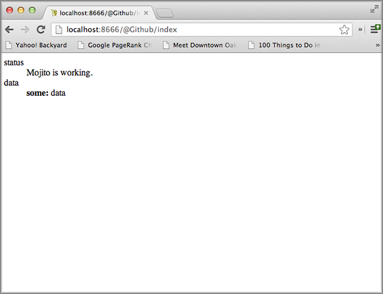

=====================
1. Mojito CLI Basics
=====================

.. _01_cli-intro:

Introduction
============

There is a Mojito command-line utility that provide you with some 
essential functionality such as creating applications, mojits, and 
starting application. The utility also has commands for helping 
you develop and generate documentation. 
 
In this module, we will be covering some of the more commonly 
used Mojito CLI commands to create an application, a mojit, 
and then run our application. In addition, we'll learn how to 
use the utility to sanitize code, and run tests. Our lesson 
will give an overview of the utility, covering some features 
that you won't use in this module, but will be using in future modules.

.. _01_intro-time_est:

Time Estimate
-------------

10 minutes

.. _01_intro-cover:

What We'll Cover
----------------

- creating applications and mojits
- testing applications and mojits
- code sanitization 
- running applications
- specifying a context (runtime environment) to run an application 

.. _01_intro-final:

Final Product
-------------

Our first application isn't very impressive as it just displays 
the default text, but the focus in this module is to learn how 
to use the Mojito CLI utility. In the process, we also create 
our first application and a mojit.

.. _01_intro-before_starting:

Before Starting
---------------

.. _01_before_starting-review:

Review of the Last Module
#########################

We discussed the topics that this tutorial will cover and 
that is organized in modules that help you create self-contained 
applications. These self-contained applications are a subset of 
the final application created in the last module. Each module 
will have a lesson that focuses on one topic.

.. _01_before_starting-prereqs:

Prequisites
###########

If you have not done so, please complete the `Mojito Quickstart <../getting_started/quickstart.html>`_, 
which will show you how to install Mojito and run basic commands.

.. _01_before_starting-setting_up:

Setting Up
##########

If you haven't installed the ``mojito-cli`` package, you should do so now:

``$ npm install -g mojito-cli``

.. _01_cli-lesson:

Lesson: Using the Mojito Command-Line Utility
=============================================

We described the lesson section in the introduction, but we'll
mention it again here as it's your first module. In the lesson of
each module, you will be learning about a specific topic and **not**
creating an application. Thus, the code snippets and explanations in the
lesson will cover the topic that the application is focused on, but will
not necessarily show application code. We just want to give you a heads up 
now so you're not wondering why you're not creating application code or 
why the code snippets are not the same as the code that you're 
using to create your application in the **Creating the Application** section
of each module.

.. _01_lesson-gen_code:

Generating Code
---------------

The primary use of the Mojito command-line utility is to generate 
directories and files needed for Mojito applications.This is 
because Mojito applications depends on a very specific directory 
structure containing configuration files, JavaScript files, and 
markup. The  configuration files consist of JSON or YAML, and the 
JavaScript files are YUI modules. Much of the configuration and 
the structure of the YUI module code is boilerplate, so manually 
setting up the file structure and creating configuration and 
JavaScript files would require a lot of time and possibly
result in errors. 

Having said that, let's start with the ``create`` command used to 
create applications. If you ever have questions about a 
command, you can also always ask Mojito by running the following: 
``mojito help <command>``

.. _01_lesson_gen_code-create:

create
######

The ``create`` command can be used to create applications and mojits. 
We'll be spending much of the next module discussing mojits, but 
for now, think of mojits as the self-contained MVC components of Mojito applications 
that is manifested in an application as a rectangular area of a page. 

The following is the basic syntax for using the ``create`` command to 
create applications:

``$ mojito create app [<archetype-name>] <app-name>``

By  running the command below, you will create the application ``my_first_mojito``.

``$ mojito create app my_first_mojito``

You'll see the that the directory ``my_first_mojito`` was created and 
inside that directory are several ``.json`` files, a ``server.js`` file, and 
the directories ``assets`` and ``mojits``. 

The syntax for creating a mojit is similar, and the command creates 
template code for the MVC components and configuration files for a 
mojit in the ``mojits`` directory.

``$ mojito create mojit [<archetype-name>] <mojit-name>``

Great, you know how to create application and mojit code, but 
you're probably still wondering what is an archetype, so let’s 
answer that question before moving on.

.. _01_lesson-archetypes:

What Are Archetypes?
--------------------

Archetypes are basically different types of artifacts in a Mojito 
application. In other words, Mojito offers several versions of template 
code for an artifact such as an application or a mojit. So, when you 
select the archetype ``simple`` for an application, you are asking Mojito 
to create an application using the boilerplate code from the *simple* 
version of an application. 

This is reflected in the source code of the ``mojito-cli-create`` package, where you’ll find an 
`archetypes <https://github.com/yahoo/mojito-cli-create/tree/develop/archetypes>`_
directory.  In this directory, you'll see the directories for the two 
artifacts ``app`` and ``mojit``. Within these directories that map to the artifacts, 
you will find the archetypes that you specify on the command line. When you 
run ``mojito create app simple myApp``, you are asking Mojito to copy the 
template code in ``archetype/app/simple`` to ``./myApp``.

If no archetype name is provided, the default archetype is used, 
which is the same as running ``mojito create app default``.

.. _01_lesson_archetypes-mojito:

Mojito Archetypes
#################

Mojito offers the following four archetypes for applications:

- ``simple`` - The minimal configuration and code needed to run an application.
- ``default`` - This archetype is run if no command-line archetype option is specified.  
  The template file for setting up routing, ``routing.json``, is created for you.
- ``full`` - The ``application.json`` has more boilerplate code for 
  you to use than the default application.
- ``yahoo`` - This archetype was created so that the ``dimensions.json`` file that defines
  contexts would conform more closely to `Yahoo Configuration Bundles (YCB) <https://github.com/yahoo/ycb>`_.
  This archetype is in the process of being removed.

Mojits have three archetypes:

- ``simple`` - The mojit only contains a controller.
- ``default`` - Again, this archetype is run if no command-line archetype 
  option is specified. Your MVC components are all created, binders (client-side code), 
  and the controller has example code for using models and Mojito addons, which are 
  built-in modules that offer features such as handling configuration, assets, 
  parameters, making REST calls, and more.
- ``full`` - Provides the configuration file ``defaults.json``, offers binders with 
  examples of handling client events, and more complex controller tests.

If you run ``mojito help create``, you will notice that there is a ``custom`` archetype. 
The ``custom`` archetype allows you to use Mojito to copy your own customized code. 
For example, you may have your own template application or mojit that you would 
like to use again. You can just run the following to reuse your template: 
``mojito create custom <path-to-your-template-code> name``

Mojito also has a ``demo`` archetype that allows you to easily create the ``quickstartguide`` that
serves documentation and serves as an example application. You can also add your own demo application
to the ``archetypes/demo`` directory of the ``mojito-cli-create`` package. To create the
demo application ``quickstartguide``, you run the following command ``mojito create demo quickstartguide qs``,
where ``qs`` is your local copy of the ``quickstartguide`` application.

.. _01_lesson-start:

Starting the Server
-------------------

You use ``node`` and the ``app.js`` file to start your application.

``$ node app.js``

The port number is specified in the ``app.js`` file. The default port number is 8666.
You can also write Express middleware and use ``app.js`` to define routing configuration.

.. _01_lesson-test:

Testing
-------

The Mojito CLI utility also lets you use YUI Test to run unit tests for mojit code. 
In this module, we're just going to look at how to use the CLI to run tests. We'll 
go into detail about how to write tests in the `6. Testing in Mojito <06_testing.html>`_ 
module. 

Because Mojito creates some boilerplate YUI Test code when you create a mojit, 
you can try using the ``test`` command without having to write tests. Of course, you'll want
to write your own tests as you develop your application.

For now, let's just look at how to invoke tests with the ``test`` command. To run 
unit tests for all of your mojits, use the following: 

``$ mojito test app``

To run the unit tests for a specific mojit or mojit module, use the 
following:

``$ mojito test mojit <mojit-path> [<mojit-module>]`` 

You'll see results similar to those below, and the results will 
also be written to the file ``${CWD}/artifacts/test/result.xml``.

.. code-block:: text

   info: (mojito-resource-store): Store initialized
   info: (mojito-resource-store): Store initial preloaded
   info: (mojito-resource-store): Store fully preloaded

   Test Results:
   artifacts/test/result.xml

   ✔  passed	github-model-tests :: github-model user tests :: test mojit model
   ✔  passed	github-tests :: Github user tests :: test mojit

   Total tests: 2	✔ Passed: 2	⚑ Deferred: 0	✖ Failed: 0	100% pass rate

.. _01_lesson-coverage:

Code Coverage
-------------

You can add code coverage to your tests with the option ``--coverage`` or ``-c``. To run 
code coverage tests, you need to have `Java <http://java.com/en/download/index.jsp>`_ 
installed. Coverage results are written to the console and also to file in the 
directory ``{CWD}/artifacts/coverage/``. 

.. _01_lesson-func_tests:

Functional Tests
----------------

To run functional and unit tests for the Mojito framework, you would use the test 
framework `Yahoo Arrow <https://github.com/yahoo/arrow>`_. Follow the instructions in 
`Mojito Framework's Unit and Functional Tests 
<https://github.com/yahoo/mojito/wiki/Mojito-Framework's-Unit-and-Functional-Tests>`_ the 
framework tests for Mojito. We're also going to cover functional tests in 
`6. Testing in Mojito <06_testing.html>`_.

.. _01_lesson-lint:

Sanitizing Code
---------------

Mojito applications consist of many structured files, so having a tool to find 
syntax errors is very important. The ``lint`` command uses JSLint to do a static 
code analysis and then writes output to text files as well as the HTML 
file ``jslint.html``.

You can use the ``lint`` command at the framework, application, and mojit levels. 
We'll focus on the application and mojit levels because you'll be using them 
as you work towards creating the dashboard application.

To run JSLint on an application, including all of its mojits:

``$ mojito jslint app <app-name>``

As with the test command, the output is written to a file: ``{app-dir}/artifacts/jslint/``

For linting mojits, use the following:

``$ mojito jslint mojit <mojit-path>``

Once again, the output is written to ``{app-dir}/artifacts/jslint/mojits/{mojit-name}/``.

.. _01_lesson-util:

Other Utilities
---------------

The Mojito CLI also has commands for creating documentation, building HTML5 applications, 
and creating a visual graph of dependencies. We're going to hold off on looking at 
these commands until we have an application. Check out the 
`Mojito CLI documentation <../reference/mojito_cmdline.html>`_ if you're itching to learn 
more.

.. _01_cli-create:

Creating the Application
========================

#. Let's first create our application with the ``create`` command. We're using the default 
   for the reason that the simple application gives us too little to work with, and the 
   full application includes a lot of features that we won't need and may just be confusing. 
   Once you've finished this tutorial, you very well may opt to start with the full application 
   to quicken development.

   ``$ mojito create app 01_mojito_cli_basics``

#. Change to your application directory, which you need to do to create mojits.
   Our ``dashboard`` application is going to get statistics from GitHub, so let's 
   create the mojit that will be doing a lot of work for us now.

   ``$ mojito create mojit Github``

#. Let's run some tests now. First, run the application unit tests, which, in reality, 
   just runs all the unit tests of your mojits. 

   ``$ mojito test app .``

   You'll see that a controller and a model test passed and that results were saved to 
   ``artifacts/test/result.xml``.

#. Since we only have one mojit, the application unit tests and the mojit unit tests 
   should be the same, but go ahead and run the following command to confirm:

   ``$ mojito test mojit mojits/Github``

#. You can also test a mojit module, which is basically the module
   name that you register with ``YUI.add``. Mojit controllers and models are YUI modules.

   ``$ mojito test mojit mojits/Github github``

   Notice that module names are lowercased (``github``).
#. Mojito's test command comes with a very useful option for getting coverage results. 
   Run the command for application unit tests, but add the option ``-c`` to get coverage 
   results as well.

   ``$ mojito test app -c .``

#. In a browser, open the file ``artifacts/test/coverage/lcov-report/index.html`` to see the 
   code coverage report. The report gives line and function coverage. 

#. Our application shouldn't have any syntax errors--if it does, we should file a `GitHub 
   issue with Mojito <, but let's run the ``jslint`` command for both the application 
   and our one mojit:

   :: 

     $  mojito jslint app .
     $  mojito jslint mojit mojits/Github

#. Alright, we've tested and linted our application. Go ahead and start the application
   by running the following from your application directory.
   
   ``$ node app.js``

   In future modules, we won't include steps for running tests and linting your code, but highly 
   recommend that you do this on your own to save yourself the headache of unraveling more
   complicated errors. 

#. To view your application, open the URL http://localhost:8666/@Github/index in a browser. This
   is the :ref:`page <01_intro-final>` created and served by your application.

   It's a strange URL, right? First, the port 8666 is the default port used by Mojito, 
   which we'll override in the next step. As for the path, well, we haven't set up any routes yet, 
   but the syntax for routes is as follows: ``/{mojit_instance}/{action}``.

   We haven't created a mojit instance, which is an in-memory instance created from the
   mojit code (mojit definition), but we'll do that in the next module.
   If you open ``app.js`` in an editor, you'll see we defined the following routing path:

       app.get('/:mojit/:action', libmojito.dispatch("{mojit}.{action}"));

   Mojito creates for us an anonymous instance of the mojit ``Github`` by 
   prepending ``@`` to the mojit name. As for ``'index'``, it's an action called from the mojit 
   instance. Thus, the defined path uses parameterized arguments that allow you to explicitly
   state the anonymous instance and the action, which Mojito will then get from the path and execute.

     
#. Stop the application with **Ctl-C**, and the restart it with a different port by 
   exporting ``PORT=8000``:

       $ export PORT=8000; 
       $ node app.js

   You can now view the application at http://localhost:8000/@Github/index.
#. As we discussed in our lesson, you can start an application in a given context, so that a 
   specific set of configurations are applied for a runtime environment. 

   To start the application in the development context, pass the ``context`` object 
   to ``libmojito.extend`` in ``app.js``. The ``context`` object in this case has
   the key-value pair ``environment:development`` as shown below:

   .. code-block:: javascript

      libmojito.extend(app, {
          context: {
              environment: "development"
          }
      }); 
#. Now when you restart your application, you'll be starting it with the ``development`` context. 
 
If you open the file ``application.json``, you will see the property ``"settings"`` twice.  
The string value given in the array assigned to ``"settings"`` is the context. 
Although neither configuration object in ``application.json`` has many configurations, 
you can have many configuration objects with different configuration values that are 
mapped to a context. 

.. _01_cli-review:

Module Review
=============

In this module, we covered the following features of the Mojito 
command-line utility:

- creating applications and mojits
- running application and mojit unit tests
- linting code
- starting applications
- specifying ports and contexts when starting applications.

.. _01_cli-ts:

Troubleshooting
===============

Mojito must be installed locally
--------------------------------

After you install the ``mojito-cli`` package, you can use the Mojito CLI utility
to create applications and mojits. When you create an application, the Mojito
framework will be installed in the ``node_modules`` directory under your application
directory. If you run commands from directories other than the application directory,
you will get the following error message::

   err!  Mojito must be installed locally. Please try `npm i mojito

Try changing to the application directory and running the command again.

Error: listen EADDRINUSE
------------------------

If you get the following error, it means that another Mojito application is currently
running and that the Mojito server is listening to the same port::

   Error: listen EADDRINUSE

Either stop the other application or start this application so that it listens
to a different port: ``$ export PORT=8001; node app.js``

.. _01_cli-qa:     

Q\&A
====

- Why is there a ``mojito-cli`` and a ``mojito`` package?

  The ``mojito-cli`` package is the CLI utility for Mojito. the ``mojito`` package contains
  the framework that your applications needs to run. Thus, you want the ``mojito-cli``
  package to be global and the ``mojito`` package to be local in your application. You
  don't want an application to depend on a global installation of the framework.

- Is there a way to configure your application to run on a different default port?

  Yes, in ``app.js``, you can define the port or use the value of the variable ``PORT``.

  ``app.set('port', process.env.PORT || 8666);``

  To set ``process.env.PORT``, you can do the following from shell CLI: ``$ export PORT=8000``

.. _01_cli-test:

Test Yourself
=============

.. _01_cli_test-questions:

Questions
---------

- What is the command for getting coverage results for the mojit ``myMojit``?
- Why would you start an application with a context?
- What is an archetype and what are the available archetypes for applications?
- Name two other Mojito CLI commands besides ``create`` and ``test``.

.. _01_cli_test-addition_exs:

Additional Exercises
--------------------

- Create an application with three mojits, test the app, test a module from 
  one of the mojits, and then run the application in the context ``"environment:development"``.
- Build documentation for the application you created and for the Mojito framework.
  See the chapter `Mojito Command Line <../reference/mojito_cmdline.html>`_ if you need
  help.

.. _01_cli-terms:

Terms
=====

**archetypes** 
   Different versions of template 
   code for an artifact such as an application or a mojit. So, when you 
   select the archetype ``simple`` for an application, you are asking Mojito 
   to create an application using the boilerplate code from the ``simple`` 
   version of an application. 

**mojits** 
   The basic unit of composition and reuse in a Mojito application that uses MVC.
   Visually, you can think of a mojit as the rectangular area of a page that was constructed 
   by a Mojito application.

`YAML <http://en.wikipedia.org/wiki/YAML>`_

**anonymous mojit instance** 
   A mojit instance auto-created by the Framework that you can
   reference in your application. The syntax is the mojit name prepended with ``@``. For
   example: ``@Github``

**context** 
   The runtime environment that your application runs in. For example, you can 
   run your application in a development environment with the context ``environment:development``.

.. _01_cli-src:

Source Code for Example
=======================

`01_mojito_cli_basics <https://github.com/yahoo/mojito/tree/develop/examples/developer-guide/dashboard/01_mojito_cli_basics>`_

.. _01_cli-reading:

Further Reading
===============

- `Mojito Introduction <../intro/>`_
- `Mojito Command Line <../reference/mojito_cmdline.html>`_

