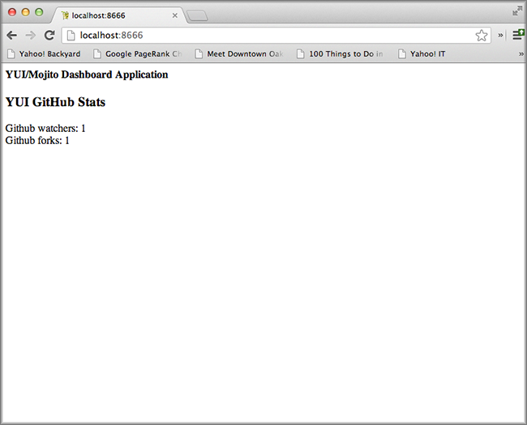
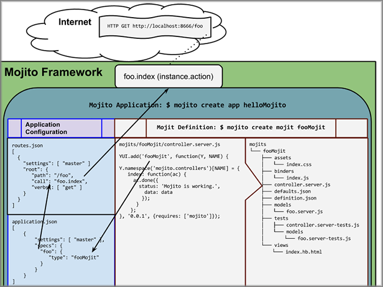

============================
2. Mojits: Powering Your App
============================

.. _02_mojits-intro:

Introduction
============

Mojits are the basic unit of composition and reuse in a Mojito application. 
Imagine that a rectangular square of a Web page being the visual 
representation of a mojit. The word *mojit* is a compound consisting of 
the stems module and widget, but a mojit is really neither. The mojit is built 
on YUI modules, but is not a module, and although it can be used independently 
of other mojits, is not a standalone application like a widget. Regardless 
of how you try to formally understand mojits, you must understand this: 
mojits power your applications.

In this module, we will be creating several mojits and then looking at the 
MVC structure underneath the hood. We’ll also discuss the difference 
between a mojit definition and a mojit instance and how those are 
manifested in configuration. 

.. _02_mojits-time_est:

Time Estimate
-------------

15 minutes

.. _02_mojits-cover:

What We’ll Cover
----------------

- mojit definitions and instances
- mojit MVC
- the ``ActionContext`` object and `the `ActionContext`` addons
- templates

.. _02_mojits-final:

Final Product
-------------

You’ll see that our application now shows something other than the 
default information. We’ve created new mojits and reworked the 
``Github`` mojit to show some information, which required changing the 
controller, model, and templates).

.. _02_mojits-before_starting:

Before Starting
---------------

.. _02_before_starting-review:

Review of the Last Module
#########################

In the last module, we discussed the uses of the Mojito 
command-line utility and then learned how to use the basic 
commands to do the following:

- create applications and mojits
- run applications and mojit unit tests
- lint and test code
- start applications
- specify ports and contexts when starting applications.

.. _02_before_starting-prereqs:

Setting Up
##########

We’ll be starting where you left off from the last module, 
so you’ll want to make a copy of the application that we made:

``$ cp -r 01_mojito_cli_basics 02_mojits``

.. _02-lesson:

Lesson: Mojits and More Mojits
==============================

.. _02_lesson-mojit:

What is a Mojit?
----------------

Mojits can be thought of as both physical entities represented physically 
by a directory structure and as executable code. The physical files of a 
mojit are what we call the mojit definition and where you most clearly see the
mojit’s MVC structure. The executable code, or the instantiation 
of the mojit definition, is called the mojit instance.

We’re going to take a closer look at both the mojit definition and instance, 
and how they are created and used.

.. _02_lesson-mojit_def:

Mojit Definitions
-----------------

To create the mojit definition, you use the command ``create`` that we looked 
at in the previous module. When you run ``mojito create mojit <mojit_name>``, 
Mojito creates a directory structure with boilerplate code for your controller, 
model, view (template) as well as tests and configuration. 

As you can see from the directory structure of the default mojit below, 
the mojits live under the mojits directory and have subdirectories for models, 
tests, and views:

:: 

   Github
   ├── assets
   │   └── index.css
   ├── binders
   │   └── index.js
   ├── controller.server.js
   ├── defaults.json
   ├── definition.json
   ├── models
   │   └── model.server.js
   ├── tests
   │   ├── controller.server-tests.js
   │   └── models
   │       └── model.server-tests.js
   └── views
       └── index.hb.html

.. _02_lesson-controllers:

Controllers, Models, and YUI
----------------------------

If you have worked with YUI before, you’ll notice pretty quickly that 
mojit controllers and models are simply custom YUI modules that are 
registered with ``YUI.add``. The skeleton of these custom modules include 
the controller namespace and the ``requires`` array for specifying dependencies:

``controller.server.js``

.. code-block:: javascript

   YUI.add('github', function (Y, NAME) {

     Y.namespace('mojito.controllers')[NAME] = {
      // Code here
     };
   }, '0.0.1', {requires: ['mojito', 'mojito-models-addon', 'github-model']});

``model.server.js``

.. code-block:: javascript

   YUI.add('github-model', function(Y, NAME) {
    
     Y.namespace('mojito.models')[NAME] = {
       init: function(config) {
         Y.log(config);
         this.config = config;
       }
     };
   }, '0.0.1', {requires: []});

.. _02_lesson-ac:

ActionContext Object
--------------------

In mojit controllers, functions in the ``mojito.controller`` namespace are 
passed a special object called the Action Context. We’ll be calling it 
the ``ActionContext`` object or ``ac`` for short.

The ``ActionContext`` object gives you access to important features of the Mojito 
framework. One critical feature is the ability to send data to templates and 
have those templates executed. Mojito also provides a library that can be 
accessed through the ``ac`` object through a mechanism called addons.  

For your mojits to render templates, controller functions need to call 
the method ``ac.done``. The ``done`` method also allows you to choose the view to 
render and pass meta data, which we will cover in later chapters. If a 
routing path is mapped to an action (controller function) that doesn’t 
call ``ac.done``, your application will hang until it times out.  

.. _02_lesson-addons:

ActionContext Addons
--------------------

The ``ActionContext`` addons provide functionality that lives both on the 
server and client. Each addon provides additional functions through a 
namespacing object that is appended to the ``ActionContext`` object. To use 
addons, the controller need to require the addons by listing the addons
in the ``requires`` array. The default Mojito application uses the ``Models`` and 
``Assets`` addon. As our application gets more complicated, we’ll be relying on addons 
to do more work. 

.. _02_lesson_addons-features:

Features
########

The ``ActionContext`` addons offer a lot of functionality. The list below
shows you some of the functionality: 

- access assets, such as CSS and JavaScript files
- get configuration information (``application.json``, ``defaults.json``, 
  ``definition.json``)
- get and set cookies
- localize content
- access query and response parameters
- get and set HTTP headers
- create URLs
- share data between mojits

.. _02_lesson_addons-syntax:

Syntax
######

Using the ActionContext object ``ac``, you would call a ``{method}`` from an ``{addon}`` 
with the following syntax: ``ac.{addon}.{method}``

For example, in the application that we will be building, we use the ``Config ``
addon to get the value for the key title: ``ac.config.get('title')``

.. _02_lesson-req_addons:

Requiring Addons
----------------

You require an addon by including an associated string in the ``requires`` 
array of your controller. For example, in the controller below, the ``Config`` addon 
is required by adding the string ``'mojito-config-addon'`` to the ``requires`` array.

.. code-block:: javascript

   YUI.add('github', function(Y, NAME) {
     Y.namespace('mojito.controllers')[NAME] = {
       index: function(ac) {
         var title = ac.config.get(‘title’);
       }
     };
     // Require the addon by adding the param name to the requires array
   }, '0.0.1', {requires: ['mojito', 'mojito-config-addon']});

.. _02_lesson-controller_methods:

Controller Methods
------------------

When we say controller methods or functions we are referring to those 
methods in the controller namespace as shown below. 

.. code-block:: javascript

   ...
     Y.namespace('mojito.controllers')[NAME] = {
       index: function(ac) {
         ac.done({ data: { status: "This is an example controller method." }});
     };
   ...

.. _02_lesson-templates:

Templates
---------

The templates for Mojito applications are HTML files that may contain semantic templates for
variable substitution. The default templating system used by Mojito is Handlebars. You can 
use other templating systems as well, but for the purposes of this tutorial, we’ll only 
be covering Handlebars.

If you know nothing about Handlebars, we suggest that you read the `Handlebars 
documentation <http://handlebarsjs.com/>`_. When a controller function calls ``ac.done`` with 
an object as a parameter, the object can be passed to the template file. The value of the 
property or key will replace the Handlebars expression.

For example, in the controller function ``index`` below, the object ``{ status: "It’s working" }`` 
is passed by default to the template ``index.hb.html``.

.. code-block:: javascript

   ...
     index: function(ac) {
       ac.done({ status: "This is an example controller method." });
   ...

In the ``index.hb.html`` file below, the Handlebars expression ``{{status}}`` is replaced 
by the string ``"This is an example controller method."`` when the template is rendered.

.. code-block:: html

   

     <b>{{status}}</b>
   

.. _02_lesson-mojit_configs:

Mojit Configuration Files
-------------------------

Mojits have two files for defining configurations. The file ``defaults.json`` 
allows the mojit to have defaults that can be overridden. The file 
``definition.json`` allows the mojit to define key-value pairs that can 
be accessed by the controller. You can also use the ``settings`` property 
to specify a context for a runtime environment.

In the ``defaults.json`` file, you list configurations in the ``config`` object as shown 
below. These configurations are defaults that will be used unless a mojit instance has 
configurations with the same keys. 

.. code-block:: javascript

   [
     {
       "settings": [ "master" ],
       "config": {
         "gh_mojito": "https://github.com/yahoo/mojito.git",
         "gh_yui3": "https://github.com/yui/yui3.git"
       }
      },
      {
        "settings": [ "environment:development" ],
        "config": {
          "gh_mojito": "https://github.com/yahoo/mojito.git",
          "gh_mojito_remote": "git@github.com:yahoo/mojito.git",
          "gh_yui3": "https://github.com/yui/yui3.git",
          "gh_yui3_remote": "git@github.com:yui/yui3.git"
        }
      }
    ]

The configurations in ``definition.json`` do not need to be in a ``config`` object. 
You just list key-value pairs:

.. code-block:: javascript

   [
     {
       "settings": [ "master" ],
       "gh_mojito": "https://github.com/yahoo/mojito.git",
       "gh_yui3": "https://github.com/yui/yui3.git"
     },
     {
       "settings": [ "environment:development" ],
       "gh_mojito": "https://github.com/yahoo/mojito.git",
       "gh_mojito_remote": "git@github.com:yahoo/mojito.git",
       "gh_yui3": "https://github.com/yui/yui3.git",
       "gh_yui3_remote": "git@github.com:yui/yui3.git"
     }
   ]

.. _02_lesson-mojit_instances:

Mojit Instances
---------------

We have already seen that Mojito creates anonymous instances of 
mojit definitions by prepending the symbol ``@`` the the mojit name, 
allowing you to execute a mojit action. Generally though, you define a 
mojit instances in configuration, so that the Mojito framework can create 
the instances. The configuration file that is used for defining mojit instances 
and many other application-level configurations is ``application.json``. When you 
run the ``start`` command, the Mojito framework parses and loads the application 
configuration, so mojit instances can be dispatched and their actions 
(controller functions) can be executed.

.. _02_lesson-instances-configuration:

Configuring a Mojit Instance
############################

Mojit instances are configured in the ``specs`` object in ``application.json``. 
You create a named object that has a ``type`` property that specifies an existing 
mojit definition. In the example below, the mojit instance ``github`` is defined as 
being of type ``Github``. 

.. code-block:: javascript

   [
     {
       "settings": [ "master" ],
       "specs": {
         "github": {
           "type": "Github"
         }
       }
     }
   ]

.. _02_lesson-map_routes:

Mapping Routing Paths to Actions
--------------------------------

Because of the anonymous mojit instances that Mojito creates with a 
mojit definition, your application also gets some default routing 
paths that let you execute mojit actions with a URL. We use the term 
action to differentiate the controller functions of the mojit definition 
from the same functions run by a mojit instance. When you create a mojit, 
as you might have already guessed, you can use the following URL
schema to execute mojit actions:  ``http://{domain}:{port}/@{mojit_name}/{action}/``

As with using anonymous instances, you obviously don’t want to use these 
default routes created by Mojito. You instead map routing paths to mojit 
actions in the configuration file ``app.js``.  The configuration object that 
defines routing information has properties for defining the routing path, HTTP 
methods that are accepted, parameters, and the mojit actions to execute. In the 
example ``app.js`` below, the application is configured to execute 
the action index of the mojit ``github`` when an HTTP GET call is made to the path ``"/"``:

.. code-block:: javascript

   var debug = require('debug')('app'),
       express = require('express'),
       libmojito = require('../../../../'),
       app;
   
   app = express();
   app.set('port', process.env.PORT || 8666);
   libmojito.extend(app);
   
   app.get('/', libmojito.dispatch('github.index'));

.. _02_lesson-http_req_mojit_action:

From HTTP Request to Mojit Action
---------------------------------

The diagram below shows the relationship of mojit definition, mojit instance, 
and routing paths. In addition, you can also see the relationship of the application 
within the framework. Notice also that the mojit controller has the function ``index`` 
that maps to the action ``index``specified in the routing configuration.

.. _02_lesson-naming_conventions:

Recommended Naming Conventions for Mojits
-----------------------------------------

When creating mojits (mojit definitions) with the command-line tool, we will be using upper 
camel case for the mojit name, such as ``Github``. For mojit instances, we will be using 
lower case, such as ``github``. This is the typical convention when defining a class and 
creating an object, so you can think of the mojit definition as the class definition and 
the mojit instance as an instance or object of that class.

.. _02_mojits-create:

Creating the Application
========================

We’re going to extend the application we created in the last module with several 
mojits and then configure mojit instances and routing paths. 

#. After you have copied the application that you made in the last module in 
   `Setting Up <#setting-up>`_, change into the application directory ``02_mojits``.
#. Let’s create mojits that will help generate output for the different parts of 
   the HTML page:

   ::

      $ mojito create mojit Body
      $ mojito create mojit Header
      $ mojito create mojit Footer

#. In the mojits directory, you should now see the four mojits we created: ``Github``, 
   ``Body``, ``Header``, and ``Footer``. We’re going to want to create mojit instances 
   that use the mojit definitions. Edit the ``application.json`` so that it is the same as 
   below (feel free to just replace the content of your ``application.json``):

   .. code-block:: javascript

      [
        {
          "settings": [ "master" ],
          "specs": {
            "github": {
              "type": "Github",
              "config": {
                "title": "Trib - YUI/Mojito Developer Dashboard"
              }
            },
            "header": {
              "type": "Header"
            },
            "body": {
              "type": "Body"
            },
            "footer": {
              "type": "Footer"
            }
          }
        },
        {
          "settings": [ "environment:development" ],
          "staticHandling": {
            "forceUpdate": true
          }
        }
      ]

#. Notice that the instance ``github`` has a ``config`` object. This allows your 
   instance to access the property ``title``, which we’ll look at soon.

   .. code-block:: javascript

      ...  
        "github": {
          "type": "Github",
          "config": {
            "title": "Trib - YUI/Mojito Developer Dashboard"
          }
        }
      ...

#. With those freshly created instances, we can now define routing paths 
   that execute mojit actions. Let’s create simple routing paths for 
   each of our instances for testing purposes by adding the following 
   defined paths to ``app.js`` beneath the ``/status`` path:

   .. code-block:: javascript

      app.get('/', libmojito.dispatch('github.index'));
      app.get('/header', libmojito.dispatch('header.index'));
      app.get('/body', libmojito.dispatch('body.index'));
      app.get('/footer', libmojito.dispatch('footer.index'));

#. We have our instances and our routing paths. Let’s start our 
   application and try hitting the routing paths below. You’ll see the 
   familiar default page for each path, but we’re going to change that next.

   - http://localhost:8666/
   - http://localhost:8666/header
   - http://localhost:8666/body
   - http://localhost:8666/footer

#. We’re going to work a little with the MVC of ``Github``. Let’s first 
   modify the model so that it passes different data to the controller. 
   We’ll get real data in the future, but for now update the method ``getData``
   in your model (``mojits/Github/models/model.server.js``) so that it’s the same 
   as the following:

   .. code-block:: javascript

      getData: function(callback, err) {
        callback(null, { watchers: 1, forks: 1 });
      }
   
   .. note:: If you are using a version of Mojito prior to v0.7.0, the default model
             name will be ``foo`` and not ``model``.

#. We’re also going to update the controller so that we’re passing pseudo 
   GitHub data to the template. Open the controller of ``Github``
   (``mojits/Github/controller.server.js``) in an editor and update the 
   object that is passed to ``ac.done`` and the addons required with the following:

   .. code-block:: javascript

      ...
        ac.done({
          title: ac.config.get('title'),
          github: data
        });
      ...
      {requires: ['mojito', 'mojito-assets-addon', 'mojito-models-addon', 'github-model', 'mojito-config-addon']});

#. Because we’ve modified the object that we are passing to the template, 
   we’ll need to modify the template as well. We’re also going to change 
   the HTML in the template, so you can simply replace the contents of the 
   template ``mojits/Github/views/index.hb.html`` with the following:

   .. code-block:: html

      

        <h4>{{title}}</h4>
        

          <h3>YUI GitHub Stats</h3>
          {{#github}}
            
Github watchers: {{watchers}}

            
Github forks: {{forks}}

          {{/github}}
        

      

#. Alright, we’re ready to try out our application. Let’s first test out the 
   routes ``header``, ``body``, and ``footer``. You should see the default Mojito application.

   - http://localhost:8666/body
   - http://localhost:8666/header
   - http://localhost:8666/footer
#. Now for the finale: let’s go to the route to execute our ``Github``, which 
   we modified the model, controller, and view: http://localhost:8666

   You’ll see that model data was passed to the controller and in turn passed to the 
   template, all according to our plan. 

.. _02_mojits-review:     

Module Review
=============

We covered a lot of content in his module and still missed a lot of points that 
we hope to capture in the upcoming modules. The main focus of this module was 
mojits, but that is a fairly meaty topic because the mojit is central to 
Mojito applications and one of the main things that sets it apart from 
other frameworks.

- mojit definitions and instances
- mojit MVC
- ``ActionContext`` and ``ActionContext`` addons
- mojit and application configuration
- templates with Handlebars expressions

.. _02_mojits-ts:       

Troubleshooting
===============

Route Not Being Found
---------------------

If you started the application, went to ``http://localhost:8666/body``, 
and got the following error ``Cannot GET /body``, It appears that you started 
Mojito from the wrong location. Try changing  to the application directory, which in this 
example is ``02_mojits``, and then run ``app.js``.

Error: listen EADDRINUSE
------------------------

If you start Mojit and get the following error, it means that Mojito is 
already running. You’ll need to kill that process before you can restart Mojito.

.. _02_mojits-qa:     

Q&A
===

- Can you extend Mojito to use other addons or libraries?

  Yes, this is a more advanced feature not included in this tutorial, but you 
  can add libraries, use Node.js modules, or even write your own addons.
  See the chapter `Extending Mojito <../topics/mojito_extensions.html>`_.

- Handlebars has features such as helpers and partials. Can you use them in Mojito 
  applications?

  Yes, Mojito has a ``Helpers`` addon for registering Handlebars helpers. You can also
  create partials for mojits or for your application. We show you how to do both
  in the module `9. Handlebars, Templates, and Custom Views <09_custom_views.html>`_.

.. _02_mojits-test:    

Test Yourself
=============

.. _02_mojits-questions:

Questions
---------

- What is a *mojit*?
- What is the difference between a mojit instance and a mojit definition?
- Name four configuraton files used in Mojito applications.

.. _02_mojits-addition_exs:

Additional Exercises
--------------------

- Create an additional mojit and a routing path that allows your application to execute
  an action for that mojit.
- Modify the mojit you created so that the model passes data to controller and that data
  is rendered in the template.

.. _02_mojits-terms:   

Terms
=====

**mojit definition** 
   A set of artifacts that collectively define a reusable unit of 
   functionality known as a mojit.

**mojit instance** 
   The specification of all the information required to create a 
   running instance of mojit functionality within an application or the
   in-memory runtime instance of a mojit—part of the running application.

**Action Context** 
   An essential element of the Mojito framework that gives you 
   access to the frameworks features from within a controller function. The Mojito API
   has an ``ActionContext`` class. The controller gets an instance of this class, often 
   referred to as ``ac``. The instance has methods and addons that give the controller
   access to the `Mojito API <../../api/>`_

.. _02_mojits-src:  

Source Code
===========

- `02_mojits <http://github.com/yahoo/mojito/examples/dashboard/02_mojits>`_

.. _02_mojits-reading:  

Further Reading
===============

- `Mojits <../intro/mojito_mojits.html>`_
- `Action Context <../api_overview/mojito_action_context.html>`_
