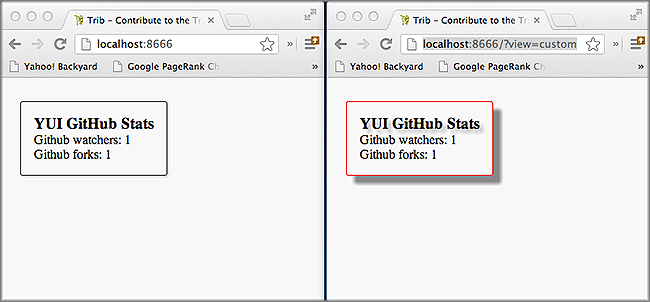

===============
3. Frame Mojits
===============

..  03_frame_mojits-intro:

Introduction
============

Mojito also has special mojits called frame mojits that are 
used the create the HTML frame of a page. Mojito comes with 
two built-in frame mojits that you can use by creating instances, 
just like you would do with your own mojits. Mojito also makes it 
easy to create your own frame mojits if you want to customize the 
behavior of the frame mojit. In this module, we’re going to use 
the built-in ``HTMLFrameMojit`` for our application. We’ll leave 
creating a custom frame mojit as an exercise at the end of the chapter.

.. _03_intro-time_est:

Time Estimate
-------------

15 minutes

..  03_intro-what:

What We’ll Cover
----------------

- configuring ``HTMLFrameMojit``
- deploying code to client
- parent and child mojits
- handling assets (CSS)
- get query string parameters with the ``Params`` addon

..  03_intro-final:

Final Product
-------------

In this module, you’ll be creating an application that displays similar output, 
but we’ll be relying on the frame mojit to create the page and 
insert assets (CSS). The application will create two pages, one 
based on a query parameter.

..  03_intro-before:

Before Starting
---------------

..  03_intro_before-review:

Review of the Last Module
#########################

In the last module, we discussed mojits. We covered the following
about mojits:

- differences between the mojit definition and mojit instance
- how to create mojit definitions and instances
- application and mojit configuration
- mojit MVC
- passing data from the controller to templates

..  03_intro_before-setup:

Setting Up
##########

Once again, we’ll be starting where you left off from the last module, 
so you’ll want to make a copy of the application that we made:

``$ cp -r 02_mojits 03_frame_mojit``

..  03_frame_mojits-lesson:

Lesson: Frame Mojits
====================

..  03_lesson-intro:

Introduction
------------

The concept behind the frame mojit is that it is a mojit that builds the 
HTML skeleton and attaches assets (CSS/JavaScript) as well as the the 
content of other mojits to the page. The frame mojit does this by having a 
controller that can execute other mojits and a template that has the full 
HTML skeleton with Handlebars expressions to attach the content rendered 
from other mojits. 

The frame mojit is able to execute other mojits because of a parent-child 
relationship that is configured between mojits. As the parent, the frame 
mojit can execute its children and then attach the content to its template. 
When we examine how to use the HTMLFrameMojit, you’ll learn how to configure 
this parent-child relationship, but we won’t learn about how frame mojits 
execute child mojits until the next module Composite Mojits.

..  03_lesson-htmlframemojit:

HTMLFrameMojit
--------------

The HTMLFrameMojit is a generic frame mojit that tries to meet the requirements 
of most use cases. For example,  the HTMLFrameMojit creates the elements ``<html>``, 
``<head>``, and ``<body>`` and then attaches assets such as CSS and JavaScript files 
into either the ``<head>`` or ``<body>`` elements and the content from its child mojits 
to the ``<body>``.

As a frame mojit, the ``HTMLFrameMojit`` is responsible for the creation of the HTML 
page, and thus, the instance of the ``HTMLFrameMojit`` must be the top-level mojit 
in the application. This will be clearer when we discuss configuring the 
``HTMLFrameMojit`` in the next section. 

..  03_lesson-configuration:

Configuration
-------------

As with defining instances of other mojit types, you define an instance of the 
``HTMLFrameMojit`` in ``application.json``. As we have said, because frame mojits have 
to be the top-level mojit of an application, the instance of ``HTMLFrameMojit`` has 
to be the parent of child mojits. To create the parent-child relationship, the 
child mojit instance is created within the config object of the parent mojit.  
In the example ``application.json`` below, the child instance is for the mojit 
definition ``Github``.

.. code-block:: javascript

   [
     {
       "settings": [ "master" ],
       "specs": {
         "frame" : {
           "type" : "HTMLFrameMojit",
           "config": {
             "title": "Trib - YUI/Mojito Developer Dashboard",
             "child" : {
               "type" : "Github"
             }
           }
         }
       }
     }
   ]

.. tip:: Your frame mojit can also have multiple child instances, 
         which we will discuss in Composite Mojits.

..  03_lesson-deploy:

Deploying to Client
-------------------

One of the most important reasons to use a frame mojit is to have 
your mojit code deployed to the client. The Mojito framework will 
deploy framework code as well as application code to the client. 

In the config object for the parent mojit (our frame mojit ``HTMLFrameMojit``), 
you set the deploy property to true. 

.. code-block:: javascript

   [
     {
       "settings": [ "master" ],
       "specs": {
         "frame" : {
           "type" : "HTMLFrameMojit",
           "config": {
             "deploy": true,
             "child" : {
               "type" : "Github"
             }
           }
         }
       }
     }
   ]

..  03_lesson-assets:

Using Assets 
------------

Assets are resources that are required on the clients, 
such as CSS or JavaScript. In general, you only want to 
use JavaScript assets that are not a core component of your 
application. Mojito offers several ways to add assets to your 
application. Our application uses two of the three ways, but 
we’ll go over all three for good measure, but you’ll first 
need to know where to place assets and how to let Mojito 
find them through configuration.

..  03_lesson_assets-location:

Location of Assets
##################

Assets can be used at the application level and the mojit level. 
By application level, we mean that all mojits have access to 
the mojits, whereas, mojit-level assets are only available to 
one mojit. 

For application-level assets, the convention is to use the 
``{application_name}/assets`` directory. Mojit-level assets 
are placed in the {application_name}/mojits/{mojit_name}/assets 
directory.

..  03_lesson_assets-configuring:

Configuring Assets
##################

When we say configuring assets, we are really just defining the 
location of our assets so that Mojito can find them. In the ``application.json`` 
file, we use the ``assets`` object, which contains the array ``css`` for the paths 
to CSS assets and the array ``js`` for paths to the JavaScript assets. 

The ``assets`` object has a ``top`` and ``bottom`` property so that you can attach 
assets to the ``<head>`` element or to the ``<body>`` element right before the 
closing ``</body>`` tag. Within the ``top`` or ``bottom`` objects, you can have 
either a ``css`` or ``js`` array for defining paths to CSS or JavaScript assets. 

.. code-block:: javascript

   ...
     "specs": {
       "tribframe": {
         "type": "HTMLFrameMojit",
         "config": {
           "deploy": true,
           "title": "Trib - YUI/Mojito Developer Dashboard",
             "child": {
               "type": "Github"
             },
             "assets": {
               "top": {
                 "css": ["/static/03_frame_mojits/assets/trib.css"]
               }
             }
           }
         }
       }
     }
   ...

..  03_lesson-static_assets:

Static Assets
-------------

Static assets are simply those assets that your application can 
refer to with a static URL. To do this, you add your CSS and JavaScript 
file to an ``assets`` directory and then refer to the static URL to the 
assets in your template.

For application-level assets, you place the assets in the ``assets`` directory 
directly beneath the application directory: ``{app_name}/assets/``

For mojit-level assets, you just use the assets directory under a mojit: ``mojits/{mojit_name}/assets``

So, for example, suppose we want the file index.css to be available to all of the 
mojits in our application ``03_frame_mojits``, we would place the file in the 
following location: ``03_frame_mojits/assets/index.css``

..  03_lesson_static_asset-url:

Static URL to Assets
####################

The static path to assets is important because your templates can include 
assets with this path. The static path has the following syntax: ``/{prefix}/{source_path}/{relative_path}``

The ``{prefix}`` is ``static`` by default, but you can configure the prefix with the 
``staticHandling`` object. The ``{source_path}`` can be ``mojito`` for framework assets, an 
application name, or the mojit name.  

For example, the static path for the application-level asset ``index.css`` in the our 
application ``03_frame_mojits`` would be ``/static/03_frame_mojits/assets/index.css``.

..  03_lesson_static_asset-using:

Using Static Assets in a Template
#################################

From your template, you can use a link tag pointing to the static URL for your assets.
So, for the application-level asset ``index.css`` that we have been discussing, you would 
simply use a link element and point to the static URL in your ``index.hb.html`` 
template as seen below:

.. code-block:: html

   <html>
     <head>
       <link rel="stylesheet" type="text/css" href="/static/03_frame_mojits/assets/index.css."/>
     </head>
     <body>
       

         <h2 id="header">{{title}}</h2>
         {{data}}
       

     </body>
   </html>

..  03_lesson_static_asset-adding:

Dynamically Adding Assets With the Controller
#############################################

We do not recommend that you hard-code the static URL to your assets. 
A better way would be to use your controller to add the assets to your page. 
You can probably guess that we’re going to rely on a ``ActionContext`` addons 
to help us to this, and you’re correct.

The ``Assets`` addon has methods for adding JavaScript, CSS, and meta data 
to your page. The ``Assets`` addon knows to look in the mojit’s assets directory 
to find files and creates the HTML frame to attach both CSS and JavaScript assets.

For example, in your mojit, if you have ``assets/index.css``, you can just pass the 
name of the file to the ``Assets`` addon method ``addCss``:

.. code-block:: javascript

   ...
     Y.namespace('mojito.controllers')[NAME] = {
       index: function(ac) {
         // The Assets addon is smart enough to find the 
         // the asset file ./assets/index.css
         // and then attach it to the rendered page.
         ac.assets.addCss('./index.css');
         ac.done({
           status: 'Mojito is working.',
         });
       }
     };
     // To use the Assets addon, you must require it: ‘mojito-assets-addon’
   }, '0.0.1', {requires: ['mojito', 'mojito-assets-addon']});

Okay, but what about attaching application-level assets with the 
``Assets`` addon? Well, you can’t, so you either need to hard-code a static 
URL in your template or use a frame mojit to do it for you, which is 
what we’re going to show you next.

..  03_lesson_static_assets-frame:

Frame Assets
############

The ``HTMLFrameMojit`` can attach both mojit-level and application-level assets 
to the page. You just need to add the asset files to the appropriate ``assets`` 
directory and then define the location of your assets in an ``assets`` object in 
``application.json``.

In the example ``application.json`` below, the ``HTMLFrameMojit`` instance frame 
has one child mojit with a CSS asset. Notice that the ``assets`` object is a 
property of the instance of type ``HTMLFrameMojit``. You use the top property 
to attach the asset files to the ``<head>`` element. If you were going to 
attach JavaScript assets, you could use the ``top`` or ``bottom`` property to 
specify JavaScript assets. When using the ``bottom`` property, the asset is 
inserted right before the closing ``<body>`` tag. You’ll also notice that the 
path to the assets uses the static URL syntax: ``/{prefix}/{source_path}/{relative_path}``

.. code-block:: javascript

   [
     {
       "settings": [ "master" ],
       "specs": {
         "frame" : {
           "type" : "HTMLFrameMojit",
           "config": {
             "title": "App Using HTMLFrameMojit",
             "child" : {
               "type" : "myMojit"
             },
             "assets": {
               "top": {
                 "css": [
                   "/static/myApp/assets/css/index.css"
                 ],
               },
               “bottom”: {
                 “js”: [
                   "/static/myMojit/assets/js/index.js"
                 ]
               }
             }
           }
         }
       }
     }
   ]

Based on the ``application.json`` above, the ``HTMLFrameMojit`` will create the HTML skeleton 
and attach the CSS and JavaScript assets in the ``<head>`` and ``<body>`` elements as shown below:

.. code-block:: html

   <!DOCTYPE HTML>
   <html>
     <head>
       <title>App Using HTMLFrameMojit</title>
       <link rel="stylesheet" type="text/css" href="/static/myApp/assets/css/index.css"/>
     </head>
     <body>
       <!-- Content from child mojit(s) attached here! →
          
     </body>
   </html>

.. tips:: Nulla mattis volutpat justo, et elementum quam condimentum vel. Cras dignissim hendrerit dui, at mollis nisi commodo in. 

..  03_frame_mojits-create:

Creating the Application
========================

#. Change to the ``03_frame_mojits`` application.
#. The first thing we need to do is create an instance of the ``HTMLFrameMojit`` and 
   have a child mojit that will create some content. We’ll use our ``Github``
   to create content and remove the instances that we defined for the other mojits 
   for now. Also, we’re going to add a CSS asset so that the ``HTMLFrameMojit`` can attach
   it to the page for us. For the sake of simplicity, you’re probably better off just 
   replacing the contents of ``application.json`` with the following: 

   .. code-block:: javascript

      [
        {
          "settings": [ "master" ],
          "specs": {
            "tribframe": {
              "type": "HTMLFrameMojit",
              "config": {
                "deploy": true,
                "title": "Trib - YUI/Mojito Developer Dashboard",
                "child": {
                  "type": "Github"
                },
                "assets": {
                  "top": {
                    "css": ["/static/03_frame_mojits/assets/trib.css"]
                  }
                }
              }
            }
          }
        },
        {
          "settings": [ "environment:development" ],
          "staticHandling": {
            "forceUpdate": true
          }
        }
      ]

   If you are looking at the path to the CSS file and wondering how it was created, 
   review the section :ref:`Static URL to Assets <03_lesson_static_asset-url>`.
   
  

#. The mojit instance based on the ``HTMLFrameMojit`` is what we’ll use for the root path. 
   Replace the content of ``app.js`` with the following. 

   .. code-block:: javascript

      'use strict';
      
      var debug = require('debug')('app'),
          express = require('express'),
          libmojito = require('../../../../'),
          app;
      
      app = express();
      app.set('port', process.env.PORT || 8666);
      libmojito.extend(app);
      
      app.use(libmojito.middleware());
      
      app.get('/', libmojito.dispatch('tribframe.index'));
      
      app.listen(app.get('port'), function () {
          debug('Server listening on port ' + app.get('port') + ' ' +
                     'in ' + app.get('env') + ' mode');
      });
      module.exports = app;

#. Our frame mojit is configured to attach a CSS file to our page, so we’re still 
   going to need to add the CSS file to our application. Based on the static URL 
   to the asset ``trib.css`` you can see that we’re using an application-level asset, 
   so let’s create the file ``assets/trib.css`` with the following:

   .. code-block:: css

      body {
        background-color: #F8F8F8;
        padding-left: 8px;
      }
      div {
        xborder: 1px solid red;
      } 
      .a {
        padding-top: 30px;
      }
      .mymodule {
        border: 1px solid #2d2d2d;
        margin: 8px;
        padding: 16px;
        border-radius: 3px;
        box-shadow: 2px 2px 2px #DDDDDD;
        float: left;
      }
      .mymodule h3 {
        margin: 0px;
        padding: 0px;
        font-weight: bold;
      }
      .myfooter {
        clear: left;
      }
      .bodytext {
        padding-left: 4px;
      }

#. If you remember the screenshot for the final application, you’ll recall that our 
   application displayed two different versions of the same page. The ``HTMLFrameMojit`` 
   is going to take care of the CSS file we added earlier, but we’re going to need 
   another CSS file for the second page. For that, we’re going to use the ``Assets`` 
   addon to dynamically add custom CSS based on a query parameter. To get the query 
   parameter, we’re going to use the ``Params`` addon. Once again, because of all the 
   changes, you might want to just replace the contents of the ``Github/controller.server.js`` 
   with the following:

   .. code-block:: javascript

      YUI.add('github', function(Y, NAME) {

        Y.namespace('mojito.controllers')[NAME] = {

          index: function(ac) {

            var model = ac.models.get('model');
            Y.log(model);
            model.getData(function(err, data){
                Y.log("Github -index - model.getData:");
                if (err) {
                    ac.error(err);
                    return;
                }
                Y.log(data);
                var view = ac.params.getFromUrl('view') || 'index';
                Y.log(view);
                if(view =='custom') {
                   ac.assets.addCss('/static/03_frame_mojit/assets/custom.css','top');
                } else if(view !='index') {
                  // In case a view that doesn't exist is chosen
                  view = 'index';
                }
                ac.done({
                    title: "",
                    github: data
                }, view);
            });
          }
        };
      }, '0.0.1', {requires: ['mojito', 'mojito-assets-addon', 'mojito-params-addon','mojito-models-addon']});

   We should call out the use of the addons that we mentioned. The ``Params`` addon 
   method ``getFromUrl`` is going to fetch the value for the query parameter ``view``. 
   So, if the HTTP GET request is made to ``http://localhost:8666?view=custom``, 
   we’re going to get the string ``"custom"``. As for the ``Assets`` addon, we’re 
   dynamically attaching the application-level CSS file ``trib.css`` to the ``<head>`` 
   element with the method ``addCss``.

#. When we called ``ac.done``, we passed the variable ``view`` as the second parameter. 
   If you recall from the last module about mojits, you can request Mojito to render a different 
   template other than the default, which is the template with the same name as the 
   action being executed. In this application, we’re telling Mojito to either use 
   the default or the ``custom`` view, which means we need the custom template 
   ``custom.hb.html`` for Mojito to execute. So, in the ``views`` directory, copy the 
   ``Github/views/index.hb.html`` to ``Github/views/custom.hb.html`` and just change 
   the class of the inner ``
`` tag from ``"mymodule"`` to ``"mycustom"``.
  
   
#. Our custom CSS doesn’t really do much, but the more important takeaway is how 
   to choose a template other than the default and use the ``Assets`` addon to dynamically 
   add CSS. From your application directory, create the file ``assets/custom.css`` with 
   the following:

   .. code-block:: css 

      .mycustom {
        border: 1px solid red;
        margin: 8px;
        padding: 16px;
        border-radius: 3px;
        box-shadow: 10px 10px 5px #888888;
        float: left;
      }
      .mycustom h3 {
        margin: 0px;
        padding: 0px;
        font-weight: bold;
        text-shadow: 5px 5px 5px #C0C0C0;
      }

#. Okay, we’re ready to view our application. Let’s take a look at the default 
   template that is rendered and attached to the page by ``HTMLFrameMojit`` by going 
   to http://localhost:8666. The page doesn’t look very different, but take a look 
   at the page source. You’ll see that the ``HTMLFrameMojit`` has created the HTML 
   skeleton, inserted the value for the ``<title>`` element and attached our CSS and 
   some JavaScript files.

#. To look at our custom template and CSS, append the query parameter ``/?view=custom``. 
   You’ll see basically the same page with some shadowing. If you look at the page 
   source again, you’ll see the custom CSS file now.

..  03_frame_mojits-summary:

Module Review
=============

In this module, we covered the following:

- frame mojits
- ``HTMLFrameMojit``, Mojito's built-in frame mojit
- configuring the ``HTMLFrameMojit`` 
- adding assets with the ``HTMLFrameMojit``
- deploying code to the client with the ``deploy`` property
- adding child mojits to the ``HTMLFrameMojit``

..  03_frame_mojits-ts:

Troubleshooting
===============

Failed to load resource: the server responded with a status of 404 (Not Found)
------------------------------------------------------------------------------

If you are getting an error on the client saying that the CSS file ``trib.css`` is not found,
it's likely that you have not updated the application name in the path to the CSS file or
have a typo.

In the ``application.json``, make sure that the path to the CSS file in the ``css``
array is correct:

.. code-block:: javascript

   ...
     "assets": {
       "top": {
         "css": ["/static/03_frame_mojits/assets/trib.css"]
       }
     }
   ...

OK Message and No Page
----------------------

If you only see the text **OK** in your page, but no errors, it could mean that your
``app.js`` has a syntax error. Unfortunately, running ``mojito jslint`` will only
find JSLint errors that are in JavaScript files, so you can either use another command-line
utility to check for syntax errors, use the website http://jslint.com/ to test the ``app.sj``,
or use Node.js to evaluate the JSON with the following command: ``node -e 'require("./app.js");'``

..  03_frame_mojits-qa:

Q&A
===

- **Is there a way to deploy code to the client without the "HTMLFrameMojit"?**

  Yes, but you need to create your own frame mojit. The frame mojit deploys the files to
  the client. 

- **Can child mojits of the "HTMLFrameMojit" also use the "HTMLFrameMojit"?**

  No, the mojit instance of type ``HTMLFrameMojit`` must be the top-level mojit in the 
  application, so there can only be one mojit using the ``HTMLFrameMojit``.

..  03_frame_mojits-test:

Test Yourself
=============

.. _03_frame_mojits-questions:

Questions
---------

- What does a frame mojit do?
- How do you configure frame mojits to deploy code to the client?
- How do you configure Mojito to find assets?

.. _03_frame_mojits-addition_exs:

Additional Exercises
--------------------

- Create another mojit, make it a child of the ``HTMLFrameMojit``, and add another asset, 
  which could either be a JavaScript or CSS file. 
- Read the section on `Creating Custom Frame Mojits <../topics/mojito_frame_mojits.html#creating-custom-frame-mojits>`_ 
  and replace the ``HTMLFrameMojit`` with your own frame mojit.

..  03_frame_mojits-terms:

Terms
=====

**frame mojits**
   Mojits that construct Web pages from the skeleton HTML to the styling and 
   content. The ``HTMLFrameMojit`` is Mojito's built-in frame mojit, but developers can 
   create their own custom frame mojits. 
**assets** 
   Resources that are required on the clients. These resources are 
   primarily CSS but can also be JavaScript that is ancillary to and not a core component of 
   the Mojito application. 

..  03_frame_mojits-src:

Source Code
===========

`03_frame_mojits <https://github.com/yahoo/mojito/tree/develop/examples/developer-guide/dashboard/03_frame_mojits>`_
- 
..  03_frame_mojits-reading:

Further Reading
===============

- `Frame Mojits <../topics/mojito_frame_mojits.html>`_
- `Attaching Assets with HTMLFrameMojit <../code_exs/framed_assets.html>`_
- `HTMLFrameMojit <../topics/mojito_frame_mojits.html#htmlframemojit>`_
- `Creating Custom Frame Mojits <../topics/mojito_frame_mojits.html#creating-custom-frame-mojits>`_
