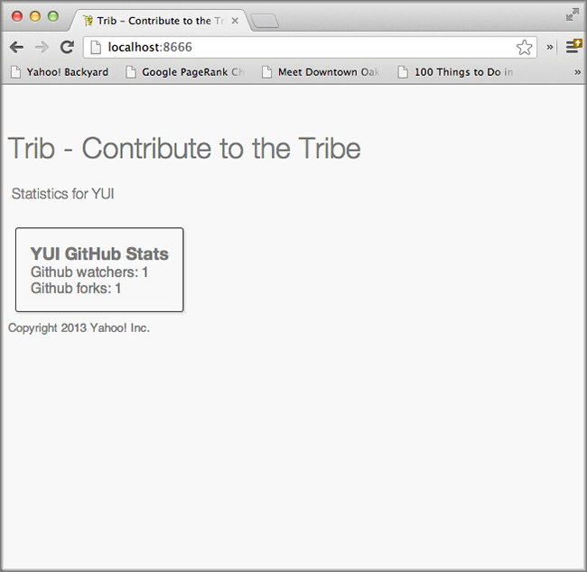

===================
4. Composite Mojits
===================

.. _04_composite_mojits-intro:

Introduction
============

Mojito allows you to establish parent-child relationships between your mojits, 
so parent mojits can execute child mojits and attach the content to the 
parent mojit’s template. The parent mojit in this relationship is called a 
*composite* mojit. The frame mojit ``HTMLFrameMojit`` that we looked in the last module is 
also a composite mojit. In fact, all frame mojits are composite mojits, but composite mojits 
do not have to be frame mojits. A frame mojit can also have a child mojit that is a 
composite mojit, extending the parent-child relationship. 

In this module, we’re going to keep using the ``HTMLFrameMojit`` and have a child 
that is a composite mojit with several children. To make it more 
interesting, one of its children is also a composite mojit with a child. 
The composite mojits will manage the child mojits that create our content, 
while the ``HTMLFrameMojit`` will continue to put together our HTML page. Do you 
remember all those mojits that we created earlier that have been just sitting 
there unused? Well, we’re finally going to use them for the application that 
we’ll create in this module.

.. _04_intro-time_est:

Time Estimate
-------------

15 minutes

.. _04_intro-cover:

What We’ll Cover
----------------

- configuring the composite mojit instance
- using the ``Composite`` addon
- passing data from parent to child mojits
- attaching child mojits to templates

.. _04_intro-final:

Final Product
-------------

As you can see from the screenshot, we haven't changed much aside from adding the header
and footer to the page, but beneath the surface, we have also changed the structure of the
application, which we'll talk about shortly.

.. _04_intro-before_starting:

Before Starting
---------------

.. _04_before_starting-review:

Review of the Last Module
#########################

In the last module, we discussed frame mojits, and in particular, the 
``HTMLFrameMojit`` that comes with Mojito. We also looked at adding CSS assets 
to our application using several different ways. More specifically, we 
covered the following:

- creating an instance of the HTMLFrameMojit
- configuring parent-child relationships between mojits
- adding assets with the Assets addon, with static URLs, and with the ``HTMLFrameMojit``

.. _04_before_starting-setting_up:

Setting Up
##########

``$ cp -r 03_frame_mojits 04_composite_mojits``

.. _04_composite_mojits-lesson:

Lesson: Composite Mojits
========================

.. _04_lesson-intro:

Introduction
------------

Composite mojits are simply parent mojits with child mojits that 
can be executed by the parent with the ``Composite`` addon. This allows you to have 
central control over several mojits that are responsible for generating content for 
parts of a page, and it also allows you to share data and configuration with 
child mojits.

.. _04_lesson_intro-config_composite_mojits:

Configuring Composite Mojits
############################

Configuring composite mojits is very similar to configuring frame mojits, 
except composite mojits use the ``children`` object instead of the ``child`` object 
to define parent-child relationships. The composite mojit can also have many 
child mojit instances defined in the ``children`` object. Moreover, your application
can have many composite mojits, but only one frame mojit. 

In the example ``application.json`` below, the layout instance in its configuration 
has defined three child mojit instances. This parent-child relationship lets the 
layout instance execute the actions of its child instances and then attach the 
content from those child instances to its template. 

.. code-block:: javascript

   [
     {
       "settings": [ "master" ],
       "specs": {
         "layout": {
           "type": "PageLayout",
           "config": {
             "children": {
                "header": {
                  "type": "Header"
                },
                "body": {
                  "type": "Body"
                },
                "footer": {
                  "type": "Footer"
                }
              }
            }
          }
        }
      }
    }
  ]

You can imagine how our layout instance would organize the parts of the page 
such as the body, header, and footer, but we’re still going to need our ``HTMLFrameMojit`` 
to create the HTML skeleton and attached our content. To do this, we simply make our 
``tribframe`` instance a child of the ``HTMLFrameMojit``. Notice though that our composite 
instance is now ``child``.

.. code-block:: javascript

   [
     {
       "settings": [ "master" ],
       "specs": {
         "tribframe": {
           "type": "HTMLFrameMojit",
           "config": {
             "deploy": true,
             "title": "Trib - YUI/Mojito Developer Dashboard",
             "child": {
               "type": "PageLayout",
               "config": {
                 "children": {
                   "header": {
                     "type": "Header"
                   },
                   "body": {
                     "type": "Body"
                   },
                   "footer": {
                     "type": "Footer"
                   }
                 }
               }
             }
           }
         }
       }
     }
   ]

As of now, the only mojit that we have that is creating content is ``Github``. 
As you would expect, we’d want that content to be in the body of our HTML document. 
The ``Body`` mojit seems like the right mojit to handle this content. We might want 
other mojits creating content for the body as well. It does sound as if our ``Body``
should be a composite mojit as well, and there are no limitations to using composite 
mojits (aside from possible performance problems), so let’s configure the ``body`` 
instance to be a composite mojit as well:

.. code-block:: javascript

   [
     {
       "settings": [ "master" ],
       "specs": {
         "tribframe": {
           "type": "HTMLFrameMojit",
           "config": {
             "deploy": true,
             "title": "Trib - YUI/Mojito Developer Dashboard",
             "child": {
               "type": "PageLayout",
               "config": {
                 "children": {
                   "header": {
                     "type": "Header"
                   },
                   "body": {
                     "type": "Body",
                     "config": {
                       "children": {
                         "github": {
                           "type":"Github"
                         }
                       }
                     }
                   },
                   "footer": {
                     "type": "Footer"
                   }
                 }
               }
             }
           }
         }
       }
     }
   ]

.. _04_lesson-composite_addon:

Executing Child Mojits With the Composite Addon
-----------------------------------------------

The controller of the parent mojit uses the ``Composite`` addon to execute 
its child mojits. Like other addons, you require the ``Composite`` addon and 
have access to it through the ``ActionContext`` object. The ``Composite`` addon 
provides the two methods ``done`` and ``execute`` for executing child mojit. The snippet 
from the parent controller below uses the method ``ac.composite.done``:

.. code-block:: javascript

   ...
     ...
       index: function(ac) {
         // You can pass data to the parent mojit’s template and
         // meta data, such as a template name.
         ac.composite.done({ parent_data: “I’m the parent mojit” }, ‘custom’);
       }
     };
     // Add the string ‘mojito-composite-addon’ to access 
     // the Composite addon.
   }, '0.0.1', {requires: ['mojito','mojito-composite-addon']});

The ``ac.composite.done`` method is used much like ``ac.done``. You can pass data to the 
parent template as well as meta data such as the template name.

.. code-block:: javascript

   ...
     ...
       index: function(ac) {
         ac.composite.done({ parent_data: “I’m the parent mojit” }, ‘custom’);
       }
     };
     // Add the string ‘mojito-composite-addon’ to access 
     // the Composite addon.
   }, '0.0.1', {requires: ['mojito','mojito-composite-addon']});

The method ``ac.composite.execute``, however, requires that you explicitly pass 
configuration defining child mojit instances, making it more complicated to use 
but allows for the dynamic creation of mojit instances. 

.. code-block:: javascript

   ...
     ...
       index: function(ac) {
         // To use execute, you need to create the configuration
         // that defines the child mojit instances, but this 
         // allows you to dynamically execute mojit instances.
         var cfg = {
           children: {
             body: {
               type: "Body",
               action: "index"
             },
             header: {
               type: "Header",
               action: "index",
               params: {
                 route: {},
                 url: {},
                 body: {},
                 file: {}
               }
             }
           },
           assets: {}
        };
        actionContext.composite.execute(cfg)
      }
    };
    // Add the string ‘mojito-composite-addon’ to access 
    // the Composite addon.
  }, '0.0.1', {requires: ['mojito','mojito-composite-addon']});

We’re not going to dynamically create mojit instances in our application, so it makes more 
sense to just use ``ac.composite.done`` to execute the child mojits. Based on 
what we’ve learned, the controller for the parent mojit ``Body`` shown 
below should make more sense. Based on our configuration, the ``body`` instance 
will execute the ``github`` instance. We’re also passing some data to the parent 
template, but how does the parent template attach the content created by our 
``github`` instance? Well, we’re going to look at that next. 
 
.. code-block:: javascript

   YUI.add('body', function(Y, NAME) {

     Y.namespace('mojito.controllers')[NAME] = {

       index: function(ac) {
         Y.log("body - controller.server.js index called");
         ac.composite.done({
           title: "Statistics for YUI"
         });
       }
     };
   }, '0.0.1', {requires: ['mojito','mojito-composite-addon']});

.. _04_lesson-parent_templates:

Parent Mojit Templates
----------------------

We’ve already seen how data from the controller is captured in templates 
by Handlebars expressions. Attaching the content from child mojits to 
parent templates is done in the same way. In the parent template, you 
use the Handlebars expressions and the mojit instance name to attach the 
content. In our configuration, the ``body`` instance has the one child ``github``, 
so in the template of the ``Body`` mojit, you use the Handlebars expression 
``{{github}}`` to get the content from the ``github`` instance:

.. code-block:: html

   

     <h4 class="bodytext">{{title}}</h4>
     

       {{{github}}}
     

   

.. _04_lesson-yui:

YUI CSS
-------

In this module, we use YUI CSS to style our application. We're not going
to cover the YUI CSS in this tutorial, but we encourage you to read the YUI
documentation to learn more about what the CSS does and how you can use it 
in your own projects.

- `Normalize CSS (normalize.css) <http://yuilibrary.com/yui/docs/cssnormalize/>`_
- `Response Grids <http://yuilibrary.com/yui/docs/cssgrids/#responsive>`_
  - ``forms-responsive.css``
  - ``list-responsive.css``
  - ``cssgrids-responsive-min.css``

The application also uses YUI CSS for common HTML elements such as lists and forms and
custom CSS (``trib.css``) for the containers and headings.

.. _04_composite_mojits-create:

Creating the Application
========================

#. Change to the ``04_composite_mojits`` application.
#. Although we’re still using the ``HTMLFrameMojit`` to create the Web page, we are also 
   going to create the mojit ``PageLayout`` to handle the layout of the Web page.
  
   ``$ mojito create mojit PageLayout``

#. For ``PageLayout`` to control the layout of the content of the other mojits, 
   it will have to be a composite mojit. As we’ve seen in our lesson, to create a 
   composite mojit instance, you give it a ``config.children`` object where its child 
   mojit instances are defined. The hierarchy should be frame mojit -> composite mojit -> child mojit. 
   This structure will be reflected in the configuration, so the ``HTMLFrameMojit`` 
   will be the top-level mojit (this is required for frame mojits), its child 
   will be the composite mojit, and the composite mojit will have children. Let’s 
   create this mojit structure by replacing the content of your ``application.json``
   with the following:

   .. code-block:: javascript

      [
        {
          "settings": [ "master" ],
          "specs": {
            "tribframe": {
              "type": "HTMLFrameMojit",
              "config": {
                "deploy": true,
                "title": "Trib - YUI/Mojito Developer Dashboard",
                "child": {
                  "type": "PageLayout",
                  "config": {
                    "children": {
                      "header": {
                        "type": "Header"
                      },
                      "body": {
                        "type": "Body",
                        "config": {
                          "children": {
                            "github": {
                              "type":"Github"
                            }
                          }
                        }
                      },
                      "footer": {
                        "type": "Footer"
                      }
                    }
                  }
                },
                "assets": {
                  "top": {
                    "css": [
                      "http://yui.yahooapis.com/3.9.0/build/cssnormalize/cssnormalize-min.css",
                      "http://yui.yahooapis.com/gallery-2013.03.13-20-05/build/gallerycss-cssform/gallerycss-cssform-min.css",
                      "http://yui.yahooapis.com/3.9.0/build/cssgrids-responsive/cssgrids-responsive-min.css",
                      "http://yui.yahooapis.com/3.9.0/build/cssbutton/cssbutton-min.css",
                      "http://yui.yahooapis.com/gallery-2013.03.13-20-05/build/gallerycss-csslist/gallerycss-csslist-min.css",
                      "https://rawgithub.com/tilomitra/yuicss-common/master/ui.css",
                      "/static/04_composite_mojits/assets/trib.css"
                    ]
                  }
                }
              }
            }
          }
        },
        {
          "settings": [ "environment:development" ],
          "staticHandling": {
            "forceUpdate": true
          }
        }
      ]

#. Try running the app, and you’ll see the familiar Mojito default application again. 
   Our application works, but the composite mojit isn’t really doing much with the 
   content of its children. That’s because it hasn’t used the ``Composite`` addon to 
   execute its children and attached the content from those children to the template.
   The first step is have the controller ``mojits/PageLayout/controller.server.js`` 
   use the ``Composite`` addon and call ``ac.composite.done``:
  

   .. code-block:: javascript

      YUI.add('pagelayout', function(Y, NAME) {

        /**
        * The pagelayout module.
        *
        * @module pagelayout
        */

        /**
        * Constructor for the Controller class.
        *
        * @class Controller
        * @constructor
        */
        Y.namespace('mojito.controllers')[NAME] = {

          /**
          * Method corresponding to the 'index' action.
          *
          * @param ac {Object} The ActionContext that provides access
          *        to the Mojito API.
          */
          index: function(ac) {
            ac.composite.done({
              title: "Trib - YUI/Mojito Developer Dashboard"
            });
          }
        };
      }, '0.0.1', {requires: ['mojito','mojito-composite-addon']});

#. In the template ``mojits/PageLayout/views/index.hb.html``, we can use the ``child`` 
   instance names in Handlebars expressions to attach the content of the rendered 
   children to the template:

   .. code-block:: html

      

        <h1>{{title}}</h1>
        

          {{{header}}}
        

        

          {{{body}}}
        

        

          {{{footer}}}
        

      

#. Try running app again. It isn’t much but you can at least see the same default 
   content being rendered three times and attached to the page. The next step is 
   to modify our children so that we have more interesting content.

#. Update ``mojits/Header/controller.server.js`` and ``mojits/Header/views/index.hb.html`` 
   with the content below. Note that our controller is not contributing much because 
   the content is mostly static.

   .. code-block:: javascript

      /*jslint anon:true, sloppy:true, nomen:true*/
      YUI.add('header', function(Y, NAME) {

        /**
        * The header module.
        *
        * @module header
        */

        /**
        * Constructor for the Controller class.
        *
        * @class Controller
        * @constructor
        */
        Y.namespace('mojito.controllers')[NAME] = {

          /**
          * Method corresponding to the 'index' action.
          *
          * @param ac {Object} The ActionContext that provides access
          *        to the Mojito API.
          */
          index: function(ac) {
            ac.done({
              title: ""
            });
          }
        };
      }, '0.0.1', {requires: ['mojito']});

   .. code-block:: html

      

        <h3>{{title}}</h3>
      

#. Do the same thing for the ``Footer`` mojit. Again, mostly static content, 
   which is what you would expect from the header and footer.

   .. code-block:: javascript

      YUI.add('footer', function(Y, NAME) {

        /**
        * The footer module.
        *
        * @module footer
        */
        /**
        * Constructor for the Controller class.
        *
        * @class Controller
        * @constructor
        */
        Y.namespace('mojito.controllers')[NAME] = {
          /**
          * Method corresponding to the 'index' action.
          *
          * @param ac {Object} The ActionContext that provides access
          * to the Mojito API.
          */
          index: function(ac) {
            ac.done({
              title: "Copyright 2013 Yahoo! Inc."
            });
          }
        };
      }, '0.0.1', {requires: ['mojito']});

   .. code-block:: html

      

        <small>{{title}}</small>
      

#. In our application, the ``Body`` mojit is responsible for the dynamic content of 
   our page. Let's update the controller and template with some 
   content.

   .. code-block:: javascript

      YUI.add('body', function(Y, NAME) {

        /**
        * The body module.
        *
        * @module body
        */

        /**
        * Constructor for the Controller class.
        *
        * @class Controller
        * @constructor
        */
        Y.namespace('mojito.controllers')[NAME] = {
          /**
          * Method corresponding to the 'index' action.
          *
          * @param ac {Object} The ActionContext that provides access
          * to the Mojito API.
          */
          index: function(ac) {
            Y.log("Body - controller.server.js index called");
            ac.composite.done({
              title: "Statistics for YUI"
            });
          }
        };
      }, '0.0.1', {requires: ['mojito', 'mojito-composite-addon']});

   .. code-block:: html

      

        <h4 class="bodytext">{{title}}</h4>
        

          {{{github}}}
        

      

#. Let's also simplify the ``Github`` mojit, removing the ``custom`` view by replacing
   the contents with the following:

   .. code-block:: javascript

      YUI.add('github', function(Y, NAME) {

        Y.namespace('mojito.controllers')[NAME] = {

          index: function(ac) {

            var model = ac.models.get('model');
            Y.log(model);
            model.getData(function(data){
              Y.log("Github -index - model.getData:");
              Y.log(data);
              ac.done({
                title: "",
                watchers: data.watchers,
                forks: data.forks
              });
            });
          }
        };
      }, '0.0.1', {requires: ['mojito', 'mojito-models-addon']});

#. The model for the ``Github`` mojit has a slight change as well. Replace the
   ``getData`` method with the following:

   .. code-block:: javascript

      getData: function(callback) {
            callback({ watchers: 1, forks: 1 });
      }
#. Also, update the ``index.hb.html`` for the ``Github`` mojit
   with the following markup:

   .. code-block:: html

      

        <h4>{{title}}</h4>
        

          <h3>YUI GitHub Stats</h3>
          
Github watchers: {{watchers}}

          
Github forks: {{forks}}

        

      

#. Before we run our application, let's do a little clean up by deleting our custom 
   template ``Github/views/custom.hb.html`` and the custom CSS (``04_composite_mojits/assets/custom.css``),
   which we will no longer be using.
#. Start your app again to see the mocked GitHub stats that is being attached to the
   template of the ``Body`` mojit. The page would be more useful with real data,
   so, that will be the topic of our next module.

.. _04_composite_mojits-summary:

Module Review
=============

In this module, we covered the following:

- creating an instance of the HTMLFrameMojit
- configuring parent-child relationships between mojits
- adding assets with the Assets addon, with static URLs, and with the HTMLFrameMojit

.. _04_composite_mojits-ts:

Troubleshooting
===============

Error Executing Child Mojit
---------------------------

If you got the following error, chances are that you forgot to include the 
``Composite`` addon to the ``requires`` array of your composite mojit::

   error: (mojito-composite-addon): Error executing child mojit at 'child':
   error: (mojito-composite-addon): Cannot call method 'done' of undefined

Just add ``mojito-composite-addon`` to the ``requires`` array of the controller of
your composite mojit as shown here:

.. code-block:: javascript

   }, '0.0.1', {requires: ['mojito','mojito-composite-addon']}); 

Child Mojits Not Being Rendered
-------------------------------

If you do not see your child mojits being rendered and there are no errors,
check to see that the mojit instance defined in ``application.json`` and the 
Handlebars expressions in the composite mojit's template is the same.

For example, if you have the mojit instance ``github`` defined as a child of the
``body`` instance, then the template of the ``body`` mojit should have the 
Handlebars expressions ``{{github}}``.

.. _04_composite_mojits-qa:

Q&A
===

- **Can you inherit the configuration of another instance that has children?**

  Yes, the ``base`` property allows you to inherit the mojit configuration, so instead
  of recreating the configuration, you only need to point ``base`` at an already defined  
  instance. See the ``base`` property in the `specs Object <../intro/mojito_configuring.html#specs-object>`_
  configuration.

  In the example below, you can see that the ``mojito_frame`` instance inherits the
  mojit configuration of the mojit instance ``_frame`` using the ``base`` property, but
  overrides the ``config`` property with its own configurations.

  .. code-block:: javascript

     "_frame": {
       "type": "HTMLFrameMojit"
       "config":
       "deploy": true
       "title": "Trib - YUI/Mojito Developer Dashboard"
       "assets": {
          "top": {
            "css": [ "static/04_composite_mojits/trib.css" ]
          }
       }
     },
     "mojito_frame": {
       "base": "_frame",
       "config": {
         "title": "Mojito Dashboard",
         "child": {
           "type": "Github",
           "assets": {
             "top": {
               "css": [ "static/Github/assets/github.css" ]
             }
           }
         }
       }
     } 

.. _04_composite_mojits-test:

Test Yourself
=============

.. _04_composite_mojits-questions:

Questions
---------

- What are the differences between configuring a frame mojit and a composite mojit?
- What Handlebars expression allows you to attach the content of a child mojit?
- What are the two ``Composite`` addon methods that allow parent mojits to execute child mojits?

.. _04_composite_mojits-addition_exs:

Additional Exercises
--------------------

- Create another mojit and configure it to be a composite mojit that is the parent
  of ``Github``, so that you have the following parent-child structure: 
  ``tribframe`` -> ``Body`` -> ``{new_mojit}`` -> ``github``
- Try replacing ``ac.composite.done`` in the controller of the ``Body`` mojit with 
  ``ac.composite.execute``. You'll need to create the configuration to pass to 
  ``execute``. Refer to `Running Dynamically Defined Mojit Instances <../topics/mojito_run_dyn_defined_mojits.html>`_
  for help.

.. _04_composite_mojits-terms:

Terms
=====

**composite mojit**
   A parent mojit that has child mojits and executes those child
   mojits with the ``Composite`` addon.

.. _04_composite_mojits-src:

Source Code
===========

- `04_composite_mojits <https://github.com/yahoo/mojito/tree/develop/examples/developer-guide/dashboard/04_composite_mojits>`_

.. _04_composite_mojits-reading:

Further Reading
===============

- `Composite Mojits <../topics/mojito_composite_mojits.html>`_
- `Running Dynamically Defined Mojit Instances <../topics/mojito_run_dyn_defined_mojits.html>`_

