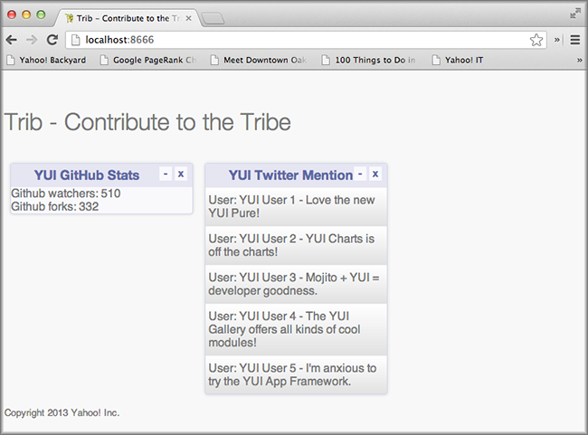

===============
5. Getting Data 
===============

.. 05_getting_data-intro:

Introduction
============

As with other MVC-based frameworks, you use models to get data although Mojito allows 
controllers to directly fetch content as well. Thus far, our applications have been 
just getting static data from the model, but in this module we’re going to learn how 
to get data in a couple of different ways. The recommended way in Mojito is to use YQL, an 
SQL-like language and Web Service that allows you to make queries on Web data. You can 
also use the REST module that comes with Mojito to make HTTP calls to Web services.

We’re going to use YQL to get GitHub data into our application, but we'll present an example
of how to use the `Y.mojito.lib.REST Class <../../api/classes/Y.mojito.lib.REST.html>`_ to 
make REST calls. We’re going to add another mojit to get Twitter data with the help of the 
Node.js module `simple-twitter <https://npmjs.org/package/simple-twitter>`_.

.. _05_intro-time_est:

Time Estimate
-------------

20 minutes

.. 05_intro-what:

What We’ll Cover
----------------

- mojit models 
- YQL and how to use it to get data
- accessing and calling model methods from the controller
- using the ``Y.mojito.lib.REST`` class to make REST calls
- using other forms of data such as query string parameters.

.. 05_intro-final:

Final Product
-------------

In the screenshot, you can see we’ve added a mojit for Twitter data 
and that we finally have live data for our GitHub statistics.

.. 05_intro-before:

Before Starting
---------------

.. 05_intro-review:

Review of the Last Module
#########################

In the last module, we discussed composite mojits, showing how to 
configure the parent-child relationship between mojits and then use 
the `Composite` addon to execute child mojits. Using composite mojits, 
we were able to create a page layout and add content to the body of 
the HTML page. We also kept our frame mojit to create the HTML page 
for use. In summary, we covered the following:

- configuring composite mojits
- using the `Composite` addon
- ``ac.composite.done`` versus ``ac.composite.execute``
- parent mojit templates

.. 05_intro-setup:

Setting Up
##########

- ``$ cp -r 04_composite_mojits 05_getting_data``

To get live Twitter data for your application:

#. `Create a Twitter application <https://dev.twitter.com/apps/new>`_ to get OAuth keys 
   from Twitter. You'll need a consumer key, consumer secret, access token key, and access 
   token secret.
#. Add the ``simple-twitter`` module as a dependency in ``package.json``. We'll be
   using the ``simple-twitter`` module to make OAuth-authorized REST calls to the Twitter
   Search API.

   .. code-block:: javascript

       ...
         "optionalDependencies": {
           "simple-twitter": "~1.0.0"
         },
       ...
#. From the application directory, install the dependencies: ``$ npm install``

.. 05_getting_started-lesson:

Lesson: Getting Data
====================

.. 05_lesson-intro:

Introduction
------------

Mojito separates the data layer with models that can use the Mojito REST library or YQL. 
In most cases, we recommend YQL because you can have a consistent API to get data from 
different sources and can filter results with YQL statements. The response that is 
returned from YQL is also more consistent regardless of the data sources, making it 
easier to parse. The YQL Web Service is also optimized to get data to you faster, and 
YUI has a handy YQL module that makes using YQL even easier. We’re going to provide an 
overview of YQL, show you how to form YQL statements, and finally how to use YUI’s 
`YQL Query module <http://yuilibrary.com/yui/docs/yql/>`_.

.. 05_lesson-models:

Models
------

We briefly went over the structure of models in the Mojits module when we discussed mojit 
MVC. Mojito models, like controllers, are just YUI modules, but use a different namespace 
than controllers. With that in mind, let’s just summarize some of the important points 
about mojit models.

.. 05_lesson-location:

Location
--------

The location of models are in the ``models`` directory under the mojit directory. So, if 
your mojit is ``myMojit``, the models would be found in ``myMojit/models``. 

.. 05_lesson-naming_convention:

File Naming Convention
----------------------

The file name of a model has two parts. The model name and the affinity. The model name 
is an arbitrary string, and the affinity, as we have said before, indicates where the code 
is running. The affinity may be ``server``, ``client``, or ``common``, where ``common``
indicates the code can run on either the server or client. Thus, the syntax of the model 
file name is the following: ``{model_name}.{affinity}.js``

.. 05_lesson-yui_modules:

Models as YUI Modules
---------------------

Models like controllers are registered with YUI as modules with ``YUI.add``, have their own 
namespace, and list dependencies in the ``requires`` array.  

Below is the skeleton of the model. Notice that we have required the ``yql`` module. 
This is the main way for getting data. If you haven’t heard of or used YQL before, 
don’t worry, we’ll give you a little primer before writing code to get data with 
YQL in the next section.

.. code-block:: javascript

   YUI.add('yql', function(Y, NAME) {

     // The namespace for the model that passes the
     // name 
     Y.mojito.models[NAME] = {
       init: function(config) {
         this.config = config;
       },
       getData: function(params, callback) {
         // Model function to get data...
       },
       ...
     };
   }, '0.0.1', {requires: ['yql']});

.. 05_lesson-yql_primer:

YQL Primer
----------

.. 05_lesson_yql-what:

What is YQL?
############

If you know SQL, then think of YQL as SQL for the Internet, with the Internet 
representing a MySQL database. In reality, Internet data can only be fetched 
by the YQL Web Service if there is a table that defines how data is accessed. 
YQL comes with a wide range of built-in tables, and the developer community has 
contributed YQL Open Data Tables (ODT) as well. The table tells YQL how to 
get the Web data, and the YQL statement (like an SQL query) tells YQL what 
data to get from that table and how to filter that data. If you have questions,
take a look at the `YQL Guide <https://developer.yahoo.com/yql/guide>`_. 

.. 05_lesson_yql-statements:

YQL Statements
##############

The YQL language, like SQL, has many verbs for reading and writing data. For 
our application, we’ll be just reading data with the ``SELECT`` verb. To filter data, 
like SQL, you use the key word ``WHERE``. YQL also includes operators such as ``LIKE`` 
for filtering, the key word ``LIMIT`` to limit the number of results, and the 
pipe (``|``) to filter results through a function such as ``SORT``. We can’t possibly 
cover all of the features of YQL here, but an example YQL statement can 
certainly show you many of the features that we’ve just discussed: 

``select Title, Rating.AverageRating from local.search(20) where query="pizza" and city="New York" and state="NY" | sort(field="Rating.AverageRating") | reverse()``

Try running the `local search query <http://y.ahoo.it/grM5T>`_ above in the 
`YQL Console <https://developer.yahoo.com/yql/console>`_ to see the results returned
by YQL.

.. 05_lesson_yql-web_service:

YQL Web Service
###############

To use YQL, you make an HTTP request to the YQL Web Service. You use one of 
the YQL Web Service URLs and append the YQL statement to the query parameter ``q``. 
The YQL Web Service has a couple URLs for getting public and authorized data:

- Public Data: http://query.yahooapis.com/v1/public/yql
- Public/Private (OAuth authorized): http://query.yahooapis.com/v1/yql

So, if you wanted to make the query ``select * from local.search where query=”pizza”``, 
you would make an HTTP GET call to the following URL: 
``http://query.yahooapis.com/v1/public/yql?q=select * from local.search where query=”pizza”``

Fortunately, YUI’s YQL module forms the URL and makes the call for you, so you 
just need to form the YQL statement. With that being said, let’s look at the YQL module.

.. 05_lesson_yql-module:

YQL Query Module
################

To use the YQL Query module in a mojit model, you simply add the string ``"yql"`` 
to the ``requires`` array as shown below:

.. code-block:: javascript

   }, '0.0.1', {requires: ['yql']});

To use the module, you form the YQL statement using an existing table or a table that you
have created and are hosting and then pass that statement and a callback function
to ``Y.YQL``. The ``yql`` module will make the REST call to the YQL Web service using
the passed statement and your results will be returned to the callback.

In our application, we'll be using YQL to get GitHub statistics. In the ``getData`` method
of our model shown below, we're using a custom table (thus, the ``use`` statement) that is 
appropos hosted on GitHub. The results are handled by the method ``onDataReturn``.

.. code-block:: javascript

   getData: function(params, callback) {
       
      var yqlTable = 'https://raw.github.com/triptych/trib/master/src/yql/github.xml',
          query = "use '{table}' as yahoo.awooldri.github.repo; select watchers,forks from yahoo.awooldri.github.repo where id='yql' and repo='yql-tables'",
          queryParams = {
            table: yqlTable
          },
      cookedQuery = Y.substitute(query, queryParams);
      Y.YQL(cookedQuery, Y.bind(this.onDataReturn, this, callback));
   },
   onDataReturn: function (cb, result) {
       Y.log("onDataReturn called");
       if (typeof result.error === 'undefined') {
           var results = result.query.results.json;
           cb(results);
       } else {
          cb(result.error);
       }
   }

.. 05_lesson-rest_module:
 
Using the Mojito REST Module
----------------------------

The `REST module <https://developer.yahoo.com/cocktails/mojito/api/classes/Y.mojito.lib.REST.html>`_ 
for Mojito provides an easy make HTTP calls to Web services

To use the module, you add the string ``"mojito-rest-lib"`` to the ``requires`` array as 
shown below.

.. code-block:: javascript

   }, '0.0.1', {requires: [ 'mojito-rest-lib']});

The REST module allows you to make HTTP GET, HEAD, PUT, POST, and DELETE calls. 
The methods of the module all take the following parameters:

- ``url`` - The URL to make the HTTP call to.
- ``params`` - The parameters to add to the request.
- ``config`` - Configurations for the call, such as headers or timeout values.
- ``callback`` - The function that receives the response or error.

Using the REST module, the HTTP calls have the following syntax:

``Y.mojito.lib.REST.{HTTP_VERB}}(uri, params, config, callback)``

We won't be using the REST module in this application because the Twitter Search API 
requires OAuth authorization, which is done more easily through a library such as 
``simple-twitter``. We're going to just show you a simple example of using the REST 
module for your future reference. 

In the ``getData`` method below, we pass our 
parameters to make the call to the Y! Groups page and return the JSON parsed results back 
with the callback. 

.. code-block:: javascript

   YUI.add('groups-model', function(Y, NAME) {

     Y.namespace('mojito.models')[NAME] = {

       init: function(config) {
            this.config = config;
       },
       getData: function(callback) {
         var uri = "http://groups.yahoo.com" + "/search",
             params = { "query": "baking" };
         Y.mojito.lib.REST.GET(uri, params,null,function(err, response) {
           if (err) {
             callback(err);
           }
           callback(null, response._resp.responseText);
         });
       }
     };
   }, '0.0.1', {requires: ['mojito-rest-lib']});

.. 05_lesson-twitter_module:

Using a Node.js Module to Get Twitter Data
------------------------------------------

After you have your OAuth keys and installed ``simple-twitter``, you can use
that module in your model to get Twitter data. Because Mojito runs on Node.js,
you can use just about any npm module using the ``require`` method, which is what 
we're going to do in the ``Twitter`` model.

To help explain the model code, let's first just take a look at how
to use the ``simple-twitter`` module. You require the module and save a reference
to a variable. With that reference, you can instantiate an object with your
Twitter OAuth keys that will allow you to make a REST call to their APIs.

.. code-block:: javascript

   var twitter = require('simple-twitter'),
       tweets = new twitter(
                        oauth.consumer_key, 
                        oauth.consumer_secret,
                        oauth.access_token_key,
                        oauth.access_token_secret
        );

You append the HTTP method to the object and pass in the ``{endpoint}``, such
as ``search/tweets``, the parameters, such as ``q=@yui``, and a callback to handle
the returned response.

.. code-block:: javascript

   tweets.get("{endpoint}", params, callback);

In our ``Twitter`` model shown below, we also use the YUI JSON module to help parse
the returned results. In case you don't want to get Twitter OAuth keys, we also 
provide mocked data.

.. code-block:: javascript

   YUI.add('twittersearch-model', function (Y, NAME) {
     Y.mojito.models[NAME] = {

       init: function (config) {
         this.config = config;
       },
       getData: function (count, q, oauth, cb) {
        // Confirm OAuth keys have been passed
         Y.log(oauth, "info", NAME);
         if (oauth) {
           var twitter = require('simple-twitter'),
               tweets = new twitter(
                        oauth.consumer_key, 
                        oauth.consumer_secret,
                        oauth.access_token_key,
                        oauth.access_token_secret
               );
               tweets.get("search/tweets", "?q="+ encodeURIComponent(q) + "&count=" + count,
                 function(error, data) {
                   if(error) {
                     return cb(error);
                   }
                   cb(null, Y.JSON.parse(data));
                 }
               );
               //  Use mock data if no OAuth keys have been provided
         } else {
             var mock_yui_data = { statuses: [ { from_user: "YUI User 1", text: "Love the new YUI Pure!" },
                                          { from_user: "YUI User 2", text: "YUI Charts is off the charts!" },
                                          { from_user: "YUI User 3", text: "Mojito + YUI = developer goodness." },
                                          { from_user: "YUI User 4", text: "The YUI Gallery offers all kinds of cool modules!" },
                                          { from_user: "YUI User 5", text: "I'm anxious to try the YUI App Framework." }
                                       ]};
             var mock_mojito_data = { statuses: [ { from_user: "Mojit User 1", text: "Mojits are self-contained MVC modules." },
                                          { from_user: "Mojito User 2", text: "The Data addon allows you to rehydrate data on the client!" },
                                          { from_user: "Mojito User 3", text: "Mojito + YUI = developer goodness." },
                                          { from_user: "Mojito User 4", text: "Mojito makes it easier to create pages for different devices." },
                                          { from_user: "Mojito User 5", text: "The Mojito CLI is now a separate package from Mojito." }
                                       ]};
             if ("@yuilibrary"==q) {
                cb(null, mock_yui_data);
             } else {
                cb(null, mock_mojito_data);
             }
         }
       }
     };
   }, '0.0.1', {requires: ['mojito', 'mojito-rest-lib', 'json']});

.. 05_lesson-model_methods:

Calling Model Methods From Controller
-------------------------------------

The controller brokers all requests, calling the model, and passing data back 
to the client or rendering templates with the data. The controller accesses and uses 
models much like it uses addons. 

The controller needs to require the ``Models`` addon and use the method ``get`` from 
that addon to access a model.  For example, for the controller shown below 
to get the model with the file name ``twitter.{affinity}.{selector}.js``, the ``Models`` addon 
is required and then used to access and use the the model. In our application,
the file will be ``twitter.server.js``, but you could have a version for the
client that uses the affinity ``client`` or you could have a model with a
different selector that is chosen based on the context, which we'll learn
about in `9. Handlebars, Templates, and Custom Views <09_custom_views.html>`_, 
when we use selectors to choose the appropriate template for a client, such
as an iPhone template or an Android template.

.. code-block:: javascript

   YUI.add('twitter', function (Y, NAME) {

     Y.namespace('mojito.controllers')[NAME] = {
       index: function (ac) {
         var q="@yuilibrary", oauth_keys, count=10;

         // Get Twitter API keys from your developer account (https://dev.twitter.com/apps) and
         // use the `oauth_keys` to hold your consumer key/secret and access token/secret.
         // If you leave `oauth_keys` undefined, your app will just use mocked data.
         /*
          * oauth_keys = {
          *    "consumer_key": "xxxx",
          *    "consumer_secret": "xxxx",
          *    "access_token_key": "xxxx",
          *    "access_token_secret": "xxxx"
          * }
         */
         // Get OAuth keys from definition.json to get real data.
         // If `oauth_keys==null`, use mock data from model.
         ac.models.get('twitter').getData(count, q, oauth_keys, function (err, data) {
           if (err) {
             ac.error(err);
             return;
           }
           // Add mojit specific CSS
           ac.assets.addCss('./index.css');
           ac.done({
             title: "YUI Twitter Mentions",
             results: data.statuses
           });
         });
       }
     };
   }, '0.0.1', {requires: ['mojito', 'mojito-assets-addon', 'mojito-models-addon', 'mojito-params-addon']});

.. 05_getting_data-create:

Creating the Application
========================

#. After you have copied the application that you made in the last module 
   (see :ref:`Setting Up <05_intro-setup>`), change into the application ``05_getting_data``.
#. Let’s create the ``Twitter`` mojit that get Twitter data for us.

   ``$ mojito create mojit Twitter``
#. Change to the ``models`` directory of ``Twitter``. We’re going to deal with 
   getting ``Twitter`` data first.
#. Rename the file ``model.server.js`` to ``twitter.server.js`` and then change the 
   registered module name from ``twitter-model`` to ``twittersearch-model``.
#. Open ``twitter.server.js`` in an editor, and modify the method ``getData``, so 
   that it looks like the snippet below. As you can see, we use the ``simple-twitter``
   module to make the REST calls to the Twitter Search API. We've also added mocked 
   data for those who don't want to open a Twitter developer account and get OAuth keys.

   .. code-block:: javascript

      getData: function (count, q, oauth, cb) {
        // Confirm OAuth keys have been passed
        // You'll also need to add `simple-twitter: "~1.0.0"` to the `dependencies` object in
        // `package.json` and then run `npm install` from the application directory
        // to get the `simple-twitter` module that will call the Twitter Search API
        // If `oauth` is null, you'll be using the mocked data.
        Y.log(oauth, "info", NAME);
        if (oauth) {
          var twitter = require('simple-twitter'),
              tweets = new twitter(
                  oauth.consumer_key,
                  oauth.consumer_secret,
                  oauth.access_token_key,
                  oauth.access_token_secret
              );
          tweets.get("search/tweets", "?q="+ encodeURIComponent(q) + "&count=" + count,
            function(error, data) {
              if(error) {
                return cb(error);
              }
              cb(null, Y.JSON.parse(data));
            }
          );
          //  Use mock data if no OAuth keys have been provided
        } else {
          var mock_yui_data = { statuses: [ { from_user: "YUI User 1", text: "Love the new YUI Pure!" },
                                 { from_user: "YUI User 2", text: "YUI Charts is off the charts!" },
                                 { from_user: "YUI User 3", text: "Mojito + YUI = developer goodness." },
                                 { from_user: "YUI User 4", text: "The YUI Gallery offers all kinds of cool modules!" },
                                 { from_user: "YUI User 5", text: "I'm anxious to try the YUI App Framework." }
                               ]};
          var mock_mojito_data = { statuses: [ { from_user: "Mojit User 1", text: "Mojits are self-contained MVC modules." },
                                    { from_user: "Mojito User 2", text: "The Data addon allows you to rehydrate data on the client!" },
                                    { from_user: "Mojito User 3", text: "Mojito + YUI = developer goodness." },
                                    { from_user: "Mojito User 4", text: "Mojito makes it easier to create pages for different devices." },
                                    { from_user: "Mojito User 5", text: "The Mojito CLI is now a separate package from Mojito." }
                                ]};
           if ("@yuilibrary"==q) {
             cb(null, mock_yui_data);
           } else {
             cb(null, mock_mojito_data);
           }
        }
      }

#. We also need to add the dependencies to use the REST and JSON modules:

   .. code-block:: javascript

      }, '0.0.1', {requires: ['mojito', 'mojito-rest-lib','json']});

#. We need to modify the controller to use the model ``twitter.server.js``. 
   Open ``mojits/Twitter/controller.server.js`` in an editor,
   modify the ``index`` method so that it’s the same as that shown below. 
   Make sure that the ``Models`` and ``Assets`` addon are required as well. The ``Models``
   addon allows you to access our model and call the model function ``getData``. 

   .. code-block:: javascript

      ...
        ... 
          index: function (ac) {
            var q="@yuilibrary", oauth_keys, count=10;

            // Get Twitter API keys from your developer account (https://dev.twitter.com/apps) and
            // use the `oauth_keys` to hold your consumer key/secret and access token/secret.
            // If you leave `oauth_keys` undefined, your app will just use mocked data.
            /*
             * oauth_keys = {
             *    "consumer_key": "xxxx",
             *    "consumer_secret": "xxxx",
             *    "access_token_key": "xxxx",
             *    "access_token_secret": "xxxx"
             * }
            */

            // Get OAuth keys from definition.json to get real data.
            // If `oauth_keys==null`, use mock data from model.
            ac.models.get('twitter').getData(count, q, oauth_keys, function (err, data) {
              if (err) {
                ac.error(err);
                return;
              }
              // add mojit specific css
              ac.assets.addCss('./index.css');
              ac.done({
                title: "YUI Twitter Mentions",
                results: data.statuses
              });
            });
          }
        };
      }, '0.0.1', {requires: ['mojito', 'mojito-assets-addon', 'mojito-models-addon']});

#. Let’s replace the content of ``index.hb.html`` with the following while we’re here:
 
   .. code-block:: html

      

        

          <h3>
            <strong>{{title}}</strong>
            <a title="minimize module" class="min" href="#">-</a>
            <a title="close module" class="close" href="#">x</a>
          </h3>
          

            <ul>
            {{#results}}
              <li>User: {{from_user}} - {{text}}</li>
            {{/results}}
            </ul>
          

        

      

#. Let’s turn our attention to the ``Github`` mojit. We have been waiting long 
   enough to get GitHub data, but before we change any code, let’s rename 
   the model file to ``yql.server.js``. Now we can edit the file ``yql.server.js``. 
   Open the file in an editor, change the module name to ``stats-model-yql``, update 
   the ``getData`` function with the code below. Notice that we are using the YQL 
   Open Data Table ``github.xml``, which YQL allows you to use with the ``use``
   statement. 

   .. code-block:: javascript

      YUI.add('stats-model-yql', function(Y, NAME) {

        Y.mojito.models[NAME] = {

          init: function(config) {
            this.config = config;
          },
          getData: function(params, callback) {
            var yqlTable = 'https://raw.github.com/triptych/trib/master/src/yql/github.xml',
                query = "use '{table}' as yahoo.awooldri.github.repo; select watchers,forks from yahoo.awooldri.github.repo where id='yql' and repo='yql-tables'",
                queryParams = {
                  table: yqlTable
                },
                cookedQuery = Y.substitute(query, queryParams);
                Y.log("getData called");
                Y.log("cookedQuery:" + cookedQuery);
                Y.YQL(cookedQuery, Y.bind(this.onDataReturn, this, callback));
          },
          onDataReturn: function (cb, result) {
            Y.log("onDataReturn called");
            if (typeof result.error === 'undefined') {
              var results = result.query.results.json;
              Y.log("results.json:");
              Y.log(results);
              cb(results);
            } else {
              cb(result.error);
            }
          }
        };
      }, '0.0.1', {requires: ['yql', 'substitute']});

#. Besides the YQL module, we also used the ``Substitute`` module, so make 
   sure to add both of those modules to the ``requires`` array:

   .. code-block:: javascript

      }, '0.0.1', {requires: ['yql', 'substitute']});

#. The ``Github`` controller needs to get the correct model. We’re also 
   going to simplify the ``index`` function to only use the default template and
   add the ``mojito-assets-addon`` to the ``requires`` array.
   Modify the ``index`` function  and the ``requires`` array so that they are the same 
   as that below. 

   .. code-block:: javascript

      ...
        index: function(ac) {
        
          var model = ac.models.get('yql');
          Y.log(model);
          model.getData({}, function(data){
            Y.log("githubmojit -index - model.getData:");
            Y.log(data);
            ac.assets.addCss('./index.css');
            ac.done({
              title: "YUI GitHub Stats",
              watchers: data.watchers,
              forks: data.forks
            });
          });
        }
      ...
     }, '0.0.1', {requires: ['mojito', 'mojito-assets-addon','mojito-models-addon']});

#. Let's update our template to look more like the Twitter 
   template. So, go ahead and replace the content of ``index.hb.html`` 
   with the following:

   .. code-block:: html

      

        

          <h3>
            <strong>{{title}}</strong>
            <a title="minimize module" class="min" href="#">-</a>
            <a title="close module" class="close" href="#">x</a>
          </h3>
          

            
Github watchers: {{watchers}}

            
Github forks: {{forks}}

          

        

      

#. Because the Github mojit displays a title for the GitHub statistics. Let's remove
   the ``title`` property passed to ``ac.composite.done`` in ``Body/controller.server.js`` 
   and the ``{{title}}`` Handlebars expression in the template 
   ``Body/views/index.hb.html`` so they look like the following:

   .. code-block::

      index: function(ac) {
        Y.log("Body - controller.server.js index called");
        ac.composite.done({});
      }

   .. code-block:: html

      

        

          

            {{{github}}}
          

          

            {{{twitter}}}

          

        

      

#. Okay, we have ``Github`` mojit getting real data and even have a mojit 
   for getting Twitter data. Did we forget anything? Yeah, we need to 
   plug our ``Twitter`` mojit into the body by making it a child of the 
   ``body`` instance. Let’s update the ``body`` instance in the ``application.json``:

   .. code-block:: javascript

      ... 
        "body": {
          "type": "Body",
          "config": {
            "children": {
              "github": {
                "type":"Github"
              },
              "twitter": {
                "type": "Twitter"
              }
            }
          }
        },
      ...
#. We're going to need to update the path to our assets, but before we do that, let's 
   update the CSS file. Replace the contents of ``assets/trib.css`` with the following 
   and then update the path in ``application.json`` to ``static/05_getting_data/assets/trib.css``:

   .. code-block:: css

      body {
          background-color: #F8F8F8;
          padding-left: 8px;
      }
      h1 {
          text-shadow: -2px -2px 3px #FFF;
      }
      .trib h1 {
          margin: 0px;
          text-align: center;
      }
      div.mod{
          background-color: #F9F9FC;
          border: 1px solid #D4D8EB;
          border-radius: 4px;
          box-shadow: 0 0 6px rgba(0,0,0,0.15);
          margin: 15px 8px;
          xpadding-bottom: 1px;
      }
      div.mod h3 {
          position: relative;
          background-color: #E5E6F1;
          border-radius: 4px 4px 0 0;
          color: #5E6BA4;
          font-weight: bold;
          font-size: 1.1em;
          margin: 0;
          padding: 4px 7px 5px;
      }
      div.mod h3 strong {
          font-weight: bold;
          padding-left: 25px;
          background-repeat: no-repeat;
          background-position: 2px;
      }

      /** for each mojit, add a bgimage for logo **/

      div.mod h3 a.close,
      div.mod h3 a.min,
      div.mod h3 a.refresh {
          background-color: #F9F9FC;
          border:1px solid #E5E6F1;
          color: #5E6BA4;
          text-align: center;
          display: block;
          height: 19px;
          width: 17px;
          text-decoration: none;
          font-weight: bold;
          right: 4px;
          top: 1px;
          position: absolute;
          font-size: 80%;
          margin: 2px;
          padding: 0;
      }
      div.mod h3 a.min {
          right: 25px;
      }
      div.minned h3 a.min {
          right: 25px;
      }
      div.mod h3 a.refresh {
          right: 50px;
      }
      div.mod div.inner {
          overflow: hidden;
          xpadding-right: 8px;
      }
      div.inner ul {
          margin: 0;
          padding: 0;
      }

      div.inner ul li {
          list-style-type: none;
          margin: 0;
          padding: 8px 4px;
          border-top: 1px solid #ececec;
      }
      div.inner ul li a {
          text-decoration: none;
          color: #000;
      }

      div.inner ul li {
          background: rgb(255,255,255); /* Old browsers */
          background: -moz-linear-gradient(top,  rgba(255,255,255,1) 0%, rgba(241,241,241,1) 48%, rgba(225,225,225,1) 100%, rgba(246,246,246,1) 100%); /* FF3.6+ */
          background: -webkit-gradient(linear, left top, left bottom, color-stop(0%,rgba(255,255,255,1)), color-stop(48%,rgba(241,241,241,1)), color-stop(100%,rgba(225,225,225,1)), color-stop(100%,rgba(246,246,246,1))); /* Chrome,Safari4+ */
          background: -webkit-linear-gradient(top,  rgba(255,255,255,1) 0%,rgba(241,241,241,1) 48%,rgba(225,225,225,1) 100%,rgba(246,246,246,1) 100%); /* Chrome10+,Safari5.1+ */
          background: -o-linear-gradient(top,  rgba(255,255,255,1) 0%,rgba(241,241,241,1) 48%,rgba(225,225,225,1) 100%,rgba(246,246,246,1) 100%); /* Opera 11.10+ */
          background: -ms-linear-gradient(top,  rgba(255,255,255,1) 0%,rgba(241,241,241,1) 48%,rgba(225,225,225,1) 100%,rgba(246,246,246,1) 100%); /* IE10+ */
          background: linear-gradient(to bottom,  rgba(255,255,255,1) 0%,rgba(241,241,241,1) 48%,rgba(225,225,225,1) 100%,rgba(246,246,246,1) 100%); /* W3C */
          filter: progid:DXImageTransform.Microsoft.gradient( startColorstr='#ffffff', endColorstr='#f6f6f6',GradientType=0 ); /* IE6-9 */
      }

      /** collapse module **/
      div.mod.collapse div.inner {
          display:none;
      }

      .myfooter {
          clear: left;
      }

      .bodytext {
          padding-left: 4px;
      }

      .galleryFlow {
          position:relative;
      }

      .swap {
          /*transform*/
          -webkit-transform:scale(0.5,0.5);
          -moz-transform:scale(0.5,0.5);
          -ms-transform:scale(0.5,0.5);
          -o-transform:scale(0.5,0.5);
          transform:scale(0.5,0.5);
          position: absolute;
          top: 0px;
          right: 0px;
      }

#. You can go ahead and start the application. You’ll see both real-time 
   data for GitHub and Twitter. We’ll be adding more mojits with more 
   data in the coming modules, so you may want to review the sections on YQL.

.. 05_getting_data-ts:

Troubleshooting
===============

Cannot call method 'get' of undefined
-------------------------------------

If you cannot access your model, you probably have forgotten to 
include the ``mojito-models-addon``. Just add the addon to the ``requires``
array in your controller:

.. code-block:: javascript

   }, '0.0.1', {requires: ['mojito', 'mojito-assets-addon', 'mojito-models-addon']});

Cannot call method 'getData' of undefined
-----------------------------------------

If you can access your model, but can't call a method in your model, you either
tried to access a model (module) that doesn't exist or a method that doesn't exist.
Make sure that the ``{model_name}`` in the expression ``ac.models.get({model_name});``
is correct and that the method exists. The ``{{model_name}}`` is the prefix of the
model file name: ``{{model_name}}.{{affinity}}.{{selector}}``

Cannot find module 'simple-twitter'
-----------------------------------

This generally means that you forgot to install the ``simple-twitter`` module.
Make sure the ``package.json`` file has the following and then run ``npm install`` from
the application directory:

.. code-block:: javascript

   "dependencies": {
     "mojito": "0.7.x",
     "simple-twitter": "~1.0.0"
   },

.. 05_getting_data-summary:

Summary
=======

In this module, we covered the following:

- models 
- YQL
- calling model methods from the controller
- make REST calls with the ``Http`` addon
- using Node.js modules in your Mojito application

.. 05_getting_data-qa:

Q&A
===

- Does Mojito support the push model of data to the client?

  Currently, no. You push data to the client to initially render the page, but thereafter,
  binders or new HTTP requests only can get new data. We'll see how to use binders to request
  new data in `7. Mojito on the Client <07_binders.html>`_.

- Does Mojito have addons or an API to use a local database?

  Mojito does not have any native database solutions, but there is nothing preventing a 
  developer from using a Node.js modules such as `mysql <https://npmjs.org/package/mysql>`_
  for a MySQL database or `mongodb <https://npmjs.org/package/mongodb>`_ for a MongoDB 
  database.  

.. 05_getting_data-test:

Test Yourself
=============

.. 05_test-questions:

Questions
---------

- How do you access models from a controller?
- What are the four arguments passed to the methods of the REST module?
- What is the recommended way for getting data in Mojito applications?
- How do you use Node.js modules in the controller of a mojit?

.. 05_test-exs:

Additional Exercises
--------------------

- Create an additional model for your ``Twitter`` mojit that returns dummy
  tweets. Call the ``getData`` method of your new model when the Twitter API
  returns an error.
- Create an additional mojit that gets data with the model using YQL. 

.. 05_getting_data-terms:

Terms
=====

**YQL** 
   An SQL-like language for querying Internet data and the Web service that
   fetches data and returns it to clients.

**YQL Tables** 
   XML files that define the data source, keys, pagination options, authentication/security
   options, and any other information needed by the YQL Web Service to fetch data.

`REST <http://en.wikipedia.org/wiki/REST>`_ 

.. 05_getting_data-src:

Source Code
===========

`05_getting_data <https://github.com/yahoo/mojito/tree/develop/examples/developer-guide/dashboard/05_getting_data>`_

.. 05_getting_data-reading:

Further Reading
===============

- `Data in Mojito <../topics/mojito_data.html>`_
- `Calling YQL from a Mojit <../code_exs/calling_yql.html>`_
- `YQL Guide <https://developer.yahoo.com/yql/guide>`_
- `YQL Console <https://developer.yahoo.com/yql/console/>`_

