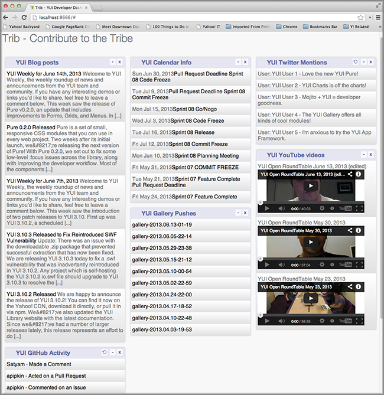

=======================
7. Mojito on the Client
=======================

.. _07_binders-intro:

Introduction
============

Although we’ve created client-side code by deploying controllers, models, framework 
code, and templates to the client, we have written client code that works with the 
DOM. Mojito has a special way for you to write code specifically for DOM binding 
and manipulation called binders. Mojits can have one or more binders that are 
deployed to the client (they cannot run on the server). We’re going to create 
some binders to allow users to update data and hide content. 

.. _07_intro-time_est:

Time Estimate
-------------

20 minutes

.. _07_intro-what:

What We’ll Cover
----------------

- requirements for using binders
- allow event handlers to attach to the mojit DOM node
- communicate with other mojits on the page
- execute actions on the mojit that the binder is attached to
- refresh templates with binders

.. _07_intro-final:

Final Product
-------------

In the screenshot, you can see that we now have a full dashboard with data
from GitHub, Twitter, the YUI blog, YouTube, and YUI Gallery. You can also see
the icon **⟲**, which uses binders to refresh data when clicked.

.. _07_intro-before:

Before Starting
---------------

.. _07_intro_before-review:

Review of the Last Module
#########################

In the last module, we covered writing unit and functional tests for Mojito. 
We looked at both the YUI Test and Arrow testing frameworks and also fleshed 
out our dashboard application. In summary, we looked at the following:

- structure of unit tests
- YUI Test overview: test suite, test cases, and assertions
- controller and model unit tests
- introduction to Arrow
- writing YUI Tests for Arrow
- running functional tests with Arrow

.. _07_intro_before-setup:

Setting Up
##########

``$ cp -r 06_testing 07_binders``

.. _07_binders-lesson:

Lesson: Binders
===============

.. _07_lesson-intro:

Introduction
------------

Client-side code for Mojito are placed in files called binders. A mojit may have zero, 
one, or many binders within the binders directory. Each binder 
will be deployed to the browser along with the rest of the mojit code, where the 
client-side Mojito runtime will call it appropriately. The view used to generate 
output determines which binder is used. Thus, if the ``simple`` view is used, the 
binder ``simple.js`` is used. This can be overridden by setting ``view.binder`` in the meta 
argument to ``ac.done``. If no binder matches the view, then no binder is used.

.. _07_lesson-location:

Location
--------

``{app_name}/mojits/{mojit_name}/binders/{action_name}.js``

.. _07_lesson-reqs:

Requirements for Using Binders
------------------------------

To use binders, your application must be using 
`HTMLFrameMojit <../topics/mojito_frame_mojits.html#htmlframemojit>`_ or your own frame 
mojit and be configured to deploy code to the client with the 
``deploy`` property in ``application.json``. See `Configuring 
Applications to Be Deployed to Client <../intro/mojito_configuring.html#configuring-applications-to-be-deployed-to-client>`_ 
for more information. Also, the template files (e.g., ``index.hb.html``) must have 
containers (``div`` elements) that have the ``id`` attribute assigned the value 
``{{mojit_view_id}}`` because the attribute value 
``{{mojit_view_id}}`` allows binders to attach themselves to the DOM.
For example: ``
``. Mojito generates the value for
``{{mojit_view_id}}`` at runtime. 

.. _07_lesson-binder:

Binder Code
-----------

Like controllers and models, binders register a module name with ``YUI.add`` and their own 
namespace. Binders have the two essential functions ``init`` and ``bind``. The ``init`` 
function initializes the binder and contains the ``mojitProxy`` object, which we will discuss 
in detail soon. The ``bind`` function, as you might imagine, allows the binder code to be 
attached to the DOM.

The example binder below shows its basic structure:

.. code-block:: javascript

   YUI.add('blog-binder-index', function(Y, NAME) {
     Y.namespace('mojito.binders')[NAME] = {
       init: function(mojitProxy) {
         this.mojitProxy = mojitProxy;
       },
       bind: function(node) {
       }
     };
   }, '0.0.1', {requires: ['mojito-client']});

.. _07_lesson_binder-when:

When Are Binders Executed?
##########################

The binder ``index.js`` will be created whenever the ``index`` function of the controller 
is executed. and its corresponding DOM node is attached to a client page. Mojito will 
select that DOM node and pass it into the ``bind`` function. This allows you to write 
code to capture UI events and interact with Mojito or other mojit binders.

.. _07_lesson_binder-functions:

Binder Functions
################

.. _07_binder_functions-init:

init
****

The ``init`` method is called with an instance of a mojit proxy specific for this mojit 
binder instance. The ``mojitProxy`` instance can be used at this point to listen for events. 
It is typical to store the ``mojitProxy`` for later use as well. The ``mojitProxy`` object 
is the only gateway back into the Mojito framework for your binder.

.. _07_binder_functions-bind:

bind
****

The ``bind`` method is passed a ``Y.Node`` instance that wraps the DOM node representing 
this mojit instance within the DOM. It will be called after all other binders on the page 
have been constructed and their ``init`` methods have been called. The ``mojitProxy`` can 
be used at this point to broadcast events. Users should attach DOM event handlers in ``bind`` 
to capture user interactions.

.. _07_lesson_binder-mojitProxy:

mojitProxy Object
#################

Each binder, when constructed by Mojito on the client, is given a proxy object for interactions 
with the mojit it represents as well as with other mojits on the page. This ``mojitProxy`` 
should be saved with this for use in the other parts of the binder. 

.. _07_lesson_mojitProxy-props:

Properties
**********

The ``mojitProxy`` object has the following properties:

- ``config`` - the instance specification for the mojit linked to the binder
- ``context`` - environment information such as language, device, region, site, etc.
- ``children`` - the children of the mojit, which are defined in ``application.json``.
- ``data`` - the data model that allows your binder to share and access data through a tunnel
  that data can pass between the client and server.
- ``type`` - the name of the mojit that attached the binder to the DOM.

From the ``mojitProxy``, you can access properties that use the interface and provides the 
information below:

.. code-block:: javascript

   YUI.add('github-model', function(Y, NAME) {

     // The namespace for the model that passes the
     // name.
     Y.mojito.models[NAME] = {
       init: function(config) {
         this.config = config;
       },
       getData: function(params, callback) {
         // Model function to get data...
       },
       ... 
     };
   }, '0.0.1', {requires: ['yql']});

.. _07_lesson_binder-api:

API Methods
###########

In addition to  the properties of the ``mojitProxy`` object, you can also use the methods 
of the `MojitProxy class <https://developer.yahoo.com/cocktails/mojito/api/classes/MojitProxy.html>`_, 
so that the binder can interact with the controller and other mojits. We’re going to focus 
on a core set of the available methods and recommend you look at the API documentation to 
complete the picture.

In the next few sections, we’ll give you an overview of binder features and
the relevant ``MojitProxy`` methods and then look at how to implement the features.

.. _07_binder_api-binder2binder:

Binder-to-Binder Communication 
******************************

- ``broadcast`` - Used by mojit binders to broadcast a message between mojits.
- ``listen`` - Allows mojit binders to register to listen to other mojit events.

.. _07_binder_api-binder2controller:

Binder-to-Controller Communication
**********************************

``invoke`` - Used by the mojit binders to invoke actions on themselves within Mojito. 

.. _07_binder_api-share_data:

Sharing and Accessing Data
**************************

- `data <../../api/classes/MojitProxy.html#property_data>`_ - Object that has methods for 
  getting and setting data that can be shared with the server.
- `pageData <../../api/classes/MojitProxy.html#property_pageData>`_ - Object that has 
  methods for getting and setting data with other mojits on the page and with server-side code.

.. _07_binder_api-update:

Updating DOM / Rendering Data
*****************************

- ``refreshView`` - Refreshes the current DOM view for this binder without recreating the
  binder instance. Will call the binder's ``onRefreshView`` function when complete with 
  the new ``Y.Node`` and ``HTMLElement`` objects.
- ``render`` - This method renders the data provided into the specified view. The "view" 
  must have the name of one of the files in the current mojits ``views`` directories. 
  Returns using the callback.

.. _07_lesson_binder-invoke:

Invoking Controller Methods
###########################

The invoke method is critical because it allows user-driven events to trigger the 
execution of controller functions. In the binder snippet below, the ``invoke``
method calls the controller function ``show`` with parameters. The returned value is 
used to update the DOM. This is the typical use of the ``invoke`` method. The controller 
may need to get data from the model, so the flow would be 
binder->controller->model->controller->binder. We'll be using the ``invoke`` method
in our application to refresh the data for our ``Twitter`` and ``Github`` mojits.

.. code-block:: javascript 

   ...
     init: function(mojitProxy) {
       var self = this;
       this.mojitProxy = mojitProxy;
       var params = {
         url: {
           url: “http://example.com”
         }
       };
       mojitProxy.invoke('show', { params: params }, function(err, markup) {
         self.node.setContent(markup);
       });
     });
   },
   ...
.. _07_lesson_binder-client2server:

Client to Server Communication
##############################

If the controller has not been deployed to the client, the binder sends a request to the 
server through a special path called the tunnel that Mojito creates to allow the client to 
make HTTP requests from the client to the server. The default path is ``http://domain:8666/tunnel``, 
but you can configure the name of the path.

.. _07_lesson_binder-broadcast:

Broadcasting and Listening for Events
#####################################

The ``broadcast`` method lets you emit custom events that other mojit binders can listen 
to and respond.  In this way, mojits can respond to user events and communicate with each other.

The mojit binder below broadcasts the event ``'fire-link'`` when a user clicks on a hyperlink in a 
unordered list. 

.. code-block:: javascript

   ...
     bind: function (node) {
       var mp = this.mp;
       this.node = node;
       // capture all events on "ul li a"
       this.node.all('ul li a').on('click', function(evt) {
         var url = evt.currentTarget.get('href');
         evt.halt();
         Y.log('Triggering fire-link event: ' + url, 'info', NAME);
         mp.broadcast('fire-link', {url: url});
       });
     } 
   ...

Another binder listening for the ``'fire-link'`` event then responds by emitting the event 
``'broadcast-link'``. 

.. code-block:: javascript

   ...
     init: function (mojitProxy) {
       var mp = this.mp = this.mojitProxy = mojitProxy;
       this.mojitProxy.listen('fire-link', function(payload) {
         var c = mp.getChildren(),
             receiverID = c.receiver.viewId;
             mojitProxy.broadcast('broadcast-link', {url: payload.data.url}, { target: {viewId: receiverID }});
             Y.log('broadcasted event to child mojit: ' + payload.data.url, 'info', NAME);
       });
     },
   ...

.. _07_lesson_binder-refresh:

Refreshing Views and Rendering Data
###################################

Often all you want your binder to do is to refresh its associated view. From the 
``mojitProxy`` object, you can call the ``refreshView`` method to render a new DOM node 
for the current mojit and its children, as well as reattach all of the existing 
binders to their new nodes within the new markup. Because all binder instances 
are retained, state can be stored within a binder’s scope.

.. code-block:: javascript

   ...
     mojitProxy.listen('flickr-image-detail', function(payload) {
       var urlParams = Y.mojito.util.copy(mojitProxy.context);
       var routeParams = {
         image: payload.data.id
       };
       mojitProxy.refreshView({
         params: {
           url: urlParams,
           route: routeParams
         }
       });
     });
   ...

.. _07_lesson_binder-share_data:

Sharing Data
############

We won't be using the ``data`` or ``pageData`` namespace to share data between mojits
in this tutorial, but we highly recommend that you read `Sharing Data <../topics/mojito_data.html#sharing-data>`_,
which provides an overview and examples.

.. _07_binders-create:

Creating the Application
========================

#. After you have copied the application that you made in the last module 
   (see :ref:`Setting Up <07_intro_before-setup>`), change into the application 
   ``07_binders``.
#. Let’s create our last two mojits ``Blog`` and ``Gallery`` for the dashboard. The ``Blog``
   mojit will display posts from the `YUI Blog <http://www.yuiblog.com/>`_, and the 
   ``Gallery`` mojit will display the latest modules pushed to the `YUI Gallery <http://yuilibrary.com/gallery/>`_.

   - ``$ mojito create mojit Blog``
   - ``$ mojito create mojit Gallery``

#. Create mojit instances for our new mojits in ``application.json`` and make them 
   children of the ``body`` instance as shown below. Also, be sure to update the
   path to the CSS assets.

   .. code-block:: javascript

      "body": {
        "type": "Body",
        "config": {
          "children": {
            "github": {
              "type":"Github"
            },
            "calendar": {
              "type":"Calendar"
            },
            "twitter": {
              "type":"Twitter"
            },
            "youtube": {
              "type": "Youtube"
            },
            "blog": {
              "type": "Blog"
            },
            "gallery": {
              "type": "Gallery"
            }
          }
        }
      }
#. Also, we'll need to add the new mojits to the template of the ``Body`` 
   mojit (``mojits/Body/view/index.hb.html``), so that the content they create will be 
   attached to the rendered page:

   .. code-block:: html

      

        <h4 class="bodytext">{{title}}</h4>
        

          

            {{{blog}}}
            {{{github}}}
          

          

            {{{calendar}}}
            {{{gallery}}}
          

          

            {{{twitter}}}
            {{{youtube}}}
          

        

      

#. Change to ``mojits/Blog/models`` and rename the file ``model.server.js`` to ``blog.server.js``.
#. Replace the content of ``blog.server.js`` with the code below. We're using YQL again to
   get the blog posts from a custom table.

   .. code-block:: javascript

      YUI.add('blog-model-yql', function (Y, NAME) {

      Y.mojito.models[NAME] = {
        init: function (config) {
            this.config = config;
        },
        getData: function (params, feedURL, callback) {

          var query = "select title,link,pubDate, description, dc:creator from feed where url='{feed}' limit 5",
                queryParams = {
                  feed: feedURL
                },
                cookedQuery = Y.Lang.sub(query, queryParams);
          Y.YQL(cookedQuery, Y.bind(this.onDataReturn, this, callback));
        },
        onDataReturn: function (cb, result) {
          Y.log("blog.server onDataReturn called");
          if (result.error === undefined) {

            var results = result.query.results.item;
            cb(results);
          } else {
            cb(result.error);
          }
        },
      };
    }, '0.0.1', {requires: ['yql', 'substitute']});

#. Update your controller to use the model we just created. 

   .. code-block:: javascript

      YUI.add('blog', function (Y, NAME) {

        Y.namespace('mojito.controllers')[NAME] = {

          index: function (ac) {
            var view_type = "yui", feedURL = "http://www.yuiblog.com/blog/feed/", title = "YUI Blog Posts";
            ac.models.get('blog').getData({}, feedURL, function (data) {
        
              // Add mojit specific css.
              ac.assets.addCss('./index.css');

              // Populate blog template.
              ac.done({
                title: title,
                results: data
              });
            });
          }
        };
      }, '0.0.1', {requires: ['mojito', 'mojito-assets-addon', 'mojito-models-addon']});
#. Update the template ``index.hb.html`` of the ``Blog`` mojit as well:

   .. code-block:: html

      

        

          <h3>
            <strong>{{title}}</strong>
            <a title="minimize module" class="min" href="#">-</a>
            <a title="close module" class="close" href="#">x</a>
          </h3>
          

            <ul>
            {{#results}}
              <li>
                <a href="{{link}}">{{title}}</a>
                {{description}}
              </li>
            {{/results}}
            </ul>
          

        

      

#. Let's update the model, controller, and view of the ``Gallery`` mojit as well. First
   rename the model ``model.server.js`` to ``gallery.server.js`` and replace the contents 
   with the code below. 

   .. code-block:: javascript

      YUI.add('gallery-model-yql', function (Y, NAME) {
        Y.mojito.models[NAME] = {
          init: function (config) {
            this.config = config;
          },
          getData: function (params, tablePath, callback) {
            Y.log("gallery getData called");

            var query = "use '{table}' as gallerylogs; select * from gallerylogs",
                queryParams = {
                    table: tablePath
                },
                cookedQuery = Y.Lang.sub(query, queryParams);

             // Y.log("cookedQuery: " + cookedQuery);
             Y.YQL(cookedQuery, Y.bind(this.onDataReturn, this, callback));
          },
          onDataReturn: function (cb, result) {
            Y.log("onDataReturn called");
            var itemLimit = 10, results;

            if (result.error === undefined) {
                results = result.query.results.json;
                results.json = results.json.slice(0, itemLimit);

                cb(results);
            } else {
                cb(result.error);
            }
          }
        };
      }, '0.0.1', {requires: ['yql', 'substitute']});

#. Update the controller and ``index`` template of the ``Gallery`` mojit as well with the 
   following:

   .. code-block:: javascript

      YUI.add('gallery', function (Y, NAME) {

        Y.namespace('mojito.controllers')[NAME] = {

          index: function (ac) {
            var view_type = "yui", tablePath = "store://owgYr7PT7CWIOWMaWs9Stb", title = "YUI Gallery Pushes";

            ac.models.get('gallery').getData({}, tablePath, function (data) {
              // add mojit specific css
              ac.assets.addCss('./index.css');

              // populate youtube template
              ac.done({
                title: title,
                results: data
              });
            });
          }
        };
      }, '0.0.1', {requires: ['mojito', 'mojito-assets-addon', 'mojito-models-addon']});

   .. code-block:: html

      

        

          <h3>
            <strong>{{title}}</strong>
            <a title="minimize module" class="min" href="#">-</a>
            <a title="close module" class="close" href="#">x</a>
          </h3>
          

            <ul>
            {{#results}}
              {{#json}}
               <li><a href="http://yuilibrary.com/gallery/buildtag/{{.}}">{{.}}</a></li>
              {{/json}}
            {{/results}}
            </ul>
          

        

      

#. For the binders, the first one we'll change is that of the ``PageLayout`` mojit 
   (``mojits/PageLayout/binders/index.js``). We're just to use the `YUI Node Class <http://yuilibrary.com/yui/docs/api/classes/Node.html>`_
   to select a node and then add a class so that users can hide content, so we won't need 
   to use the ``mojitProxy`` object. Update the ``bind`` function with the following, which
   will select a node by the class, handle a click event, and then either add or remove
   a class to allow the user to hide or show a widget.

   .. code-block:: javascript
   
      bind: function(node) {
        var me = this;
        this.node = node;

        Y.log("bind called");
        Y.on("domready", function(){
          Y.one("body").addClass("yui3-skin-sam");
        });
        Y.one(".mybody").delegate('click', function() {
          if (!this.ancestor('div').hasClass('collapse')) {
            this.ancestor('div').addClass('collapse');
          } else {
            this.ancestor('div').removeClass('collapse');
          }
        }, 'a.min');
      }

#. The next binder modification will be for the ``Twitter`` mojit. We want the binder
   to allow users to update the Twitter feed by clicking on a button. The binder code
   below cleans up the Twitter feed, handles click events on , and then calls the 
   controller method ``index`` on the server. After the ``index`` method is executed, the 
   rendered ``index.hb.html`` template is attached to the DOM. The 
   communication between the client and server is through the ``mojitProxy`` object:

   .. code-block:: javascript

      YUI.add('twitter-binder-index', function(Y, NAME) {

        Y.namespace('mojito.binders')[NAME] = {

          init: function(mojitProxy) {
            this.mojitProxy = mojitProxy;
          },
          bind: function (node) {
            var me = this,
                mp = this.mojitProxy;
            this.node = node;
            Y.on("domready", function () {
              Y.log("Twitter: bind ");
              // get elements
              var tweetsList = Y.one("#twitter").all('li');
              Y.Array.each(tweetsList._nodes, function (item, index, array) {
                Y.log(item);
                var textNode = Y.one(item).one('span');
                textNode.setContent(textNode.getHTML().replace(/(http\S+)/i, '<a href="$1" target="_blank">$1</a>')
                      .replace(/(@)([a-z0-9_\-]+)/i, '<a href="http://twitter.com/$2" target="_blank">$1$2</a>')
                      .replace(/(#)(\S+)/ig, '<a href="http://twitter.com/search' + '?q=%23$2" target="_blank">$1$2</a>'));

              });
            });
            refreshMojit = function(evt) {
              var tgt = evt.target;
                  evt.halt();
                  mp.invoke('index', function(err, markup) {
                    if (me) {
                      me.innerHTML = markup;
                    }
                  });
                };
              // Refresh the content when user clicks refresh button.
              Y.one("#twitter").delegate('click', refreshMojit, 'a.refresh');
            }
          };
        }, '0.0.1', {requires: ['event-mouseenter', 'mojito-client']});
#. We want to let users to be able to update the GitHub activity as well. Before we start
   working on the binders of the ``Github`` mojit, let's refine the controller, model, and
   update the tests. First, in the controller, update the ``index`` method and add the 
   method ``githubMap`` outside the controller namespace to format the returned response 
   with the code below. We're using a YQL table that's in the 
   `YQL hosted storage <https://developer.yahoo.com/yql/guide/yql-cloud-chapter.html>`_
   now (``store://gpgSGZAwQ3vaDaalPQZ44u``) 

   .. code-block:: javascript

      index: function (ac) {
        var yqlTable = "store://gpgSGZAwQ3vaDaalPQZ44u",
            title = "YUI GitHub Activity",
            model = ac.models.get('yql');
        Y.log(model);
        model.getData({}, yqlTable, function (data) {
          Y.log("Github -index - model.getData:");
          Y.log(data);

          //construct special data

          var res = [];
          Y.log("calling githubmap");
          res = githubMap(ac, data);

          // Add mojit specific css
          ac.assets.addCss('./index.css');
          ac.done({
            title: title,
            results: res
          });
        });
      }

   .. code-block: javascript

      var githubMap = function (ac, data) {
        Y.log("githubmap called");
        var res = [];
        Y.Array.each(data, function (itm, idx, arr) {
          Y.log(itm);
          var
              type = itm.json.type,
              username = itm.json.actor.login,
              msg = "msg",
              link = "http://www.yahoo.com";

          Y.log("github controller server type:" + type);
          if (type === "IssueCommentEvent") {
            Y.log("issuecommentevent!");
          }
          switch (type) {
            case "CommitCommentEvent":
              msg = "Made a Comment";
              link = itm.json.payload.comment.html_url;
              break;
            case "CreateEvent":
              msg = "Created Something";
              link = itm.json.payload.ref;
              break;
            case "DeleteEvent":
              msg = "Deleted Something";
              link = itm.json.payload.ref;
              break;
            case "DownloadEvent":
              msg = "Downloaded Something";
              link = itm.json.payload.download.html_url;
              break;
            case "FollowEvent":
              msg = "Followed Someone";
              link = itm.json.payload.target.url;
              break;
            case "ForkEvent":
              msg = "Forked Something";
              link = itm.json.payload.forkee.html_url;
              break;
            case "GistEvent":
              msg = "Acted on a Gist";
              link = itm.json.payload.gist.html_url;
              break;
            case "GollumEvent":
              msg = "Acted on a Page";
              if (typeof itm.json.payload.pages === 'array') {
                link = itm.json.payload.pages[0].html_url;
                } else {
                  link = itm.json.payload.pages.html_url;
              }
              break;
            case "IssueCommentEvent":
              Y.log(" inside case IssueCommentEvent!");
              msg = "Commented on an Issue";
              link = itm.json.payload.comment.html_url;
              break;
            case "IssuesEvent":
              msg = "Acted on an Issue";
              link = itm.json.payload.issue.html_url;
              break;
            case "MemberEvent":
              msg = "A member was added.";
              link = itm.json.payload.member.html_url;
              break;
            case "PublicEvent":
              msg = "A Repo was made Public!";
              link = "#";
              break;
            case "PullRequestReviewCommentEvent":
              msg = "Commented on a Pull Request";
              link = itm.json.payload.comment.html_url;
              break;
            case "PushEvent":
              msg = "Pushed some code";
              if (typeof itm.json.payload.commits === 'array') {
                link = "http://www.github.com/yui/yui3/commit/" + itm.json.payload.commits[0].sha;
              } else {
                link = "http://www.github.com/yui/yui3/commit/" + itm.json.payload.commits.sha;
              }
              break;
            case "TeamAddEvent":
              msg = "Added someone to a team.";
              link = itm.json.payload.user.url;
              break;
            case "WatchEvent":
              msg = "Had a Watch Event";
              link = "#";
              break;
            default:
              msg = "Did Something? Don't know.";
              link = "#";
              break;
          }
          res[idx] = {
            type: type,
            username: username,
            payload: itm.json.payload,
            message: msg,
            link: link
          };
        });
        // send the array back
        return res;
      };

#. Update the model for the ``Github`` mojit as well by replacing the content of
   ``mojits/Github/models/yql.server.js`` with the following:

   .. code-block:: javascript

      YUI.add('stats-model-yql', function (Y, NAME) {

        Y.mojito.models[NAME] = {
          init: function (config) {
            this.config = config;
          },
          getData: function (params, yqlTable, callback) {
            Y.log(this.config);
            var itemLimit = "10",
                query = "use '{table}' as github.events; select json.type, json.actor, json.payload from github.events where id='yui' and repo='yui3' limit {limit}",
                queryParams = {
                    table: yqlTable,
                    limit: itemLimit
                },
                cookedQuery = Y.Lang.sub(query, queryParams);
             Y.YQL(cookedQuery, Y.bind(this.onDataReturn, this, callback));
          },
          onDataReturn: function (cb, result) {
            Y.log("onDataReturn called");
            if (result.error === undefined) {

                Y.log("github result:");
                Y.log(result);
                var results = {};
                if (result && result.query && result.query.results && result.query.results.json) {
                    results = result.query.results.json;
                }
                cb(results);
            } else {
                cb(result.error);
            }
          }
      };
   }, '0.0.1', {requires: ['yql', 'substitute']});
#. We'll need to update the ``Github`` tests as well. If you've written tests for the
   other mojits, you'll need to be sure that they are updated as well. Update
   the tests with the code below:

   ``mojits/Github/tests/controller.server-tests.js``

   .. code-block:: javascript

      YUI.add('github-tests', function (Y) {

        var suite = new YUITest.TestSuite('github-tests'),
          controller = null,
          A = YUITest.Assert,
          model;
        suite.add(new YUITest.TestCase({

          name: 'Github user tests',
          setUp: function () {
            controller = Y.mojito.controllers["github"];
            model = Y.mojito.models["stats-model-yql"];
          },
          tearDown: function () {
            controller = null;
          },
          'test mojit': function () {
            var ac,
                modelData,
                assetsResults,
                route_param,
                doneResults,
                def_value;
            modelData = { x: 'y' };
            ac = {
                assets: {
                    addCss: function (css) {
                        assetsResults = css;
                    }
                },
                config: {
                    getDefinition: function (key) {
                        def_value = key;
                    }
                },
                params: {
                    getFromRoute: function (param) {
                        route_param = param;
                    }
                },
                models: {
                    get: function (modelName) {
                        A.areEqual('stats-model-yql', modelName, 'wrong model name');
                        return model;
                    }
                },
                done: function (data) {
                    doneResults = data;
                }
            };
            A.isNotNull(controller);
            A.isFunction(controller.index);
            controller.index(ac);
          }
        }));
        YUITest.TestRunner.add(suite);
      }, '0.0.1', {requires: ['mojito-test', 'github', 'stats-model-yql']});

   ``mojits/Github/tests/models/yql.server-tests.js``

   .. code-block:: javascript

      YUI.add('stats-model-yql-tests', function(Y, NAME) {

        var suite = new YUITest.TestSuite(NAME),
            model = null,
            yqlTable = null,
            A = YUITest.Assert;
        suite.add(new YUITest.TestCase({

          name: 'stats-model-yql user tests',
          setUp: function() {
            model = Y.mojito.models["stats-model-yql"];
            yqlTable = "store://gpgSGZAwQ3vaDaalPQZ44u";
          },
          tearDown: function() {
            model = null;
          },
          'test mojit model': function() {
            var cfg = { color: 'red' };
            A.isNotNull(model);
            A.isFunction(model.init);
            model.init(cfg);
            A.areSame(cfg, model.config);
            A.isFunction(model.getData);
            model.getData({}, yqlTable, function(data) {
              A.isObject(data);
              return data;
            });
          }
        }));
        YUITest.TestRunner.add(suite);
      }, '0.0.1', {requires: ['mojito-test', 'stats-model-yql']});

#. Before you modify the binder, try running the ``Github`` unit tests: ``$ mojito test mojits/Github``
#. Okay, let's update the ``bind`` method of the ``Github`` with almost the  identical code 
   we used for the ``Twitter`` binder:

   .. code-block:: javascript 

      bind: function (node) {
        this.node = node;
        var me = this.node,
            mp = this.mojitProxy,
            refreshMojit = function(evt) {
              var tgt = evt.target;
              evt.halt();
              mp.invoke('index', function(err, markup) {
                if (me) {
                  me.replace(markup);
                }
              });
            };
        // Refresh the content when user clicks refresh button.
        Y.one("#github").delegate('click', refreshMojit, 'a.refresh');
      }

#. The binders are reliant on the **refresh** icon. So, let's add that to the templates 
   of the ``Twitter`` (``mojits/Twitter/views/index.hb.html``) and ``Github`` 
   (``mojits/Github/views/index.hb.html``) mojits:

   .. code-block:: html

      

        

          <h3>
            <strong>{{title}}</strong>
            <a title="refresh module" class="refresh" href="#">⟲</a>
            <a title="minimize module" class="min" href="#">-</a>
            <a title="close module" class="close" href="#">x</a>
          </h3>
          

            <ul>
            {{#results}}
              <li>User: {{from_user}} - {{text}}</li>
            {{/results}}
            </ul>
          

        

      

   .. code-block:: html

      

        

          <h3>
            <strong>{{title}}</strong>
            <a title="refresh module" class="refresh" href="#">⟲</a>
            <a title="minimize module" class="min" href="#">-</a>
            <a title="close module" class="close" href="#">x</a>
          </h3>
          

            <ul>
            {{#results}}
              <li><a href="http://github.com/{{username}}">{{username}}</a> - <a href="{{link}}">{{message}}</a></li>
            {{/results}}
            </ul>
          

        

      

#. We'll need to modify ``assets/trib.css`` to style the **refresh** icon. Add 
   ``a.refresh`` to the ``div.mod h3`` block shown below and also the snippet that
   positions the icon:

   .. code-block:: css

      div.mod h3 a.close,
      div.mod h3 a.min,
      div.mod h3 a.refresh {
        background-color: #F9F9FC;
        border:1px solid #E5E6F1;
        color: #5E6BA4;
        text-align: center;
        display: block;
        height: 19px;
        width: 17px;
        text-decoration: none;
        font-weight: bold;
        right: 4px;
        top: 1px;
        position: absolute;
        font-size: 80%;
        margin: 2px;
        padding: 0;
      }
      div.mod h3 a.refresh {
        right: 50px;
      }
#. Go ahead and start your application. You'll see that we now have two widgets per 
   column. The GitHub and Twitter feeds should have the **refresh** icon.
#. Open a developer console or Firebug and then click on the **refresh** icon for the GitHub 
   widget. You will probably not see any new content, but in the developer console, you'll 
   see the following indicating that the controller ``index`` method was invoked through
   the RPC tunnel and that a new binder was created for the returned content.

   ::
   
      mojito-client: Executing "@Github/index" on the client. combo:13
      mojito-dispatcher: Cannot expand instance "@Github". Trying with the tunnel in case it is a remote mojit. combo:13
      mojito-dispatcher: Dispatching instance "@Github" through RPC tunnel. combo:13
      mojito-tunnel-client: rpc success combo:13
      mojito-client: Mojito Client state: paused. combo:13
      mojito-client: Created binder "github-binder-index" for DOM node "yui_3_10_3_2_1371606307041_16" combo:13
      mojito-client: Attached 0 event delegates combo:13
      mojito-client: Mojito Client state: active. 

#. Congratulations, you have basically finished the dashboard application. The last few
   modules will add Mojito information, but focus mostly on enhancing your application 
   through configuration, adding specialized templates for different devices, and 
   adding localization.

.. _07_binders-summary:

Summary
=======

In this module, we covered how to use binders in Mojito applications to handle user
interactions and update the DOM. More specifically, we looked that the following:

- binder methods
- the ``MojitProxy`` class and the ``mojitProxy`` object
- invoking controller methods with the ``invoke`` method
- using the ``{{mojit_view_id}}`` as the ID for containers so binders can
  be attached to the DOM.

.. _07_binders-ts:

Troubleshooting
===============

Nothing Happening on the Client
-------------------------------

If you open the developer console, click the refresh button for either the Github
or Twitter mojit, you should see the logs from the binder code that indicate that the
mojits are creating new nodes and attaching content to the DOM. If you see no log messages
and there are no errors on the server, there is a good chance that you have not configured 
the application to deploy to the client. In ``application.json``, confirm that ``deploy``
is set to ``true``:

.. code-block:: javascript
   
   "specs": {
     "tribframe": {
       "type": "HTMLFrameMojit",
       "config": {
         "deploy": true,
         ...
       ...
     ...
   ...

Log Messages on Client, But Mojit Isn't Refreshing Data
-------------------------------------------------------

If you see log messages on the client that indicate binders are being created,
but nothing happens when you click on the **Refresh** button to update the GitHub
or Twitter data, you might have forgotten to add ``{{mojit_view_id}}`` to the
``id`` attribute of the ``div`` container in that mojit's template. For example,
the first line in the template ``index.hb.html`` for the ``Github`` mojit should be
the following: ``
``

.. _07_binders-qa:

Q&A
===

- Can the controller update Handelbars expressions without rendering the template and
  sending it to the client?

  Yes, binder code can invoke a controller method that uses ``ac.pageData.set`` to
  update a Handlebars expression. For example, if the template for a mojit has the 
  Handlebars expression ``{{rss_feed}}`` that contains RSS feeds. That mojit's binder
  could invoke a controller method that would call 
  ``ac.pageData.set('rss_feed' { rss: <some_data> })`` to update the Handlebars expression.

- Can the server broadcast events to the client-side binders?

  Not directly, but when a controller method is executed on the server, the binder is
  created and attached to the DOM, so the binder can then broadcast events to other
  binders on the page. The controller does not have a way to directly broadcast events
  though.

.. _07_binders-test:

Test Yourself
=============

.. _07_test-questions:

Questions
---------

- How do you configure your mojits to deploy binders to the client?
- What object can be used by the binder to communicate with its controller and other binders?
- What do you need in the template to allow the binder attach itself to the DOM?
- What is the addon that allows you to share data more easily between the client/server and 
  mojits?

.. _07_test-exs:

Additional Exercises
--------------------

- Have the binder of the ``Github`` mojit broadcast a ``updated`` event that the
  binder for the ``PageLayout`` mojit listens for and invokes a controller method that
  simply logs a message that the page has refreshed data.
- Instead of having the controller of the ``PageLayout`` mojit render one of its children,
  have the controller use the ``Data`` addon to pass data to the templates.

.. _07_binders-terms:

Terms
=====

**binders** 
   The client-side code for mojits that are sent to the client and attached
   to the DOM. 
**mojitProxy** 
   An object that allows binders to communicate with the
   server and other binders on the page.

.. _07_binders-src:

Source Code
===========

`07_binders <https://github.com/yahoo/mojito/tree/develop/examples/developer-guide/dashboard/07_binders>`_

.. _07_binders-reading:

Further Reading
===============

- `Mojito Binders <../intro/mojito_binders.html>`_
- `Binding Events <../code_exs/binding_events.html>`_
- `Sharing Data <../topics/mojito_data.html#sharing-data>`_

