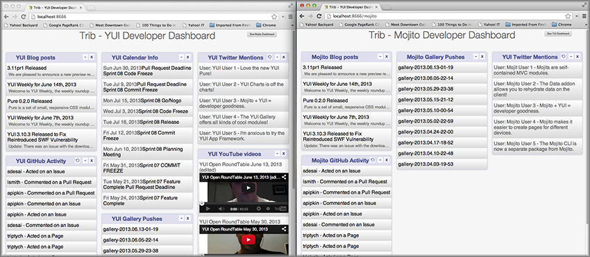

=====================================================
8. Advanced Configuration: Contexts, Routing, and YUI
=====================================================

.. _08_adv_config-intro:

Introduction
============

The good news is that your application is basically feature complete for the desktop, but we 
still have some work to do to make it better. In this module, we’re going to update 
the application-level and mojit-level configuration files. We'll update the
``application.json`` to define a static application name (no more updating the
path to the assets), add a new route with parameters for the Mojito dashboard, and 
configure Mojito to use a different version of YUI. We'll also cover how to configure logging 
levels, change the order of the logging levels, or provide logging filters. 

As for mojit configuration, we'll be using the mojit configuration file ``definition.json`` 
to store data that your controller can access. In turn, your controller can pass some of 
these configuration values to the models to get data. We don’t have to hardcode the REST 
URIs, OAuth keys, or YQL statements in the models anymore, so the models can basically get 
data from any given source. 

.. _08_intro-time_est:

Time Estimate
-------------

20 minutes

.. _08_intro-what:

What We’ll Cover
----------------

- using YAML for configuration files
- default configurations and definitions
- using the ``Config`` addon to get mojit configurations
- ``yui`` object and configurations
- configuring the YUI seed
- using the ``environment:development`` context
- adding parameters and using regular expressions in the routing configurations

.. _08_intro-final:

Final Product
-------------

The biggest visible change in the latest version of our application is that it now has
a Mojito dashboard as well as a YUI dashboard. 

.. _08_intro-before:

Before Starting
---------------

.. _08_intro_before-review:

Review of the Last Module
#########################

In the last module, we learned how to bind mojit code (binders) to the DOM and use these 
binders to call controller functions and attach content to the DOM. This involved learning 
about the following:

- requirements for using binders
- allowing event handlers to attach to the mojit DOM node
- communicating with other mojits on the page
- executing actions on the mojit that the binder is attached to
- refreshing templates with binders

.. _08_intro_before-setup:

Setting Up
##########

``$ cp -r 07_binders 08_adv_config``

.. _08_adv_config-lesson:

Lesson: Advanced Configuration
==============================

.. _08_lesson-app_config:

Application Configuration
-------------------------

.. _08_lesson_app_config-yaml:

Using YAML
##########

Mojito also supports configuration files in YAML format (JSON is a subset of YAML). 
The YAML file extension could be ``.yaml`` or ``.yml``. 
When both the JSON file (e.g., ``application.json``) and the YAML file (e.g., ``application.yaml``) 
are present, the YAML file is used and a warning is issued. For the data types of the YAML 
elements, please see the JSON configuration tables in `Application Configuration <../intro/mojito_configuring.html#application-configuration>`_, 
`Routing <../intro/mojito_configuring.html#routing>`_, and 
`Mojit Configuration <../intro/mojito_configuring.html#mojit-configuration>`_.

.. _08_lesson_app_config-yaml:

Our Application Configuration in YAML
*************************************

If you haven't worked with YAML before, you'll be happy to know that YAML supports 
commenting, which the current JSON schema currently does not support. If your application
has both an ``application.json`` and an ``application.yaml``, Mojito will use the
YAML file. To convert ``application.json`` to YAML, you can use a utility 
such as `json2yaml <https://npmjs.org/package/json2yaml>`_.

.. code-block:: yaml

   # YAML supports commenting, JSON doesn't.
   ---
   - settings:
     - master
     # The application name is statically defined to be `trib`
     staticHandling:
       appName: trib
     # The application is configured to use a specific build of YUI 
     # and the logging level is set.
     yui:
       config:
         comboBase: http://yui.yahooapis.com/combo?
         root: 3.8.1/build/
         seed:
         - yui-base
         - loader-base
         - loader-yui3
         - loader-app
         - loader-app-base{langPath}
         debug: true
         logLevel: warn
     # The specs object is where our mojit instances and the
     # parent-child mojit relationships are defined.
     specs:
       tribframe:
         type: HTMLFrameMojit
         config:
           deploy: true
           title: Trib - YUI/Mojito Developer Dashboard
           child:
             type: PageLayout
             config:
               children:
                 header:
                   type: Header
                 body:
                   type: Body
                   config:
                     children:
                       github:
                         type: Github
                       calendar:
                         type: Calendar
                       twitter:
                         type: Twitter
                       youtube:
                         type: Youtube
                       blog:
                         type: Blog
                       gallery:
                         type: Gallery
                 footer:
                   type: Footer
           # The assets for the application are specified here and will be attached
           # to the page by the `HTMLFrameMojit`.
           assets:
             top:
               css:
               - http://yui.yahooapis.com/3.9.0/build/cssnormalize/cssnormalize-min.css
               - http://yui.yahooapis.com/gallery-2013.03.13-20-05/build/gallerycss-cssform/gallerycss-cssform-min.css
               - http://yui.yahooapis.com/3.9.0/build/cssgrids-responsive/cssgrids-responsive-min.css
               - http://yui.yahooapis.com/3.9.0/build/cssbutton/cssbutton-min.css
               - http://yui.yahooapis.com/gallery-2013.03.13-20-05/build/gallerycss-csslist/gallerycss-csslist-min.css
               - https://rawgithub.com/tilomitra/yuicss-common/master/ui.css
               - /static/trib/assets/trib.css
   # Define selectors for contexts for different devices.
   - settings:
     - device:iphone
     selector: iphone
   - settings:
     - device:ipad
     selector: ipad
   # Use different logging levels and no cache for the development context.
   - settings:
     - environment:development
     staticHandling:
       forceUpdate: true
     yui:
       config:
         debug: true
         logLevel: debug
   - settings:
     - environment:production
     staticHandling:
       forceUpdate: false
     yui:
       config:
         debug: false
         logLevel: none

.. _08_lesson_app_config-static_app_name:

Static Application Name
#######################

We've been having to update the path to the assets for each application because the
application name has been changing. Generally, you're not changing application names,
but in a cloud-hosted environment, the application name may be dynamically created, so 
you'll want a way to statically define the application name so that the path to your 
assets is valid.

To statically define assets in Mojito applications, you use the ``staticHandling`` 
object and its property ``appName``. We're going to use ``trib`` for our application name,
so add the code below to your ``application.json``.

.. code-block:: javascript

     "staticHandling": {
          "appName": "trib"
        },

Now, update the path to your assets for the last time:

.. code-block:: javascript

   ...
     ...
       "assets": {
         "top": {
           "css": [
             ...,
             "/static/trib/assets/trib.css"
           ]
         }
       }
     ...
   ...

.. _08_lesson_app_config-routing:

Advanced Routing Configuration
##############################

For our application, we're going to use the ``params`` property in our routes to
pass URL parameters to our controller, which will be used to determine what template
to render. We won't be using regular expressions or parameterized paths in our application,
but for the sake of completeness, we'll look at how they work.

.. _08_lesson_routing-add_params:

Adding Parameters
*****************

As you can see from the snippet of our ``app.js`` shown below, we're going to have two routing
paths. Each path passes a different value for the ``view_type`` parameter. 
The controller can inspect the URL parameters defined here with the ``Params``
addon. If the controller sees that the value for the ``view_type`` is ``yui``, it
will serve the YUI dashboard, and vice versa, if the value for ``view_type`` is ``mojito``
the template for the Mojito dashboard is rendered.

.. code-block:: javascript

   ...
   app.get('/', function (req, res, next) {
       req.params.view_type = "yui";
       next();
   }, libmojito.dispatch('tribframe.index'));

   app.get('/mojito', function (req, res, next) {
       req.params.view_type = "mojito";
       next();
   }, libmojito.dispatch('tribframe.index'));
   ...

.. _08_lesson_routing-regex:

Regular Expressions for Paths
*****************************

The route objects can contain a ``regex`` property that allows you to 
define a regular expression and then use the key as a parameter in the 
path. In the example below, the regular expression matches a path that starts
with one or the numbers followed by an underscore and then the string ``Mojitos``
or ``mojitos``:

.. code-block:: javascript

   [
     {
       "settings": [ "master" ],
      "regex_path": {
        "verbs": ["get"],
        "path": "/:matched_path",
        "regex": { "matched_path": "\d{1,2}_[Mm]ojitos?" },
        "call": "myMojit.index"
      }
    }
  ]

.. _08_lesson_routing-parametrized_paths:

Using Parameterized Paths 
*************************

The parameterized paths allow you to have Mojito execute the correct action based
on the request. In our example ``app.js`` below, if the HTTP request 
is made on the path ``/index``, the ``index`` method of the ``tribframe`` instance
is executed. Likewise, if the HTTP request is made to ``/mojito/index``, the
``index`` method of ``tribframe`` instance is made, but the ``params`` property
has different values. We use the ``params`` property to render the right template,
but you could use a parameterized URL to call a different mojit action to render
the appropriate template.

.. code-block:: javascript

   app.get('/:action', function (req, res, next) {
       req.params.view_type = "yui";
       next();
   }, libmojito.dispatch('tribframe.{action}'));
   app.get('/mojito/:action', function (req, res, next) {
       req.params.view_type = "mojito";
       next();
   }, libmojito.dispatch('tribframe.{action}'));

.. _08_lesson_routing-yui:

YUI 
###

YUI configuration in Mojito is done with the ``yui.config`` object in ``application.json``. 
For those familiar with YUI, the ``yui.config`` object allows you to configure YUI just as 
you would with the YUI `config Class <http://yuilibrary.com/yui/docs/api/classes/config.html>`_. 
Some of the high-level ways to configure YUI would include the following:

- select which YUI modules are included in the YUI seed file
- configure the combo handler to use a CDN
- optimize performance for environments that may have latency issues or have limited CPU power
- limit the loading of certain YUI modules for specific languages
- configure logging 

For our application, we’re going to focus on configuring the YUI seed and logging. If you 
don’t configure the YUI seed, your application will use the YUI bundled with Mojito. 

.. _08_routing-yui_seed:

Configuring the YUI Seed
************************

To use YUI in Web pages, you include a small JavaScript file called the YUI seed file. The 
YUI seed file allows you to load other YUI components on your page. The seed file is added 
to your Web page by with following ``

From the URL to the seed file, the YUI library can infer the version of the library that 
should be used, the filter that you want to use (min, debug or raw), and the CDN that is 
serving the library.

.. _08_routing-yui_seed:

Seed File in Mojito Applications
^^^^^^^^^^^^^^^^^^^^^^^^^^^^^^^^

As we have said earlier, In Mojito applications, the YUI seed is configured in 
``application.json``. Mojito does this for the following reasons:

- The YUI library is bundled with the application using npm, so loading modules is done 
  differently.
- Mojito applications may run as mobile applications that have connectivity issues 
  preventing access to the YUI seed file.
- When applications are started, new YUI modules, part of the Mojito code, and part of the 
  application code are loaded in the same way as the YUI Core modules, so it is difficult 
  to simply include the YUI seed file in a template.

.. _08_yui_seed-default:

Default Seed File
^^^^^^^^^^^^^^^^^

In general, you don’t need to worry about the YUI default seed because Mojito creates a 
default configuration for the YUI seed for you. For our application, we want a specific 
version of YUI, so we’ll need to specify the base version of YUI with the ``yui``
object in ``application.json``.

.. _08_yui_seed-custom:

Specifying the YUI Build
^^^^^^^^^^^^^^^^^^^^^^^^

The ``base`` property specifies the combo URL and version of YUI. The ``seed`` 
property contains the modules that will loaded with the version of the combo URL
specified by ``base``.

.. code-block:: javascript

   [
     {
       "settings": [ "master" ],
       "yui":{
         "config": {
           "base": "http://yui.yahooapis.com/3.8.1/build/?",
           "seed": [
             "yui-base",
             "loader-base",
             "loader-yui3",
             "loader-app",
             "loader-app-base{langPath}"
           ]
         }
       },
       "specs": {
         ...
       },
     ...
   ]

.. _08_routing-logging:

Logging
*******

Logging in Mojito is handled by YUI, so as you would expect, you configure logging in the 
``yui`` object. Mojito has six default logging levels, which you can set or modify the 
order of. 

.. _08_logging-levels:

Log Levels
^^^^^^^^^^

The default logging levels are as follows:

- ``debug``
- ``mojito``
- ``info``
- ``warn``
- ``error``
- ``none``

.. _08_logging_levels-default:

Default Settings
^^^^^^^^^^^^^^^^

The server and client log settings have the following default values:

- ``debug: true`` - turns logging on so that messages are displayed in the console.
- ``logLevel: "debug"`` - log level filter.
- ``logLevelOrder: ['debug', 'mojito', 'info', 'warn', 'error', 'none']`` - the order in 
  which the log levels are evaluated.

.. _08_logging_levels-configure:

Configuring Logging
^^^^^^^^^^^^^^^^^^^

We’ve been just using the default logging up until now, but we’re going to configure the 
logging for production and development and leave the default settings for the master context.

For our production environment, we don't want any logging messages, so we're going
to set ``debug`` to ``false`` and ``logLevel`` to ``none``:

.. code-block:: javascript

   [
     ...
     {
       "settings": [ "environment:production" ],
       "yui": {
         "config": {
           "debug": false,
           "logLevel": "none"
         }
       },
     ...
     },
     ...
   ]

On the other hand, we want to make sure that we see all errors for the development 
environment (i.e., the context ``environment:development``). We set debug to true and the log level 
to ``debug``, which will show all possible 
errors.

.. code-block:: javascript

   [
     {
       "settings": [ "environment:development" ],
       "yui": {
         "config": {
           "debug": true,
           "logLevel": "debug"
         }
       },
       ...
     }
   ]

By default, we'll want to see warnings and errors, so we'll set ``logLevel`` to
``warn``:

.. code-block:: javascript

   [
     {
       "settings": [ "master" ],
       "yui": {
         "config": {
           "debug": true,
           "logLevel": "warn"
         }
       },
       ...
     }
   ]

.. _08_lesson_context_configs:

Context Configurations
######################

As we’ve said in past modules, the context is the runtime environment that an application 
is running in. Your application can use the ``setting`` property in configuration files to 
define the context and its associated configurations. For instance, as we saw in the 
section on configuring logging, you may want to have different levels of logging for 
production than for the development environment. The runtime environment could be defined 
by the device running the application or the regional environment. You may want to have 
different configurations for the application when it’s running on an iOS device or if your 
application is being viewed in a region where text is read from right to left. We’re going 
to discuss the two categories of contexts, how to configure context configurations, and 
then apply them.

.. _08_context_configs-base:

Base Context
************

The base context is statically set when you start the application by passing the
``context`` object to ``libmojito.extend`` in ``app.js`` as shown below:

.. code-block:: javascript

   libmojito.extend(app, {
       context: {
           runtime: 'server',
           environment: 'development'
       }
   });

The base context allows you to test your application in different environments. If you 
wanted to see how your application would run on an iPhone and in a region where German 
is spoken, you could pass the following ``context`` object to ``libmojito.extend``:

.. code-block:: javascript

   context: {
       runtime: 'server',
       device: 'iphone',
       lang: 'de',
       environment: 'development'
   }

When your application receives a request, you won’t be able to change the base context, 
so Mojito also has a request context that can be applied based on the context of the 
requestor. Let’s take a look at that next.

.. _08_context_configs-request:

Request Context
***************

The request context can be determined by the HTTP headers, such as the ``User-Agent`` for 
the device/OS, or from the query string parameters. Thus, when your application receives 
the HTTP header below, it will look for the context ``“device:android”``::

   HTTP header "User-Agent:Mozilla/5.0 (Linux; U; Android 2.3; en-us)”

The same context could be requested with the query string parameter ``?device=android``. 
The language, region, and device/OS contexts can often be extracted from the header files, 
but for development and production environments or customized contexts, you may need to 
need to use the query string parameters to request a context.

.. _08_lesson-mojit:

Mojits
------

We’ve already looked at the configuration file ``application.json``
to create mojit instances and ``app.js`` for defining routing paths, but Mojito also has 
configuration files that mojits can use to store key-value pairs and defaults. 

.. _08_mojit-default:

Default Configurations
######################

As you know, the mojit instance definitions can store configurations in the ``config`` 
object. For example, you may want a mojit instance to have specific configuration 
information, but you may want to define default configurations as well. You define mojit 
defaults in the ``defaults.json`` file.  In the example ``application.json``, the ``twitter`` 
instance defines the title:

.. code-block:: javascript

   ...
     "twitter": {
       "type":"Twitter"
       "config": {
         "title": "Twitter Feed"
       }
     },
   ...

We can define the default URL or search query in the ``defaults.json`` file of the 
``Twitter``. Because the ``twitter`` mojit instance does not define the ``url`` and 
``query`` properties explicitly, your application will use the defaults.

.. code-block:: javascript

   [
     {
       "settings": [ "master" ],
       "config": {
          "url" : “http://search.twitter.com/search.json”,
          "query": "YUI"
       }
     }
   ]

.. _08_mojit_config-definition:

Definitions
***********

The ``definitions.json`` file allows your mojit to store and access configurations as well. 
The key-value pairs in ``definitions.json`` has nothing to do with the mojit definition. 

For instance, suppose you want to store the possible feed URLs for YouTube videos. In the
``Youtube`` mojit, you may want to display different streams of videos for Mojito or YUI. 
You could have a default or specify one in the ``config`` object of the ``youtube`` mojit 
instance, but a better solution may be to have configurations defined in your 
``definitions.json``.

In the ``definitions.json`` of the ``Youtube`` mojit below has a series of possible feeds.

.. code-block:: javascript

   [
     {
       "settings": [ "master" ],
       "yui": { 
         "feed_name": "YUI",     
         "url": "https://gdata.youtube.com/feeds/base/users/yuilibrary/uploads",
       },
       "mojito": {
         "feed_name": "Mojito",
         "url": "..."
       }
     }
   ]

.. _08_adv_config-create:

Creating the Application
========================

#. After you have copied the application that you made in the last module 
   (see :ref:`Setting Up <08_intro_before-setup>`), change into the application 
   ``08_adv_config``.
#. We've been updating the path to our CSS assets for each application, but now we're going
   to define a static application name, so we'll be able to use the same path to the 
   CSS assets in the future and in hosting environments. Define the static application
   name with the ``staticHandling`` object in the ``application.json`` (shown below)
   and then modify the path to the CSS asset for the last time.

   .. code-block:: javascript

      "staticHandling": {
        "appName": "trib"
      },
      ...,
      "assets": {
        "top": {
          "css": [
            ...,
            "/static/trib/assets/trib.css"
          ]
        }
      }

#. Let's also configure out application to use a specific version (overriding the default
   version used by Mojito) with the ``yui`` object as shown below. Notice that we are
   also changing the default logging to only display ``warn`` and ``error`` messages.

   .. code-block:: javascript

      "yui":{
        "config": {
          "comboBase":"http://yui.yahooapis.com/combo?",
          "root":"3.8.1/build/",
          "seed": [
            "yui-base",
            "loader-base",
            "loader-yui3",
            "loader-app",
            "loader-app-base{langPath}"
          ],
          "debug": true,
          "logLevel": "warn"
        }
      }

#. Add the following logging configuration to the ``environment:development`` to display
   all logging messages and then add the context ``environment:production`` with logging
   configuration to have caching and show no logging messages:

   .. code-block:: javascript

     {
         "settings": [ "environment:development" ],
         "staticHandling": {
             "forceUpdate": true
         },
         "yui":{
             "config": {
                 "debug": true,
                 "logLevel": "debug"
             }
         }
     },
     {
         "settings": [ "environment:production" ],
         "staticHandling": {
             "forceUpdate": false
         },
         "yui":{
             "config": {
                 "debug": false,
                 "logLevel": "none"
             }
         }
     }

#. We haven't touched ``app.js`` for a long time. We're going to add
   a route to get Mojito data, and add parameters that the controller will use to determine
   what dashboard to display (YUI or Mojito). Replace the one routing path in ``app.js``
   with the following just above the ``listen`` method:

   .. code-block:: javascript

      app.get('/', function (req, res, next) {
          req.params.view_type = "yui";
          next();
      }, libmojito.dispatch('tribframe.index'));
      app.get('/mojito', function (req, res, next) {
          req.params.view_type = "mojito";
          next();
      }, libmojito.dispatch('tribframe.index'));

#. Great, we're done with the changes to our application configuration. Now, let's simplify
   our mojit code by adding configuration values, starting with the ``Blog`` mojit. Replace
   the contents of ``definition.json`` (should be pretty much empty as of now) with the following:

   .. code-block:: javascript

      [
        {
          "settings": [ "master" ],
          "mojitotitle" : "Mojito Blog Posts",
          "yuititle" : "YUI Blog Posts",
          "feedURL" : "http://www.yuiblog.com/blog/feed/"
        }
      ]
#. The ``Blog`` mojit's controller needs to be modified to use the ``Config`` addon
   to get the configuration values from ``definition.json``. Replace the content of
   the ``index`` method with the following and require the ``Config`` and ``Params`` addon
   in the ``requires`` array:
  
   .. code-block:: javascript

      index: function (ac) {
        var view_type, feedURL, title;
        view_type = ac.params.getFromRoute('view_type') || "yui";

        if (view_type === "yui") {
          feedURL = ac.config.getDefinition('feedURL', 'notfound');
          title = ac.config.getDefinition('yuititle', 'notitle');
        } else if (view_type === "mojito") {
          feedURL = ac.config.getDefinition('feedURL', 'notfound');
          title = ac.config.getDefinition('mojitotitle', 'notitle');
        }
        ac.models.get('blog').getData({}, feedURL, function (data) {
          // add mojit specific css
          ac.assets.addCss('./index.css');

          // populate blog template
          ac.done({
            title: title,
            results: data
          });
        });
      }
#. We're going to use the ``definition.json`` file to store YQL information as well.
   For the ``Gallery`` mojit, we're going to get data from the 
   `YQL store <https://developer.yahoo.com/yql/guide/yql-cloud-chapter.html>`_, which is
   a cloud storage that YQL can access. We're going have save the YQL store in 
   ``mojits/Gallery/definition.json`` as shown below:

   .. code-block:: javascript

      [
        {
          "settings": [ "master" ],
          "mojitotitle" : "Mojito Gallery Pushes",
          "yuititle" : "YUI Gallery Pushes",
          "yqlTable" : "store://owgYr7PT7CWIOWMaWs9Stb"
        }
     ]

#. The ``Gallery`` controller will also need to get the configurations with the ``Config``
   addon, so go ahead and update the ``index`` method of the controller with the code
   below. Also, make sure that you have required the ``Config`` and ``Params`` addons 
   in the ``requires`` array.

   .. code-block:: javascript

      index: function (ac) {
        var view_type, tablePath, title;
            view_type = ac.params.getFromRoute('view_type') || "yui";

        if (view_type === "yui") {
          tablePath = ac.config.getDefinition('yqlTable', 'notfound');
          title = ac.config.getDefinition('yuititle', 'notitle');
        } else if (view_type === "mojito") {
          tablePath = ac.config.getDefinition('yqlTable', 'notfound');
          title = ac.config.getDefinition('mojitotitle', 'notitle');
        }
        ac.models.get('gallery').getData({}, tablePath, function (data) {
          // add mojit specific css
          ac.assets.addCss('./index.css');

          // populate youtube template
          ac.done({
            title: title,
            results: data
          });
        });
      }

#. Let's go ahead and do the same for the ``Twitter`` and ``Github`` mojits. The 
   ``definition.json`` file for the ``Twitter`` mojit is going to store your OAuth keys
   as well. For both mojits, you're going to determine what dashboard to display (YUI/Mojito)
   based on the route parameters and then fetch a configuration from ``definition.json``
   to render the appropriate data.

   ``mojits/Twitter/definition.json``

   .. code-block:: javascript

      [
        {
          "settings": [ "master" ],
          "mojitotitle" : "Mojito Twitter mentions",
          "yuititle" : "YUI Twitter mentions",
          "yuiquery" : "@yuilibrary",
          "mojitoquery" : "#Mojito yahoo",
          "oauth": {
            "consumer_key": "[your_consumer_key]",
            "consumer_secret": "[your_consumer_secret]",
            "access_token_key": "[your_access_token]",
            "access_token_secret": "[your_access_secret]"
          }
        }
      ]

   ``mojits/Twitter/controller.server.js``

   .. code-block:: javascript

      YUI.add('twitter', function (Y, NAME) {

        Y.namespace('mojito.controllers')[NAME] = {

        index: function (ac) {
            var view_type, q, title, oauth_keys=null, count=10;
            view_type = ac.params.getFromRoute('view_type') || "yui";

            if (view_type === "yui") {
                q = ac.config.getDefinition('yuiquery', 'notfound');
                title = ac.config.getDefinition('yuititle', 'notitle');
            } else if (view_type === "mojito") {
                q = ac.config.getDefinition('mojitoquery', 'notfound');
                title = ac.config.getDefinition('mojitotitle', 'notitle');
            }
            // Get Twitter API keys from your developer account (https://dev.twitter.com/apps) and
            // use the `oauth_keys` to hold your consumer key/secret and access token/secret.
            // If you leave `oauth_keys` undefined, your app will just use mocked data.
            // Get OAuth keys from definition.json to get real data.
            // oauth_keys = ac.config.getDefinition('oauth');
            ac.models.get('twitter').getData(count, q, oauth_keys, function (err, data) {
                if (err) {
                    ac.error(err);
                    return;
                }
                // add mojit specific css
                ac.assets.addCss('./index.css');
                ac.done({
                    title: title,
                    results: data.statuses
                });
            });
          }
        };
      }, '0.0.1', {requires: ['mojito', 'mojito-assets-addon', 'mojito-models-addon', 'mojito-params-addon', 'mojito-config-addon']});    

#. For the ``Github`` mojit, you'll need more information for the YQL table to get
   GitHub data for Mojito and YUI, so we'll add the ``id`` and ``repo`` to the configuration
   file ``definition.json``:

   .. code-block:: javascript
   
      [
        {
          "settings": [ "master" ],
          "yqlTable" : "store://gpgSGZAwQ3vaDaalPQZ44u",
          "yui": {
            "title" : "YUI GitHub Activity",
            "id": "yui",
            "repo": "yui3"
          },
          "mojito": {
            "title" : "Mojito GitHub Activity",
            "id": "yahoo",
            "repo": "mojito"
          }
        }
      ]
#. You'll need to modify the ``Github`` controller and model to pass in the parameters
   for the YQL keys. Replace the ``index`` method in the controller, add the ``Params``
   and ``Config`` addons to the ``requires`` array (``mojito-params-addon``, ``mojito-config-addon``),
   and then replace the contents of the  ``getData`` method in the model ``yql.server.js`` 
   with the content below:

   .. code-block:: javascript

      index: function (ac) {
        var view_type, yqlTable, yui, mojito, title, id, repo, model = ac.models.get('yql');
        view_type = ac.params.getFromRoute('view_type') || "yui";

        if (view_type === "yui") {
          yqlTable = ac.config.getDefinition('yqlTable', '');
          yui = ac.config.getDefinition('yui', 'notitle');
          title = yui.title;
          id = yui.id;
          repo = yui.repo
        } else if (view_type === "mojito") {
          yqlTable = ac.config.getDefinition('yqlTable', '');
          mojito = ac.config.getDefinition('mojito', 'notitle');
          title = mojito.title;
          id = mojito.id;
          repo = mojito.repo
        }
        Y.log(model);
        model.getData({}, yqlTable, id, repo, function (data) {
          Y.log("Github -index - model.getData:");
          Y.log(data);

          // Construct special data 
          var res = [];
          Y.log("calling githubmap");
          res = githubMap(ac, data);

          // Add mojit specific CSS
          ac.assets.addCss('./index.css');
          ac.done({
            title: title,
            results: res
          });
        });
      }

   .. code-block:: javascript

      getData: function (params, yqlTable, id, repo, callback) {
        Y.log(this.config);
        var itemLimit = "10",
            query = "use '{table}' as github.events; select json.type, json.actor, json.payload from github.events where id='{id}' and repo='{repo}' limit {limit}",
            queryParams = {
              table: yqlTable,
              limit: itemLimit,
              id: id,
              repo: repo
            },
        cookedQuery = Y.Lang.sub(query, queryParams);
        Y.YQL(cookedQuery, Y.bind(this.onDataReturn, this, callback));
      }

#. You'll need to update the tests once again. Here are the updates for both the
   controller and model tests. 

   ``mojits/Github/tests/controller.server-tests.js``

   .. code-block:: javascript

      YUI.add('github-tests', function (Y) {

        var suite = new YUITest.TestSuite('github-tests'),
            controller = null,
            A = YUITest.Assert,
            config_def = null,
            model;

        suite.add(new YUITest.TestCase({

          name: 'Github user tests',
          setUp: function () {
            controller = Y.mojito.controllers["github"];
            model = Y.mojito.models["stats-model-yql"]
            config_def = {
              "yui": {
                "title" : "YUI GitHub Activity",
                "id": "yui",
                "repo": "yui3"
              },
              "mojito": {
                "title" : "Mojito GitHub Activity",
                "id": "yahoo",
                "repo": "mojito"
              }
            };
          },
          tearDown: function () {
            controller = null;
          },
          'test mojit': function () {
            var ac,
                assetsResults,
                route_param,
                doneResults,
                def_value;
            ac = {
              assets: {
                addCss: function (css) {
                  assetsResults = css;
                }
              },
              config: {
                getDefinition: function (key) {
                  return config_def[key];
                }
              },
              params: {
                getFromRoute: function (param) {
                  route_param = param;
                }
              },
              models: {
                get: function (modelName) {
                  A.areEqual('stats-model-yql', modelName, 'wrong model name');
                  return {
                    getData: function (params, tablePath, id, repo, cb) {
                      return {
                        onDataReturn: function (cb, data) {
                          cb(data);
                        }
                      };
                    }
                  };
                }
              },
              done: function (data) {
                console.log(data);
                doneResults = data;
              }
            };
            A.isNotNull(controller);
            A.isFunction(controller.index);
            controller.index(ac);
          }
        }));
        YUITest.TestRunner.add(suite);
      }, '0.0.1', {requires: ['mojito-test', 'github', 'stats-model-yql']});

   ``mojits/Github/tests/models/yql.server-tests.js``

   .. code-block:: javascript

      YUI.add('stats-model-yql-tests', function(Y, NAME) {

        var suite = new YUITest.TestSuite(NAME),
            model = null,
            yqlTable = null,
            id = null,
            repo = null,
            A = YUITest.Assert;
        suite.add(new YUITest.TestCase({
          name: 'stats-model-yql user tests',
          setUp: function() {
            model = Y.mojito.models["stats-model-yql"]
            yqlTable = "store://gpgSGZAwQ3vaDaalPQZ44u";
            id = "yui";
            repo = "yui3";
          },
          tearDown: function() {
            model = null;
          },
          'test mojit model': function() {
            var cfg = { color: 'red' };
            A.isNotNull(model);
            A.isFunction(model.init);
            model.init(cfg);
            A.areSame(cfg, model.config);
            A.isFunction(model.getData);
            model.getData({}, yqlTable, id, repo, function(data) {
              A.isObject(data);
              return data;
            });
          }
        }));
        YUITest.TestRunner.add(suite);
      }, '0.0.1', {requires: ['mojito-test', 'stats-model-yql']});

#. Just one more small change to our child mojits before we work on the composite
   and frame mojits. The output from our ``Blog`` mojit was pretty messy. Just replace
   the CSS in ``mojits/Blog/assets/index.css`` with the code below:

   .. code-block:: html

      #blog li .desc {
        display:block;
        color: grey;
        font-size: 0.8em;
        text-overflow: ellipsis;
        white-space: nowrap;
        overflow: hidden;
        margin-left: 4px;
        margin-top: 4px;
      }

#. From the screenshot of our application, you can see a button at the top right-hand corner.
   This button allows the user to either view the YUI or the Mojito dashboard. We are 
   going to add this button to the ``index`` template of our ``PageLayout`` mojit with the 
   following:

   .. code-block:: html

      

        <h1>{{title}}</h1>
        <a class="yui3-button swap" href="{{other}}">{{button_text}}</a>
        

          {{{header}}}
        

        

          {{{body}}}
        

        

          {{{footer}}}
        

      

#. To provide the Handlebars expression ``{{button_test}}`` with the appropriate value,
   we'll need to update the ``index`` method of the ``PageLayout`` controller and add the
   ``Params`` addon to the ``requires`` array as well. The ``Y.log`` statement will be 
   used to demonstrate our logging configuration.

   .. code-block:: javascript

      index: function(ac) {
        Y.log("PageLayout: this log message won't show in the default context, but will show up in development.","info", NAME);
        var view_type = ac.params.getFromRoute('view_type') || "yui";
        if (view_type === "yui") {
          ac.composite.done({
            title: "Trib - YUI Developer Dashboard",
            button_text: "See Mojito Dashboard",
            other: "/mojito"
          });
        } else if (view_type === "mojito") {
          ac.composite.done({
            title: "Trib - Mojito Developer Dashboard",
            button_text: "See YUI Dashboard",
            other: "/"
          });
        }
      }

#. We'll need to add a template for the Mojito data to our composite mojit ``Body`` and
   modify the controller so that ``ac.composite.done`` is passed the correct template.
   Create the template ``mojits/Body/views/mojito.hb.html`` with the following markup first:

   .. code-block:: html

      

        <h4 class="bodytext">{{title}}</h4>
        

          

            {{{blog}}}
            {{{github}}}
          

          

            {{{gallery}}}
          

          

            {{{twitter}}}
          

        

      

#. Update the ``index`` method in ``mojits/Body/controller.server.js`` with the following so 
   that the correct template is rendered. Also, once again, add the ``Params`` addon  
   to the ``requires`` array.

   .. code-block:: javascript

      index: function (ac) {
        Y.log("Body - controller.server.js index called");

        var view_type = ac.params.getFromRoute('view_type') || "yui";

        if (view_type === "yui") {
          ac.composite.done({
            title: ""
          });
        } else if (view_type === "mojito") {
          ac.composite.done({
            title: ""
          }, {"view": {"name": "mojito"}});
        }
      }
#. That ought to do it for now. We used the configuration in ``app.js`` to
   pass a view (template) name, stored configuration values in ``definition.json`` for
   our mojits, configured our application to have a static name and use a specific version
   of YUI. Go ahead and start your application and click the button to see the Mojito
   dashboard for the first time.
#. Notice from your console that you're only seeing warning messages. Try restarting
   the application with the ``environment:development`` context (update ``app.js``) to 
   see ``info`` log messages as well. You'll now see the output from ``Y.log`` 
   statement in the controller of the ``PageLayout`` mojit. 

   If you want to suppress log messages, just start the application with the 
   ``environment:production`` context.

#. Lastly, because we now have a Mojito dashboard, let's add a functional test that
   confirms that the Mojito dashboard has loaded by creating the test file 
   ``arrow_tests/test_mojito_dashboard.js`` with the following:

   .. code-block:: javascript

      YUI({
        useConsoleOutput: true,
        useBrowserConsole: true,
        logInclude: { TestRunner: true }
      }).use('node', 'node-event-simulate', 'test', 'console', function (Y) {

        'use strict';
        var suite = new Y.Test.Suite("TribApp: Mojito Dashboard test"),
            url = window.location.protocol + "//" + window.location.host + "/";
        suite.add(new Y.Test.Case({
          "test Mojito dashboard": function () {
            // Tests the title in HTML header
            Y.Assert.areEqual("Trib - YUI/Mojito Developer Dashboard", Y.one('head title').get('innerHTML'));

            // Tests the  YUI button
            Y.Assert.areEqual(url, Y.one('a.yui3-button.swap').get('href'));

            // Tests the title within the content
            Y.Assert.areEqual("Trib - Mojito Developer Dashboard", Y.one('body h1').get('innerHTML'));
          }
        }));
        Y.Test.Runner.add(suite);
      });
#. Let's also add the new scenarios that simulate the button click to load the Mojito
   Dashboard and then re-click the button to get back to the YUI Dashboard by adding the
   following scenarios to the ``scenario`` array in the test descriptor 
   ``arrow_tests/test_tribapp_descriptor.json``:

   .. code-block:: javascript

      {
        "controller": "locator",
        "params": {
          "value": "a.yui3-button.swap",
          "click": true
        }
      },
      {
        "test" : "test_mojito_dashboard.js"
      },
      {
        "controller": "locator",
        "params": {
          "value": "a.yui3-button.swap",
          "click": true
        }
      },
      {
        "test" : "test_yui_dashboard.js"
      }
#. Go ahead and run the Arrow tests to confirm that the button does indeed load the
   the dashboards. If you forgot how to run the Arrow tests, refer to the 
   module `6. Testing in Mojito <06_testing.html>`_.

.. _08_adv_config-summary:    

Summary
=======

We covered many different types of configuration in this module. Our short list
includes the following:

- YAML application configuration 
- statically configuring the name of the application
- base and request contexts
- configuring the YUI seed
- logging configuration
- advanced routing configuration that includes regular expressions and parameters
- default and definition configuration files

.. _08_adv_config-ts:    

Troubleshooting
===============

Error: Invalid or expired token
-------------------------------

If your ``Twitter`` mojit isn't rendering a template and you get the following error,
your OAuth tokens may be incorrect or your controller is not accessing the keys
from ``definition.json``. Check the ``definition.json`` file, that you're requesting
the correct key from the the file, and that your OAuth tokens that you got from Twitter
are correct and have the proper permissions.

::

   error: (mojito-output-buffer): 
   { statusCode: 401,
   data: '{"errors":[{"message":"Invalid or expired token","code":89}]}' }

Cannot GET /mojito
------------------

If you click on the **See Mojito Dashboard** and see the following message, you
probably haven't updated the ``app.js`` to include a route path for ``/mojito``.

::

   Cannot GET /mojito

Confirm that ``app.js`` has the following content:

.. code-block:: javascript

   app.get('/', function (req, res, next) {
       req.params.view_type = "yui";
       next();
   }, libmojito.dispatch('tribframe.index'));

   app.get('/mojito', function (req, res, next) {
       req.params.view_type = "mojito";
       next();
   }, libmojito.dispatch('tribframe.index'));

.. _08_adv_config-qa:    

Q&A
===

- Can YAML be used for other configuration files as well?
 
  Yes, any of the JSON configuration files can be converted to YAML.

- Is it possible to have a global ``definition.json`` that all mojits can access?

  No, it's not. The ``definition.json`` file is for mojit-level configurations.

- Do the configurations of the request context override the configurations of the
  base context?

  The configurations of the request and base context are merged. If the request and
  base context configurations have identical keys, the values of the request context
  override those of the base context. 

- What configurations take precedence, those in ``defaults.json`` or those in
  ``application.json``?

  If the same properties exist in ``application.json`` and ``defaults.json``, the
  values from ``application.json`` are applied. The configurations in ``defaults.json``
  are used if the same key-value pairs don't exist in ``application.json``, thus, the 
  name "defaults". 

.. _08_adv_config-test:  

Test Yourself
=============

.. _08_test-questions:  

Questions
---------

- How do you configure the logging levels for your application?
- What property is used to define the application name?
- How do you set the base context?
- What advantage does YAML configuration files have over JSON configuration files?
- Name two advanced routing features of Mojito.

.. _08_test-exs:  

Additional Exercises
--------------------

- Convert the ``mojits/Twitter/definition.json`` into ``mojits/Twitter/definition.yaml``. 
  Try using a JSON-to-YAML conversion tool.
- Create a new configuration object in ``application.json`` that has the context 
  ``"device:android"`` that defines the selector ``android``. Then, create the
  template ``index.android.html`` for the ``Body`` mojit.
- Modify the ``app.js`` file to define a routing path 
  that uses regular expressions to capture any path that has the word
  "yui" or "YUI" in it.

.. _08_adv_config-term:  

Terms
=====

`YAML <http://en.wikipedia.org/wiki/YAML>`_

**base context** 
   The context or environment that an application starts in. The base context is specified in the
   ``context`` object that is passed to ``libmojito.extend`` in ``app.js``, where ``libmojito`` is
   an instance of ``mojito``: ``var libmojito = require('mojito');``

**request context** 
   The context of an incoming request or the runtime environment of the client. The Mojito
   server may receive an HTTP request from an Android device. Mojito will determine the context based on the
   HTTP Header ``User-Agent`` and then apply the proper configurations based on this request context.

.. _08_adv_config-src:  

Source Code
===========

`08_adv_config <https://github.com/yahoo/mojito/tree/develop/examples/developer-guide/dashboard/08_adv_config>`_

.. _08_adv_config-reading:  

Further Reading
===============

- `Mojito Doc <https://developer.yahoo.com/cocktails/mojito/docs/>`_

