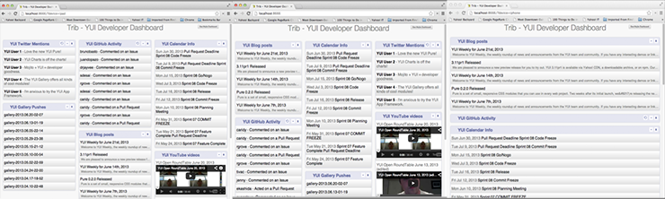

==========================================
9. Handlebars, Templates, and Custom Views
==========================================

.. _09_hb_templates-intro:

Introduction
============

Thanks to the YUI responsive grid, our application adapts nicely to changes to size 
of the browser window. We’re going to go a step further though and serve different pages 
based on the client request. You can configure Mojito to find files based on the request
context and a selector, which is just an identifier that is part of the file name. 
This allows you to have multiple templates that can be served based on the client request. 
We're also going to take advantage of Handlebars helpers and partials to simplify our
templates. 

.. _09_intro-time_est:

Time Estimate
-------------

20 minutes

.. _09_intro-what:

What We’ll Cover
----------------

- selectors - how to define them and how they are used.
- creating multiple templates
- Handlebars helpers
- template partials
- ``Helper`` addon

.. _09_intro-final:

Final Product
-------------

After you finish this module, your application will now have different layouts for
the Web, the iPad, and the iPhone as shown in the screenshot below.

.. _09_intro-before:

Before Starting
---------------

.. _09_intro_before-review:

Review of the Last Module
#########################

We worked on using more sophisticated configuration to have default configurations, 
store key-value pairs, and use contexts. In addition to ``application.json`` that we’ve 
been working with, we introduced ``defaults.json`` and ``definition.json``. We also worked 
with the ``Config`` addon again, this time using the method ``getDefinition``. In short, 
we learned the following:

- defining defaults
- instance configurations
- configurations defined in ``definitions.json``
- context configurations
- configuring YUI
- configuring logging

.. _09_intro_before-setup:

Setting Up
##########

``$ cp -r 08_mojit_adv_config 09_hb_templates``

.. _09_hb_templates-lesson:

Lesson: Selectors and Custom Templates
======================================

.. _09_lesson-selectors:

Selectors
---------

The selector is an arbitrary user-defined string, which is used to select which 
version of each resource to use. The selector is defined in the ``application.json`` 
with the ``selector`` property. Because the selector is a global entity, you cannot 
define it at the mojit level. For example, you cannot define the selector in the
``defaults.json`` of a mojit.

The value of the selector property is a string that must not have a period ('.') 
or slash ('/') in it. In practice, it’s suggested to use alphanumeric and hyphen (‘-‘) 
characters only.

Only one selector can be used in each configuration object identified by the setting 
property, which defines the context. The specified selectors must match the selector 
found in the resource file names. So, for example, the template ``views/index.iphone.hb.html`` 
has the selector ``iphone``.

You can also have controllers that use a selector. For example, your application could 
have all of the following controllers:

- ``controller.common.js``
- ``controller.common.iphone.js``
- ``controller.server.js``
- ``controller.server.iphone.js``

See the `selector Property <../topics/mojito_resource_store.html#selector-property>`_ 
and `Selectors <../topics/mojito_resource_store.html#selectors>`_ for for more information.

.. _09_lesson_selectors-devices:

Devices Recognized By Mojito
############################

.. _09_lesson-devices_supported:

Supported Devices
*****************

Mojito can examine the HTTP header User Agent and detect the following devices/browsers. 
The example templates would be based on selectors defined for each context. For our application, 
we’re only going to be creating templates for the iPhone, iPad, and Android devices in 
addition to ``index.hb.html``.

+-----------------+---------------------------+
| Device/Browser  | Example Template          |
+=================+===========================+
| Opera Mini      | index.opera-mini.hb.html  |
+-----------------+---------------------------+
| iPhone          | index.iphone.hb.html      |
+-----------------+---------------------------+
| iPad            | index.ipad.hb.html        |
+-----------------+---------------------------+
| Android         | index.android.hb.html     |
+-----------------+---------------------------+
| Windows Mobile  | index.iemobile.hb.html    |
+-----------------+---------------------------+
| Palm            | index.palm.hb.html        |
+-----------------+---------------------------+
| Kindle          | index.kindle.hb.html      |
+-----------------+---------------------------+
| Blackberry      | index.blackberry.hb.html  |
+-----------------+---------------------------+

.. _09_lesson-devices_defining:

Defining Selectors
##################

You define selectors in `application.json`. We’re going to associate selectors to 
runtime environments by defining the selector for specific contexts. 

Mojito looks at the HTTP header User-Agent when receiving an HTTP request and will 
then use the appropriate context and selector to choose resources. 

.. code-block:: javascript

   [
     ...,
     {
       "settings": [ "device:android" ], 
       "selector": "android" 
     },
     { 
       "settings": [ "device:ipad" ], 
       "selector": "ipad" 
     },
     {
       "settings": [ "device:iphone" ], 
       "selector": "iphone" 
     }
   ]

Our application is going to change the layout by having Mojito choose
the template based on the context and the associated selector.
 

.. _09_multiple_templates-hb:

Handlebars Helpers and Partials
-------------------------------

Handlebars helpers in Mojito applications are defined and registered in the 
controller. You define a Handlebars helper as a function outside the controller 
namespace in the controller. Thus, the function ``toLinkHelper`` 
shown below can be registered as a helper to create links.

.. code-block:: javascript

   YUI.add('helper', function(Y, NAME) {

     function toLinkHelper(title, url) {
       return "<a href='" + url + "'>" + title + "</a>";
     }
     Y.namespace('mojito.controllers')[NAME] = 
       ...,
       index: function(ac) {
         ...
       }
     };
   }, '0.0.1', {requires: ['mojito', 'mojito-helpers-addon']});

After you have defined the function that will serve as your Handlebars helper, you 
register it with the ``Helpers`` addon. The ``Helpers`` addon has several methods for 
getting helpers, setting mojit-level helpers, or exposing helpers so that they can shared 
with other mojits.

.. _09_multiple_templates-hb_helpers:

Helpers Addon
#############

As we’ve seen with other addons, you need to require the ``Helpers`` addon by adding 
the string ``'mojito-helpers-addon'`` in the ``requires`` array of your controller. 
You also access the addon and its methods through the ``ActionContext`` object.

The ``Helpers`` addon has the following three methods:

- ``expose`` - Exposes a parent mojit’s helper function so that on the server 
  side any child mojit instance under a particular request can use the helper. 
  On the client, any child mojit instance on the page can use the helper.
- ``get`` - Allows you to get a specify helper (if given an argument) or all 
  the helpers if not given any arguments.
- ``set`` - Sets a helper function for a mojit instance. Other mojit instances 
  will not have access to this helper function.

.. _09_multiple_templates-hb_helpers:

Setting Helpers for a Mojit Instance
####################################

You can expose a helper for use with a mojit instance or make it available to all 
mojits. To register the helper ``toLinkHelper`` that 
we defined earlier for the use of this mojit, you use ``ac.helpers.set`` as shown here:

.. code-block:: javascript

   ...
     index: function(ac) {
       var data = {
         modules: [
           {name: "event", user_guide: "http://yuilibrary.com/yui/docs/event/", title: "Event Utility"},
           {name: "node", user_guide: "http://yuilibrary.com/yui/docs/node/",  title: "Node Utility"},
           {name: "base", user_guide: "http://yuilibrary.com/yui/docs/base/", title: "Base" },
           {name: "test", user_guide: "http://yuilibrary.com/yui/docs/test/", title: "YUI Test"},
           {name: "cookie", user_guide: "http://yuilibrary.com/yui/docs/cookie/",  title: "Cookie Utility"},
           {name: "yql", user_guide: "http://yuilibrary.com/yui/docs/yql/", title: "YQL Query"}
         ]
       };
       ac.helpers.set('toLinkHelper', toLinkHelper);
       ac.done({ yui: data, highlighted_module: ac.params.url('module') || "event"});
     }
   ...

In the ``index.hb.html`` template, the helper ``toLinkHelper`` highlights takes as the 
arguments passed to it by ``ac.done`` to create links.

.. code-block:: html

   <ul>
   {{#each yui.modules}}
     <li>{{{toLink title user_guide }}}</li>
   {{/each}}
   </ul>

.. _09_lesson-hb_helpers_global:

Exposing Helpers for Global Use
###############################

To register a helper so that parent mojits can share them with their children, you 
use the ``expose`` method of the ``Helpers`` addon. In the example controller below, the 
``expose`` method registers the helper ``toLinkHelper`` that creates links. In most cases,
you would want this helper to be available to other mojits.

.. code-block:: javascript

   ...
     function toLinkHelper(title, url) {
       return "<a href='" + url + "'>" + title + "</a>";
     }
     index: function(ac) {
       var data = {
         modules: [
           {name: "event", user_guide: "http://yuilibrary.com/yui/docs/event/", title: "Event Utility"},
           {name: "node", user_guide: "http://yuilibrary.com/yui/docs/node/",  title: "Node Utility"},
           {name: "base", user_guide: "http://yuilibrary.com/yui/docs/base/", title: "Base" },
           {name: "test", user_guide: "http://yuilibrary.com/yui/docs/test/", title: "YUI Test"},
           {name: "cookie", user_guide: "http://yuilibrary.com/yui/docs/cookie/",  title: "Cookie Utility"},
           {name: "yql", user_guide: "http://yuilibrary.com/yui/docs/yql/", title: "YQL Query"}
         ]
       };
       ac.helpers.expose('toLink',toLinkHelper);
       ac.done({ yui: data });
     }
   ...

.. _09_lesson-hb_helpers_using:

Using the Helper in the Template
################################

After you define your handler and then register it with the ``Helpers`` addon, you can 
use the handler in your template. In the template ``index.hb.html`` below, the 
Handlebars block helper ``each`` iterates through the objects contained in the array 
``yui.modules``, and then the custom helper ``toLink`` creates links with the values 
of the properties ``title`` and ``user_guide``:

.. code-block:: javascript

   

     <h3>YUI Modules</h3>
     <ul>
     {{#each yui.modules}}
       <li>{{{toLink title user_guide }}}</li>
     {{/each}}
     </ul>
   

.. _09_lesson-partials:

Partials
########

Handlebars partials are simply templates using Handlebars expressions that other 
templates can include. Mojito allows you to have both global (shared by all mojits) 
or local (available only to one mojit) partials depending on the context. Global 
and local partials are used the same way in templates, but the location of the 
partials is different. Data that is available to templates is also available to 
partials.

Now let’s look at the file naming convention, location, and usage of partials 
before finishing up with a simple example.

.. _09_lesson-partials_files:

File Naming Convention
**********************

The file name for partials is similar to templates using Handlebars except ``{partial_name}`` 
replaces ``{controller_function}``: ``{partial_name}.[{selector}].hb.html``

.. _09_lesson-partials_location:

Location of Partials
********************

.. _09_lesson-partials_global:

Global Partials
^^^^^^^^^^^^^^^

``{app_dir}/views/partials``

Thus, the global partial ``foo.hb.html`` in the application ``bar_app`` would be located at
``bar_app/views/partials/foo.hb.html``.

.. _09_lesson-partials_local:

Local Partials
^^^^^^^^^^^^^^

``{app_dir}/mojits/{mojit_name}/views/partials``

Thus, the local partial ``foo.hb.html`` in the mojit ``bar_mojit`` would be located at
``mojits/bar_mojit/views/partials/foo.hb.html``.

.. _09_lesson-partials_using:

Using Partials in Templates
***************************

To use a partial, the template uses the following syntax: ``{{> partial_name}}``

To use the partial ``status.hb.html``, you would included the following in a 
template: ``{{> status }}``

.. _09_lesson-partials_ex:

Example
^^^^^^^

``/my_news_app/views/partials/global_news.hb.html``

.. code-block:: html

   

     <h3>Global News</h3>
     {{global_news_stories}}
   

``/my_news_app/mojits/newsMojit/views/partials/local_news.hb.html``

.. code-block:: html

   

     <h3>Local News</h3>
     {{local_news_stories}}
   

``/my_news_app/mojits/newsMojit/views/index.hb.html``

.. code-block:: html

   

     <h2>Today's News Stories</h2>
     {{> global_news}}
     {{> local_news}}
   

.. _09_hb_templates-create:

Creating the Application
========================

#. After you have copied the application that you made in the 
   last module (see :ref:`Setting Up <09_intro_before-setup>`), change into the application 
   ``09_hb_templates``.
#. Let’s add the contexts with the selectors to ``application.json`` that will identify the templates
   for devices such as the iPad and iPhone. Because of the new configuration objects,
   Mojito will look for the template ``index.iphone.hb.html`` when a request is received from
   an iPhone.

   .. code-block:: javascript

      {
        "settings": [ "device:iphone" ],
        "selector": "iphone"
      },
      {
        "settings": [ "device:ipad" ],
        "selector": "ipad"
      },
   
#. We're going to use a partial for a heading that we use in many of our templates.
   Create the directory ``views/partials``.
#. In the newly created directory, create the partial ``widget_refresh_heading.hb.html`` 
   for heading of those mojits that refresh data with the markup below. It's 
   just a typical HTML file with Handlebars expressions.

   .. code-block:: html
   
      <h3>
        <strong>{{title}}</strong>
        <a title="refresh module" class="refresh" href="#">⟲</a>
        <a title="minimize module" class="min" href="#">-</a>
        <a title="close module" class="close" href="#">x</a>
      </h3>
#. For those mojits that don't refresh data, create the partial ``widget_heading.hb.html``
   with the following that doesn't contain the **refresh** icon:

   .. code-block:: html
   
      <h3>
        <strong>{{title}}</strong>
        <a title="minimize module" class="min" href="#">-</a>
        <a title="close module" class="close" href="#">x</a>
      </h3>

#. Before we go ahead and update the templates to use the partial, we're going to create
   a Handlebars helper in the ``PageLayout`` mojit that will be available to 
   all the other mojits on the page as long as their controllers include the ``mojito-helpers-addon``.
   Update ``mojits/PageLayout/controller.server.js`` with the code below that includes
   a helper that takes four arguments to create links:

   .. code-block:: javascript

      YUI.add('PageLayout', function(Y, NAME) {

        // Handlerbars helper for creating links
        function createLink(title, url, path, css) {
          return "<a href='" + url + path + "'" + " class='" + css + "'>" + title + "</a>";
        }
        Y.namespace('mojito.controllers')[NAME] = {
      
          index: function(ac) {
            // Register helper for use in template
            ac.helpers.expose('linker', createLink);

            var view_type = ac.params.getFromRoute('view_type') || "yui";
            if (view_type === "yui") {
              ac.composite.done({
                title: "Trib - YUI Developer Dashboard",
                button_text: "See Mojito Dashboard",
                other: "/mojito"
              });
            } else if (view_type === "mojito") {
              ac.composite.done({
                title: "Trib - Mojito Developer Dashboard",
                button_text: "See YUI Dashboard",
                other: "/"
              });
            }
          }
        };
      }, '0.0.1', {requires: ['mojito','mojito-composite-addon', 'mojito-params-addon', 'mojito-helpers-addon']});

#. Now let's start updating the templates to use the partials and helper. Starting with the
   template for the ``PageLayout`` mojit, which uses the helper, but not a partial:

   .. code-block:: html

      

        <h1>{{title}}</h1>
        {{{linker button_text "" other "yui3-button swap"}}}
        

          {{{header}}}
        

        

          {{{body}}}
        

        

          {{{footer}}}
        

      

#. We're going to update our templates so that they use the partials we just created.
   The syntax for using the partial is ``{{> partial_name}}``. Go ahead and replace the 
   contents of ``mojits/Blog/views/index.hb.html`` with the following:

   .. code-block:: html
    
      

        

          {{> widget_heading}}
          

            <ul>
            {{#results}}
              <li>
                {{{linker title link}}}
                {{description}}
              </li>
            {{/results}}
            </ul>
          

        

      

#. Again, do the same for ``mojits/Calendar/views/index.hb.html``. We don't use the 
   Handlebars helper to create links because of the complicated data structure needed
   to create the links.
 
   .. code-block:: html

      

        

          {{> widget_heading}}
          

            <ul>
            {{#results}}
              <li>{{#entry}}{{#summary}}{{content}}{{/summary}}<a href="{{#link}}{{href}}{{/link}}" title="{{#title}}{{content}}{{/title}}">{{#title}}{{content}}{{/title}}</a>{{/entry}}</li>
            {{/results}}
            </ul>
          

        

      

#. And for the ``Gallery`` template (``mojits/Gallery/views/index.hb.html``):

   .. code-block:: html

      

        

          {{> widget_heading}}
          

            <ul>
            {{#results}}
              {{#json}}
                <li><a href="http://yuilibrary.com/gallery/buildtag/{{.}}">{{.}}</a></li>
              {{/json}}
            {{/results}}
            </ul>
          

        

      

#. And for the ``Youtube`` template (``mojits/Youtube/views/index.hb.html``):

   .. code-block:: html

      

        

          {{> widget_heading}}
          

            <ul>
            {{#results}}
              <li>
                
{{#title}}{{content}}{{/title}}

                <iframe
                        class="youtube-player"
                        type="text/html"
                        width="320"
                        height="130"
                        src="http://www.youtube.com/embed/{{id}}?html5=1" allowfullscreen frameborder="0">
                </iframe>
              </li>
           {{/results}}
           </ul>
         

       

     

#. The ``Twitter`` and ``Github`` mojits will use the partial with the **refresh** button. 
   We're not using the ``linker`` helper because the binders will be refreshing the content and
   won't have access to the helper unless it invokes the parent mojit ``PageLayout``. 
   Add the partials to the templates with the following:

   ``mojits/Twitter/views/index.hb.html``:
 
   .. code-block:: html

      

        

          {{> widget_refresh_heading}}
          

            <ul>
              {{#results}}
                  <li><strong><a href="http://twitter.com/{{from_user}}">{{from_user}}</a></strong> - {{text}}</li>
              {{/results}}
            </ul>
          

        

      

   ``mojits/Github/views/index.hb.html``:

   .. code-block:: html

      

        

          {{> widget_refresh_heading}}
          

            <ul>
            {{#results}}
              <li><a href="http://github.com/{{username}}">{{username}}</a> - <a href="{{link}}">{{message}}</a></li>
            {{/results}}
            </ul>
          

        

      

#. The use of partials just made our templates cleaner. Now we're going to create templates
   with different selectors so Mojito can render the appropriate ones depending
   on the device making an HTTP request. Notice that the layout changes for each.

   ``mojits/Body/views/index.ipad.hb.html``

   .. code-block:: html

      

        <h4 class="bodytext">{{title}}</h4>
        

          

            {{{twitter}}}
            {{{gallery}}}
          

          

            {{{github}}}
            {{{blog}}}
          

          

            {{{calendar}}}
            {{{youtube}}}
          

        

      

   **mojits/Body/views/index.iphone.hb.html**

   .. code-block:: html

      

        <h4 class="bodytext">{{title}}</h4>
        

          {{{blog}}}
          {{{github}}}
          {{{calendar}}}
          {{{gallery}}}
          {{{twitter}}}
          {{{youtube}}}
        

      

#. Okay, before we start the application, you're going to need to add the ``mojito-helpers-addon``
   to the mojits that are using the helper: ``Blog``, ``Gallery``, ``Github``, and ``Twitter``.
#. Now fire her up. You won't see much of a difference in the look of the application,
   but your templates are smaller and cleaner because of the partials and helper.
#. Append the query string parameter ``?device=iphone`` to the URL. You should see a 
   different layout for the iPhone. Try the same using ``?device=ipad``. 

.. _09_hb_templates-summary:

Summary
=======

In this module, we discussed how to create custom templates, use more advanced
features of Handlebars, and configure Mojito to select templates based
on the context. As for the details, we went over the following topics:

- selectors - how to define them and how they are used.
- creating multiple templates
- Handlebars helpers
- template partials
- ``Helpers`` addon

.. _09_hb_templates-ts:

Troubleshooting
===============

Error: The partial ... could not be found
-----------------------------------------

If your partial could not be found, make sure that the partials are in
the ``partials`` directory and that the partial name is correct in the Handlebars
expression in your template.

Error: Could not find property 'linker'
---------------------------------------

This error can be the result of a few problems. First, check to see that
the controller of the ``PageLayout`` mojit has declared the function ``createLink``
outside of the controller namespace (``Y.namespace('mojito.controllers')``), has
exposed the ``linker`` function to other mojits using the ``Helper`` addon method
``ac.helpers.expose('linker', createLink)``, and that the mojits that are using
the helper have required the ``Helpers`` addon.

.. _09_hb_templates-qa:

Q&A
===

- Can other template engines be used in Mojito applications?

  Yes, you can create a view engine addon that uses a library to render templates into
  HTML. See `View Engines <../topics/mojito_extensions.html#view-engines>`_ for general
  information and
  `Creating and Using a View Engine Addon <../code_exs/view_engines.html>`_ for 
  implementation details.

- Is there a way to change the default directory structure of a Mojito application 
  through configuration?

  You can configure the directories where Mojito looks for mojits and route configuration
  files with the properties ``mojitDirs``, ``mojitsDirs``, and ``routesFiles``. See
  the descriptions of those properties in the `configuration Object <../intro/mojito_configuring.html#configuration-object>`_.
  
- Is there a way to use middleware in Mojito?

  Yes, you can use middleware in Mojito applications although we don't cover it in this
  tutorial. See the `Middleware <../topics/mojito_extensions.html#middleware>`_ section
  for how to set up your files and configure your application to use custom middleware.

.. _109_hb_templates-test:

Test Yourself
=============

.. _09_test-questions:

Questions
---------

- How do you register Handlebars helpers in Mojito applications?
- Where do you place global partials?
- How do you configure Mojito to select the right template when receiving requests
  from different devices?

.. _09_test-exs:  

Additional Exercises
--------------------

- Create local partials for two of your mojits.
- Add a Handlebars helper to one of the child mojits and use it only for that mojit.
- Try using a different view engine for the application. 
  Follow the instructions in `Creating and Using a View Engine Addon <../code_exs/view_engines.html>`_ for 
  first before trying it.

.. _09_hb_templates-terms:

Terms
=====

- `Handlebars <http://handlebarsjs.com/>`_
- `Handlebars helpers <http://handlebarsjs.com/#helpers>`_
- **Handlebars partials** - Templates using Handlebars expressions that other templates can 
  include. 
- **selectors** - The version of the resource. A resource is either a file to Mojito or 
  metadata to the `Resource Store <../topics/mojito_resource_store.html>`_. For example, 
  ``"selector": "iphone"`` would configure the Resource Store to find resources with the 
  identifier iphone such as ``index.iphone.hb.html``.

.. _09_hb_templates-src:

Source Code
===========

`09_hb_templates <http://github.com/yahoo/mojito/examples/dashboard/09_hb_templates>`_

.. _09_hb_templates-reading:

Further Reading
===============

- `Views <../intro/mojito_mvc.html#views>`_
- `Code Examples: Views <../code_exs/views.html>`_
- `Selectors <../topics/mojito_resource_store.html#selectors>`_
- `selector Property <../topics/mojito_resource_store.html#selector-property>`_

