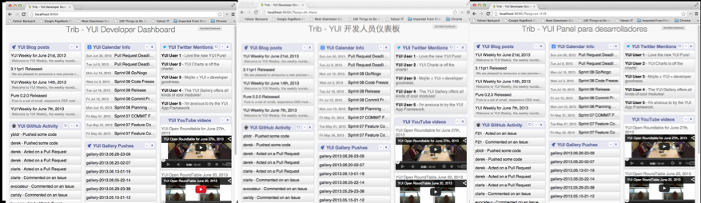

===============================
10. Localizing Your Application
===============================

.. _10_localization-intro:

Introduction
============

Because Mojito is built with YUI, which has an internationalization utility, localizing 
Mojito applications is fairly straightforward and easy. In this module, we’re just going 
to localize the title of our dashboard to show you how you would localize your own 
applications. In a nutshell, you provide localized strings, Mojito determines the 
language environment of the client, and you apply the correct localized string with an 
addon from your controller. 

.. _010_intro-time_est:

Time Estimate
-------------

15 minutes

.. _10_intro-what:

What We’ll Cover
----------------

We’re going to cover how to store localized strings and how to use the addon to access
those localized strings for a given language environment. We’ll also discuss the ways 
that Mojito detects the language environment of the client. 

- creating YUI resource bundles for your mojits
- using the ``Intl`` addon to get a localized string
- specifying the `BCP 47 language tags <http://tools.ietf.org/html/bcp47>`_. BCP 47 is 
  currently the combination of `RFC 5646 <http://tools.ietf.org/html/rfc5646>`_ and 
  `RFC 4647 <http://www.ietf.org/rfc/rfc4647.txt>`_
- understanding how Mojito determines the language environment

.. _10_intro-final:

Final Product
-------------

In the screenshot, you can see that our dashboard has three localized pages: English, 
simplified Chinese, and Spanish. Our application only localizes the title of the page,
but more importantly, you'll learn how to localize your own applications in the future.

..  _10_intro-before:

Before Starting
---------------

..  _10_intro_before-review:

Review of the Last Module
#########################

In the last module, we discussed how to create custom templates, Handlebars partials,
and Handlebars helpers in Mojito. We also looked at how to configure Mojito to select 
templates based on the context. In short, we looked at these topics:

- selectors 
- templates for different devices
- Handlebars helpers
- template partials
- ``Helpers`` addon

..  _10_intro_before-setup:

Setting Up
##########

``$ cp -r 09_hb_templates 10_localization``

.. _10_localization-lesson:

Lesson: Localizing Applications
===============================

Mojito lets you localize applications by detecting the language environment of 
the client environment and then using the the YUI Internationalization utility 
to dynamically retrieve localized strings.  Although Mojito does the work of 
detecting the language environment of the client, your application still needs 
resource bundles that contain localized strings and the ``Intl`` addon, which uses 
the YUI Internalization utility to fetch the correct localized string. The YUI 
Internationalization utility uses the ``Intl.lookupBestLang`` method to determine 
the best language based on an application’s request and a module’s language 
support.

We’re going to first look at the resource bundle files and then show how to 
use the ``Intl`` addon to access the localized strings in those files.

.. _10_lesson-rs_bundle:

Resources Bundles for Languages
-------------------------------

The resource bundle is simply a JavaScript file containing a YUI module that 
registers a new module and maps a BCP language tag to key-value pairs. BCP 47 
language tags are the identifiers for languages used on the Internet. BCP stands 
for IETF Best Current Practice, and BCP 47 is currently the combination of RFC 
5646 and RFC 4647. 

.. _10_rs_bundle-location:

Location
########

These resource bundles are placed in the ``lang`` directory of the mojit. For example, 
we’ll be using resource bundles for the ``PageLayout`` mojit, so the resource bundles 
should be in the following directory: ``mojits/PageLayout/lang``

.. _10_rs_bundle-name:

Naming Syntax
#############

.. _10_rs_bundle-file:

File Names
**********

For Mojito to find the the correct resource bundle file for a language, the 
files should use the following naming convention:

``{mojit_name}_{BCP 47 tag}.js``

.. _10_rs_bundle-module:

YUI Module Name
***************

The language resource files, as we’ve said, are YUI modules. You register the 
module name with ``YUI.add``. Thus, for the ``PageLayout`` mojit, the resource bundle file 
will be ``PageLayout_zh-Hans.js``.

.. _10_rs_bundle-register:

Registering Modules and Resource Bundles
########################################

The YUI module name of your language bundle is registered like other modules with 
``YUI.add``. For example, the resource bundle for simplified Chinese in our 
``PageLayout``, would use the following to register the module:

.. code-block:: javascript

   YUI.add('lang/PageLayout_zh-Hans.js'), function(Y) {
     ...
   }, "3.1.0", {requires: ['intl']});

The resource bundle is registered with the mojit name and the BCP 47 name tag. 
Using the same resource bundle file, we register the resource bundle using the 
following:

.. code-block:: javascript

   Y.Intl.add(
     "PageLayout",  // associated module
     "zh-Hans",    // BCP 47 language tag
     // key-value pairs for this module and language
     {
       YUITitle: "Trib - YUI 开发人员仪表板",
       MojitoTitle: "Trib - Mojito 开发人员仪表板"
     }
   );

For those who don’t read simplified Chinese, the localized strings that we 
registered are simply the translations of "Trib - YUI Dashboard" and 
"Trib - Mojito Dashboard".

.. _10_intl_addon-require:

Requiring the Intl Addon
########################

We saw that the resource bundle was registered with ``Y.Intl.add``. To use the ``intl`` 
module, you need to require it as shown below:

.. code-block:: javascript

   }, "3.1.0", {requires: ['intl']});

.. _10_rs_bundle-ex:

Example Resource Bundle
#######################

Let’s look at the completed version of the resource bundle ``FrameMojit_zh-Hans.js``:

.. code-block:: javascript

   YUI.add("lang/FrameMojit_zh-Hans", function (Y) {
     Y.Intl.add(
       "FrameMojit",  // associated module
       "zh-Hans",    // BCP 47 language tag
       // key-value pairs for this module and language
       {
         YUITitle: "Trib - YUI 开发人员仪表板",
         MojitoTitle: "Trib - Mojito 开发人员仪表板"
       }
     );
   }, "3.1.0", {requires: ['intl']});

.. _10_intl_addon-using:

Using the Intl Addon to Access Resource Bundle
##############################################

The controller accesses the YUI ``intl`` module through the ``Intl`` addon, which is 
required like other addons. The ``Intl`` addon has methods to get localized 
strings from the resource bundles and to format dates. In the 
``controller.server.js`` file below, ``ac.intl.lang`` gets the localized 
string from resource bundles.

.. code-block:: javascript

   ...
     index: function (ac) {
       var view_type = ac.params.getFromRoute('view_type') || "yui";    
       if (view_type === "yui") {
         ac.composite.done({
           title: ac.intl.lang("YUITitle"),
           button_text: "See Mojito Dashboard",
           other: "/mojito"
         });
       } else if (view_type === "mojito") {
         ac.composite.done({
           title: ac.intl.lang("MojitoTitle"),
           button_text: "See YUI Dashboard",
           other: "/"
         });
       }
     }
   ...

.. _10_lang_env-determine:

How Mojito Determines the Language Environment
##############################################

When running on the client side, YUI can detect the browser settings to select 
the default translation and date format. On the server, the preferred language 
and date format is determined by HTTP header from the client and the order of 
languages listed in the mojit controller.

Fortunately, Mojito lets you configure applications to run on either the server 
or client side. Because this code example illustrates how to localize your 
application, we want to configure Mojito to run the application on the client 
to improve the chances of serving content in the user’s preferred language and 
date format.

.. _10_localization-create:

Creating the Application
========================

#. After you have copied the application that you made in the last module 
   (see :ref:`Setting Up <10_intro_before-setup>`), change into the application 
   ``10_localization``.
#. First let's add the ``lang`` directory to the ``PageLayout`` mojit.
#. In the ``lang`` directory, create the language resource bundle files 
   ``PageLayout_en-US.js``, ``PageLayout_es-419.js``, and ``PageLayout_zh-Hans.js``
   with the content below. Notice that the YUI registered name is the same as the
   directory and file, the inclusion of the ``intl`` module, and the registration
   of the language bundle with ``Y.Intl.add``.

   ``PageLayout_en-US.js``

   .. code-block:: javascript

      YUI.add("lang/PageLayout_en-US", function (Y) {
        Y.Intl.add(
          "PageLayout",  // associated module
          "en-US",    // BCP 47 language tag
          // key-value pairs for this module and language
          {
            YUITitle: "Trib - YUI Developer Dashboard",
            MojitoTitle: "Trib - Mojito Developer Dashboard"
          }
        );
      }, "3.1.0", {requires: ['intl']});

   ``PageLayout_es-419.js``

   .. code-block:: javascript

      YUI.add("lang/PageLayout_es-419", function (Y) {
        Y.Intl.add(
          "PageLayout",  // associated module
          "es-419",    // BCP 47 language tag
          // key-value pairs for this module and language
          {
            YUITitle: "Trib - YUI Panel para desarrolladores",
            MojitoTitle: "Trib - Mojito Panel para desarrolladores"
          }
        );
      }, "3.1.0", {requires: ['intl']});

   ``PageLayout_zh-Hans.js``

   .. code-block:: javascript

      YUI.add("lang/PageLayout_zh-Hans", function (Y) {
        Y.Intl.add(
         "PageLayout",  // associated module
         "zh-Hans",    // BCP 47 language tag
         // key-value pairs for this module and language
         {
           YUITitle: "Trib - YUI 开发人员仪表板",
           MojitoTitle: "Trib - Mojito 开发人员仪表板"
         }
       );
     }, "3.1.0", {requires: ['intl']});

#. The controller of the ``PageLayout`` mojit will use the ``Intl`` addon to access
   the values of the registered language bundlers. Update the ``index`` method
   of the controller with the following:

   .. code-block:: javascript

      index: function(ac) {
        // Register helper for use in template
        ac.helpers.expose('linker', createLink);

        var view_type = ac.params.getFromRoute('view_type') || "yui";
        if (view_type === "yui") {
          ac.composite.done({
            title: ac.intl.lang("YUITitle"),
            button_text: "See Mojito Dashboard",
            other: "/mojito"
          });
        } else if (view_type === "mojito") {
          ac.composite.done({
            title: ac.intl.lang("MojitoTitle"),
            button_text: "See YUI Dashboard",
            other: "/"
          });
        }
      }

#. Also, require the ``Intl`` addon by adding the string ``mojito-intl-addon`` to the
   ``requires`` array.
#. Since this is our final application, let's put a little polish on the presentation
   with background images, favicons, and CSS. Copy the following images to the specified
   location:

   - `/assets/favicon.ico <https://github.com/yahoo/mojito/blob/develop/examples/developer-guide/dashboard/trib/assets/favicon.ico>`_ to ``10_localization/assets/``
   - `/assets/images/dust.png <https://github.com/yahoo/mojito/blob/develop/examples/developer-guide/dashboard/trib/assets/images/dust.png>`_ to ``10_localization/assets/images/``
   - `/mojits/Blog/assets/favicon.ico <https://github.com/yahoo/mojito/blob/develop/examples/developer-guide/dashboard/trib/mojits/Blog/assets/favicon.ico>`_ to ``10_localization/mojits/Blog/assets/``
   - `/mojits/Blog/assets/favicon-blog.png <https://github.com/yahoo/mojito/blob/develop/examples/developer-guide/dashboard/trib/mojits/Blog/assets/favicon-blog.png>`_ to ``10_localization/mojits/Blog/assets/``
   - `/mojits/Calendar/assets/favicon-calendar.ico <https://github.com/yahoo/mojito/blob/develop/examples/developer-guide/dashboard/trib/mojits/Calendar/assets/favicon-calendar.ico>`_ to ``10_localization//mojits/Calendar/assets``
   - `/mojits/Calendar/assets/favicon-calendar.png <https://github.com/yahoo/mojito/blob/develop/examples/developer-guide/dashboard/trib/mojits/Calendar/assets/favicon-calendar.png>`_ to ``10_localization//mojits/Calendar/assets``
   - `/mojits/Twitter/assets/favicon.ico <https://github.com/yahoo/mojito/blob/develop/examples/developer-guide/dashboard/trib/mojits/Twitter/assets/favicon.ico>`_ to ``10_localization/mojits/Twitter/assets/``
   - `/mojits/Twitter/assets/favicon-twitter.png <https://github.com/yahoo/mojito/blob/develop/examples/developer-guide/dashboard/trib/mojits/Twitter/assets/favicon-twitter.png>`_ to ``10_localization/mojits/Twitter/assets/``
   - `/mojits/Gallery/assets/favicon-blog.png <https://github.com/yahoo/mojito/blob/develop/examples/developer-guide/dashboard/trib/mojits/Gallery/assets/favicon-blog.png>`_ to ``10_localization/mojits/Gallery/assets/``
   - `/mojits/Github/assets/favicon-github.png <https://github.com/yahoo/mojito/blob/develop/examples/developer-guide/dashboard/trib/mojits/Github/assets/favicon-github.png>`_ to ``10_localization/mojits/Github/assets/``

#. We're going to update the CSS for some mojits as well so that the images and styles are used.
   Add the code to the file ``/mojits/Blog/assets/index.css``:

   .. code-block:: html

      #blog h3 strong {
        background-image: url(/static/Blog/assets/favicon-blog.png);
      }

#. For the following CSS files, just replace the content with the code below:

   ``/mojits/Calendar/assets/index.css``

   .. code-block:: html

      #calendar h3 strong {
        background-image: url(/static/Calendar/assets/favicon-calendar.png);
      }
      #calendar .inner li {
        white-space: nowrap;
        text-overflow: ellipsis;
        overflow: hidden;
      }
      #calendar .inner li span {
        padding-right: 4px;
        font-size: .8em;
        display: inline-block;
        width: 106px;
        max-width: 7.6 em;
        overflow: hidden;
      }

   ``/mojits/Gallery/assets/index.css`` 

   .. code-block:: html 

      #gallery h3 strong {
        background-image: url(/static/Gallery/assets/favicon-blog.png);
      }

   ``/mojits/Github/assets/index.css`` 
 
   .. code-block:: html

      #github h3 strong {
        background-image: url(/static/Github/assets/favicon-github.png);
      }

   ``/mojits/Twitter/assets/index.css``

   .. code-block:: html

      #twitter h3 strong {
        background-image: url(/static/Twitter/assets/favicon-twitter.png);
      }

#. Launch your application to see the application in its more finished form.
#. To view the localized title in Chinese for the dashboard, add the query string parameter
   ``?lang=zh-Hans`` to the URL and refresh the page. You can see the title in Spanish 
   as well with the query string parameter ``?lang=es-419``.
#. Let's add a functional test to test for a localized title as well. Create the test file
   ``arrow_tests/test_zh-Hans_title.js`` with the following content:

   .. code-block:: javascript

      YUI({
        useConsoleOutput: true,
        useBrowserConsole: true,
        logInclude: { TestRunner: true }
        }).use('node', 'node-event-simulate', 'test', 'console', function (Y) {

        'use strict';
        var suite = new Y.Test.Suite("TribApp: Localization Test"),
            url = window.location.protocol + "//" + window.location.host + "/";
        suite.add(new Y.Test.Case({
          "test localized title": function () {
            Y.Assert.areEqual("Trib - YUI 开发人员仪表板", Y.one('body h1').get('innerHTML'));
          }
        }));
        Y.Test.Runner.add(suite);
      });
#. Add the test scenario below after the first scenario specified in the ``scenario`` 
   array in the test descriptor as well.

   .. code-block:: javascript
      {
        "test" : "test_yui_dashboard.js",
        "page" : "$$config.baseUrl$$"
      },
      {
        "test" : "test_zh-Hans_title.js",
        "page": "$$config.baseUrl$$?lang=zh-Hans"
      },
      ...
#. Go ahead and run the functional tests again. You should see an additional test case
   passing.
#. Congratulations, you have completed all of the modules in this tutorial. There is still
   more to learn about Mojito, but you should have a strong grasp of the basics that you
   can build on. If you haven't already, be sure to read the `documentation <../>`_ and  
   work through the `code examples <../code_exs/>`_.

.. _10_localization-summary:

Summary
=======

Our topic was a bit more focused in this module. We added localization support for
three languages for the application heading using the ``Intl`` addon and resource bundles.
To do this we had to learn the following:

- creating resource bundles
- adding the ``Intl`` addon to our controller
- using the ``Intl`` addon to access the localized strings in the resource bundles

.. _10_localization-ts:

Troubleshooting
===============

Wrong language being displayed
------------------------------

Make sure that in the resource bundle file, the BCP 47 language tag has been
passed to ``Y.Intl.add`` and that the language tag matches the tag appended
to the module and file name. For example, the file ``PageLayout_zh-Hans.js`` should
register the module ``"lang/PageLayout_zh-Hans"``, and the language tag ``"zh-Hans"``
should be passed to ``Y.Intl.add``.

Cannot call method 'lang' of undefined
--------------------------------------

This error may look familiar. The ``lang`` namespace is undefined because you
have not required the ``Intl`` addon by adding the string ``mojito-intl-addon`` to
the ``requires`` array.

.. _10_localization-qa:

Q&A
===

- Can you create a global resource bundle that all mojits can use?

  No, the resource bundle has to be associated with a YUI module. Each mojit
  is registered as a YUI module that can then be associated with a resource bundle.
  
- Can the ``Intl`` addon format dates for a given language environment?

  Yes, although we didn't use it in our application, the ``Intl`` addon has the method
  ``formatData`` that will format dates for you. Again, 
  Mojito is relying on YUI (the YUI module ``datatype-date``) to do this for you.

.. _10_localization-test:

Test Yourself
=============

.. _10_test-questions:

Questions
---------

- What addon is used for localization and what YUI modules does it rely on?
- What are the three arguments that need to be passed to ``Y.Intl.add``?
- What is the language tag recognized by Mojito?

.. _10_test-additional_exs:

Additional Exercises
--------------------

- Write functional tests for the languages ``es-419`` and ``en-US``.
- Add a resource bundle file for German to your ``PageLayout`` mojit so that the 
  title can be localized in German.
- Add a ``lang`` directory and resource bundles to the ``Footer`` mojit that localizes
  the string for the copyright message assigned to the ``title`` property.

.. _10_localization-terms:

Terms
=====

- `BCP 47 language tags <http://tools.ietf.org/html/bcp47>`_
- **resource bundle** - Files that provide resources to YUI modules. In the case of
  localization, we are using language resource bundles that associates a BCP 47 language 
  tag and localized strings to the YUI module that can access it.

.. _10_localization-src:

Source Code
===========

`10_localization <https://github.com/yahoo/mojito/tree/develop/examples/developer-guide/dashboard/10_localization>`_
`trib <https://github.com/yahoo/mojito/tree/develop/examples/developer-guide/dashboard/trib>`_

.. _10_localization-reading:

Further Reading
===============

- `Internationalization <http://yuilibrary.com/yui/docs/intl/>`_
- `Internationalizing Your Application <../code_exs/i18n_apps.html>`_

