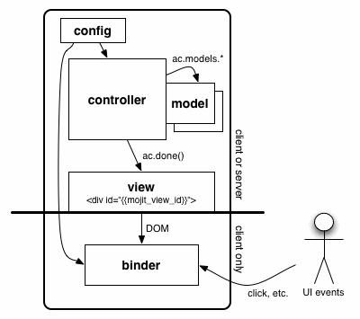

===================
Mojito Applications
===================

Mojito allows developers to use a combination of configuration and an MVC 
architecture to create applications. Because client and server components 
are both written in JavaScript, Mojito can run on the client (browser) or 
the server (Node.js). The figure below shows the MVC architecture of Mojito 
and what components can run on the client/server or just the client.

.. _mojito_apps-overview:

Overview
========

Mojito applications contains JSON configuration files and directories for 
storing JavaScript, HTML, and CSS. The configuration files can be used to 
define relationships between code components, assets, routing paths, defaults 
and are available at the application and mojit level. The directory structure 
of a Mojito application reflects the MVC architecture and separates resources, 
such as assets, libraries, middleware, etc.

To create a Mojito application, you use the command-line tool ``mojito``. When 
the command below is run, Mojito creates a directory structure with files for 
configuration and other directories for CSS and mojits.

``$ mojito create app <mojito_app>``

Mojito applications can have one or more mojits. Mojits are the basic unit of 
composition and reuse in a Mojito application. They consist of Javascript and 
markup, and follow the MVC pattern. You can think of mojits as the engines 
that create the rectangular areas of a page.

To create a mojit, you run the command below from the application directory, 
which creates another directory structure and files that include the mojit 
controller, model, binder, and view.

``$ mojito create mojit <mojito_app>``

.. _mojito_apps-files_dirs:

Application Files and Directories
=================================

Each Mojito application contains configuration files and directories for mojits 
and assets.

The principal files and directories of a Mojito application are listed below are 
globally available to all mojits. Those marked with an asterisk are not created by default.

- ``addons``\* - directory containing additional addons for Mojito.
- ``assets`` - general directory containing CSS files for all mojits.
- ``application.json`` - application configuration file that lets you specify 
  the port and the mojits used by the application.
- ``default.json``\* - file that sets default values for all specifications.
- ``index.js`` - file providing integration with a cloud-based environment 
  where Mojito applications can run.
- ``mojits`` - directory storing the mojits. See `Mojit Files and Directories`_ 
  for a description of the directory contents.
- ``package.json`` - configuration file for deploying the application.
- ``routes.json`` - (deprecated) configuration file for mapping routing paths to actions.
- ``yui_modules``\* - directory of JavaScript files that contain YUI modules added 
  with ``YUI.add``. These files are automatically included if required by a 
  YUI module.

.. _mojito_apps-mojits:

Mojits
======

Mojits are the basic unit of composition and reuse in a Mojito application. 
This section covers the details of the files and directories contained in a 
mojit. To get an overview about mojits and learn about their architecture and 
structure, see `Mojits <mojito_mojits.html>`_. 

.. _mojito_apps_mojits-files:

Mojit Files and Directories
---------------------------

When you create a mojit, a directory structure containing template files is 
auto-generated. The template files are for the model, views, controller, tests, 
and configuration.

The principal directories and template files are listed below with a short 
description. Those marked with an asterisk are not created by default. The 
allowed values for ``{affinity}`` are ``client``, ``common``, and ``server``. 
The `affinity <../reference/glossary.html>`_ specifies where the resource 
is available. 

- ``actions`` - directory of JavaScript files containing methods to add to the 
  controller. Actions are useful for maintaining large controllers.
- ``assets`` - directory for storing CSS or JavaScript files.
- ``yui_modules`` - directory containing JavaScript files that contain YUI 
  modules added with ``YUI.add``. These files are automatically included if required by a 
  YUI module. Both the application directory and mojit directory can have ``yui_modules`` 
  directories.
- ``binders`` - directory containing event binding files for the mojit.
- ``controller.server.js`` - the mojit controller that runs on the server. You 
  can also create the file ``controller.client.js`` to have a mojit controller 
  that runs on the client or the file ``controller.common.js`` that can run 
  on the client or server.
- ``models`` - directory containing the model scripts.

   - ``model.server.js`` - default model that runs on the server. You can also 
     create the file ``model.client.js`` that runs on the client or 
     ``model.common.js`` that can run  on either the client or server. Models 
     can be given names as well, such as ``{model_name}.server.js``.
- ``tests`` - directory containing the controller, model, and YUI module unit tests. 
  The structure of ``tests`` mirrors its parent mojit's directory structure.

   - ``controller.{affinity}-tests.js`` - the unit tests for the mojit 
     controllers.
   - ``{model_name}.{affinity}-tests.js`` - the unit tests for the mojit 
     models.
   - ``{module_name}.{affinity}-tests.js`` - the unit tests for YUI modules, 
     which are located in ``mojits/{mojit_name}/yui_modules`` directory.
   - Example of module and corresponding test:
   - ``{app_name}/mojits/{mojit_name}/yui_modules/{module_name}.{affinity}.js``

- ``{app_name}/mojits/{mojit_name}/tests/yui_modules/{module_name}.{affinity}-tests.js``

- ``views`` - directory containing the templates.

   - ``index.hb.html`` - the default template for the mojit. You can create other 
     templates that get content from functions in the mojit controllers.

.. _mojito_apps-dir_struct:

Application Directory Structure
===============================

The following shows the directory structure of a Mojito application that 
has one mojit. The allowed values for ``{affinity}`` are ``client``, 
``common``, and ``server``. The `affinity <../reference/glossary.html>`_ 
specifies where the resource is available. The ``{view_engine}`` is the 
engine that renders tags used in a templating system. For example, the value 
``hb`` in ``index.hb.html`` instructs Mojito to use the Handlebars 
rendering engine.

::

   [mojito_app]/
   |-- application.json
   |-- assets/
   |   `-- favicon.icon
   |-- yui_modules/
   |   `-- *.{affinity}.js
   |-- index.js
   |-- mojits/
   |   `-- [mojit_name]
   |       |-- assets/
   |       |-- yui_modules/
   |       |   `-- *.{affinity}.js
   |       |-- binders/
   |       |   `-- {view_name}.js
   |       |-- controller.{affinity}.js
   |       |-- defaults.json
   |       |-- definition.json
   |       |-- lang/
   |       |   `-- {mojit_name}_{lang}.js
   |       |-- models/
   |       |   `-- {model_name}.{affinity}.js
   |       |-- tests/
   |       |   |-- yui_modules/
   |       |   |   `-- {module_name}.{affinity}-tests.js
   |       |   |-- controller.{affinity}-tests.js
   |       |   `-- models/
   |       |      `-- {model_name}.{affinity}-tests.js
   |       `-- views/
   |           |-- {view_name}.{view_engine}.html
   |           `-- {view_name}.{device}.{view_engine}.html
   |-- package.json
   |-- routes.json (deprecated)
   |-- server.js

