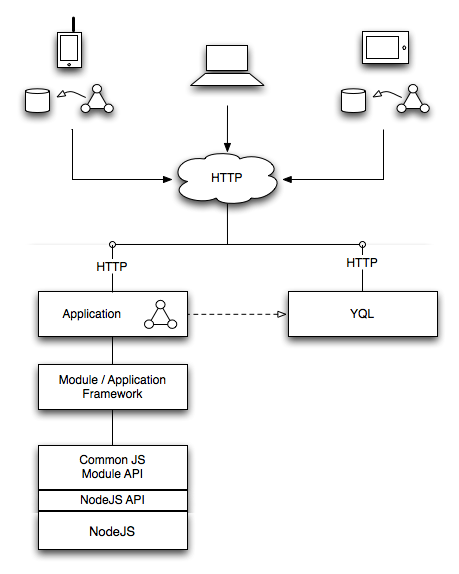
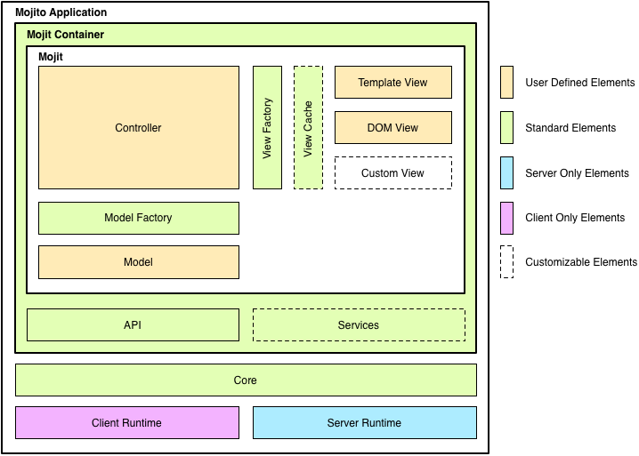
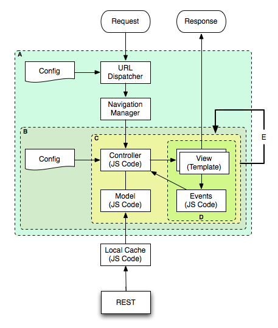

===================
Mojito Architecture
===================

.. role:: raw-html(raw)
   :format: html

This chapter attempts to give you a general understanding of the architecture of
the Mojito Framework. Our hope is that having a better understanding of how the
pieces work together and what role they play will help you design, build, and
debug your Mojito applications more effectively.

.. _mj_arch-overview:

Overview
========

Before looking at the details of Mojito, let's take a look at how Mojito
fits in the Web application world. In the diagram below, the triangular symbol
formed with three circles represents the Mojito MVC core; the circles represent 
the model, view, and controller. This common MVC core executes across devices 
and on both client and server and is one of the key elements which gives Mojito 
its power. As the diagram illustrates, Mojito runs on various clients, uses 
HTTP for all client-server communication, and typically accesses data with the 
Yahoo Query Language (YQL) due to its power, ease-of-use, and ability to run 
from either the client or server.

  

:raw-html:` `

.. _overview-clients:

Clients and Runtimes
====================

Mojito was designed with the goal of running in multiple runtime environments
and supporting online and offline experiences. The following are the supported
client/runtime environments:
                
- **Mobile browser:** - supports an HTML-based online experience and may also 
  support an HTML5-based offline experience.
- **Desktop browser:** - assumed to be always connected and support an 
  HTML-based online experience.
- **Native client:** - deployed as packaged applications, wrapping native 
  chrome around an HTML5-based experience.
  
.. _overview-apps:  

Mojito Applications
===================

A Mojito application is, quite simply, a set of module/widget components 
(called mojits) bound together with one or more JSON configuration files 
which describe the application model, view, and controller code used depending 
on context. A Mojito application is packaged to be distributed and deployed 
as a unit, and as such, it is deployment-independent. The mojits used by an 
application may be included directly within the package or may be included 
by reference from a cloud-based repository.

See also `Mojito Applications <./mojito_apps.html>`_ for a more in-depth
discussion.

.. _overview-data:

Data
====

To support seamless operation and migration of components between client and
server, Mojito application data is typically obtained with YQL. In most cases,
your data will be requested and processed in some way before it is presented to
the user. JSON is expected to be by far the most prevalent format for data
retrieved from YQL.

.. _mj_arch-framework:

Mojito Framework
================

The Mojito Framework consists of both module-level and application-level framing,
which taken together provide the infrastructure upon which applications are
built. Mojito framing includes the base component framework, the event system,
and management of navigation, views, and configuration. Mojito is built directly
on top of YUI and can be considered an extension of it.

At the bottom of the stack, for the purposes of this discussion at least, is an
implementation of the Node.js API. We use the Node.js API as the definition of an
abstraction below, which we may elect to deploy Node.js or an alternative
implementation built atop another server-side JavaScript container.

This diagram shows the relationships among the Mojito application, the Mojito
Core, mojits, and the runtime environments. The subsequent sections describe the
elements in the diagram in more detail.

         Mojito core, mojits, and runtime environments.
   :height: 513px
   :width: 718px
   :align: center

:raw-html:` `

.. _framework-server_runtime:

Mojito Server Runtime
---------------------

The base server-only capabilities that support the Mojito Core include,
but are not limited to, the following:

- HTTP Server 
- Routing Rules
- Config Loader
- Disk-Based Loader

.. _framework-client_runtime:

Mojito Client Runtime
---------------------

The base client-only capabilities that support the Mojito Core include, but are
not limited to, the following:

- URL-Based / JSON-Based Loader
- Local Storage / Cache Access

.. _framework-core:

Mojito Core
-----------

The Mojito Core is the common functionality of Mojito that runs on both server
and client. The core is initialized (or bootstrapped, if you will) by either the
Mojito Server Runtime or the Mojito Client Runtime, as appropriate. Elements of
the Mojito Core include, but are not limited to, the following:

- Front Controller
- Dispatcher
- Mojit Registry
- Resource Store

.. _framework-mojit_container:

Mojit Container
---------------

The Mojit Container is where mojit instances live. This is analogous in a
traditional Java Web framework to the servlet container. In Mojito the
component container logic runs in both server and client contexts. Mojit
container logic includes, but is not limited to, the following:

- Mojit Lifecycle Support

.. _framework-mojit_ac:

"API" (Action Context)
----------------------

The "API" block of the diagram represents the common API object provided to each
Mojit. This common API object is properly referred to as the Action Context.
A unique ``ActionContext`` object is available to each mojit instance to enable it
to do its work. In a traditional Web framework, this is analogous to the request
context (except, of course, that there is no request object when the mojit is
running within the client).

.. _framework-mojito_services:

Mojito Services
---------------

The Services block is a customizable layer within Mojito, typically created with a
combination of custom middleware and ``ActionContext`` addons, which allow your
applications to make use of common services. Mojito does not make any
presumptions about required services, but instead provides the means for reusable
services to be developed as extensions to the core framework.

.. _framework-model_factory:

.. The Model Factory was part of the original design goal and not part of the
.. current implementation, so it's being removed from the published docs, but
.. left as a comment in the source file.

   Model Factory
   #############

   The Model Factory creates the model instance for a mojit instance based on that
   mojit's configuration (and perhaps on its corresponding mojit definition). The
   use of a factory mechanism allows the framework to easily interject proxies and
   other intermediaries, in a manner that is transparent to the mojit developer. In
   addition, a mojit developer may choose to provide a custom factory, although the
   need for this is not expected except in rare circumstances.

.. _framework-view_factory:

View Factory
------------

The View Factory creates the view instance for a
mojit instance based on a mojit's configuration and on its corresponding mojit
definition. The following standard view types are provided, along with the
capability for a mojit developer to define a custom view type:

- Template View
- DOM View
- Hybrid View

.. _framework-view_cache:

View Cache
----------

The View Cache provides applications with the ability to cache. For example,
because of the View Cache, an application can cache partially rendered views to
improve performance in situations where the same partial rendering is frequently
requested.

.. _mj_arch-framework_components:

Mojito Framework Components
===========================

Box A in the flowchart below represents the Application Container at its most
basic level. Here we focus on the servicing of page requests and user
interactions, and ignore for the moment issues such as packaging and deployment.
Again, we examine more closely the framework components in the following
sections.

  

:raw-html:` `

.. _framework_components-dispatcher:

Dispatcher/Mapper
-----------------

This component processes incoming URLs and determines how to map these to the
appropriate application functionality. This is similar in many ways to the front
controller used in most action frameworks. The target functionality is almost
always provided by a mojit, and thus, the Dispatcher primarily maps URLs to
mojit identifiers.

.. _framework_components-nav_manager:

Navigation Manager
------------------

In some applications, it is important that certain *destinations* within the
application be URL addressable (e.g., to allow the user to create bookmarks to
specific points or states within the application). This is most easily managed
through a central Navigation Manager that both assists the Dispatcher in
resolving URLs and provides URL management facilities to application
functionality. Note that many sites and simpler applications have no need of URL
management, so this component may not be used in such cases.

.. _framework_components-mojit_host:

Mojit Host
----------

The mojits themselves are not part of the Application Container per se. The
container provides the facilities to host, support, and manage mojits while the
mojits collectively provide the functionality of the application. See also
`Mojits <mojito_mojits.html>`_ for more information about mojits.

.. _framework_components-app_config:

Application Configuration
-------------------------

A particular instance of the Application Container is initialized through an
externally managed configuration. This configuration includes, among other
things, the mappings that drive the Dispatcher, the identification of necessary
mojit registries, and other environmental parameters. The Application
Configuration, however, specifically excludes deployment parameters because it
is part of the packaged, deployable application, and therefore, must not be tied to a 
particular deployment environment.

