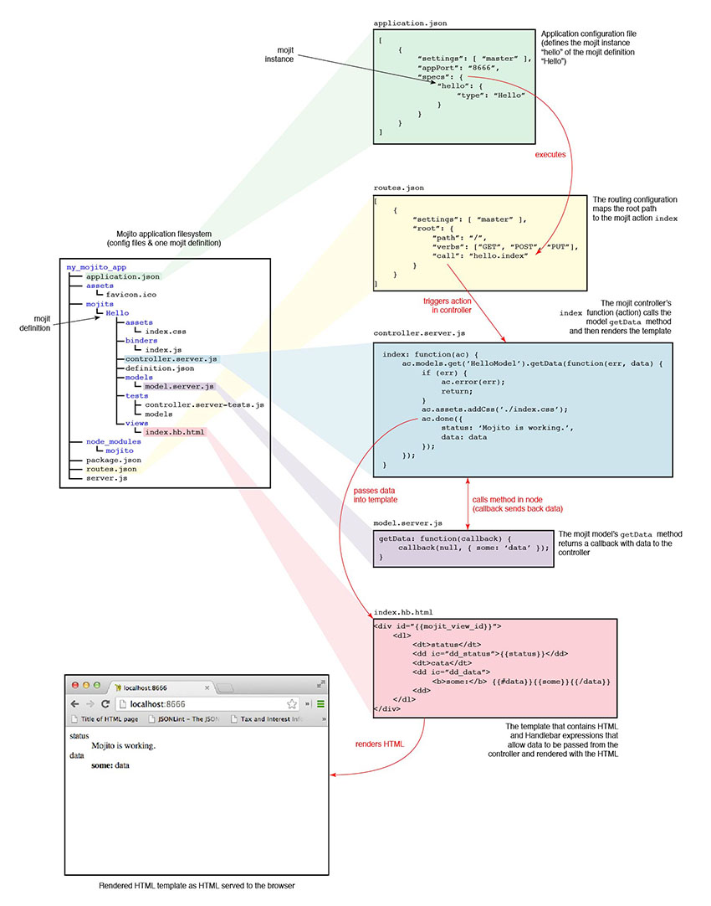

==================
Mojito Conventions
==================

.. _mojito_conventions-overview:

Overview
========

This chapter is provides an overview of the general conventions and practices when
developing Mojito applications. Think of this chapter as a guideline or a cheat sheet 
to help you remember Mojito-specific conventions. If you don't find the information 
that you're looking for here, see the chapter dedicated to the topic you're interested in, 
such as `Mojits <mojito_mojits.html>`_ or `Configuring Mojito <mojito_configuring.html>`_.

The diagram below shows you the structure of a Mojito application, the differences and relationship
between a mojit definition and instance, and how a routing path is mapped to a mojit action to
render a template:

.. _conventions_overview-mvc:

MVC Structure
-------------

Your models, controllers, and views in Mojito applications are in your mojit directories
in the following location:

- ``mojits/{mojit_name}/models/``
- ``mojits/{mojit_name}/``
- ``mojits/{mojit_name}/views/``

.. _conventions_overview-config:

Configuration
-------------

Configurations are found in either the ``.json`` or ``.yaml`` files in the application
directory or under mojit directories. The configurations are composed of JSON or YAML, which
is a superset of JSON. If both JSON and YAML versions of a configuration file exist, Mojito
will use the configurations defined in the YAML file.

.. _conventions_config-app:

Application
###########

The configurations files found directly under the application directory are considered 
application-level or shared configurations that all mojits can access.  The application 
configuration files are ``application.json`` and ``routes.json`` or the YAML versions 
``application.yaml`` and ``routes.yaml``. 

The ``application.json`` file stores general configuration for the application as well
as defines mojit instance configurations, which are covered in the 
:ref:`Mojits <mojito_conventions-mojits>` section. The ``routes.json`` file is for 
configuring routing paths so that a path is mapped to the execution of a mojit action. 

We're only going to cover the use of contexts, suggested settings for development
and production, and routing. See `Configuring Mojito <mojito_configuring.html>`_ for 
descriptions and possible values for all the configurations as well as examples for 
configuring routing and more. 

.. _conventions_app_config-context:

Contexts
********

The application configuration file ``application.json`` allows you to map configurations
to different runtime environments. The contexts are defined in the configuration 
object by the ``setting`` property. In the example snippet below, different mojit instances
are created for the developer and production environments:

.. code-block:: javascript

   {
     "settings": [ "environment:development" ],
     "specs": {
       "test": {
         "type": "Test"
       }
     }
   },
   {
     "settings": [ "environment:production" ],
     "specs": {
       "test": {
         "type": "Production"
       }
     }
   },
        

.. _conventions_app_config-dev_prod:

Development/Production Configurations
*************************************

We recommend that you add special logging and cache configurations for the 
``environment:development``, so that all log messages are displayed and assets
are not cached. The ``environment:production`` context, in contrast, does not
show any error messages and allows caching.

.. code-block:: javascript

   {
     "settings": [ "environment:development" ],
     "staticHandling": {
        "forceUpdate": true
     },
     "yui":{
       "config": {
         "debug": true,
         "logLevel": "debug"
       }
     }
   },
   {
     "settings": [ "environment:production" ],
     "staticHandling": {
        "forceUpdate": false
     },
     "yui":{
       "config": {
            "debug": false,
            "logLevel": "none"
       }
     }
   },
       
.. _conventions_config-routing:

Routing
#######

The names of routing paths should be short, descriptive, and in lowercase. The routes
are defined by an object that associates a path with an action of a mojit instance.

.. code-block:: javascript

   "root": {
     "path": "/",
     "call": "frame.index"
   }

.. _conventions-modules:

Modules
-------

Mojito code is organized into files that are custom YUI modules. In the YUI module, 
you use ``YUI.add`` to register a string as the name of the custom YUI modules. See
the :ref:`Mojits section <mojito_conventions-mojits>` for more module information for 
controllers, models, binders, and tests.

.. _conventions-tests:

Tests
-----

.. _conventions_tests-unit:

Unit
####

Unit tests are located in the mojits and are run with the Mojito command-line utility. 
Mojito allows you to write server-side unit tests for the controller and model.
See the :ref:`Mojits: Tests <conventions_mojits-tests>` below for more information.

.. _conventions_tests-func:

Functional 
##########

Mojito does not come with a functional testing suite, but we suggest that you use 
the npm module Arrow for writing and running functional tests. Arrow is a testing framework 
that fuses together JavaScript, Node.js, PhantomJS, and Selenium. 

Mojito does not have any formal conventions for using Arrow. We recommend
that you read the `Arrow documentation <https://github.com/yahoo/arrow/tree/master/docs>`_ 
and the wiki `Mojito Framework's Unit and Functional Tests <https://github.com/yahoo/mojito/wiki/Mojito-Framework's-Unit-and-Functional-Tests>`_
for examples.

.. _mojito_conventions-mojits:

Mojits
======

.. _conventions_mojits-instances:

Mojit Instances
---------------

The instance is defined in the application configuration file ``application.json`` 
and then created by Mojito when the application is started. The naming convention of
mojit instances is to use a lower-case string, much as you would use a lower-case 
string to name an object in JavaScript.

.. _conventions_instances-config:

Configuration
#############

Mojits have instance configuration, default configuration, and definition files.
The instance configuration is specified in the ``config`` object of the mojit instance
in ``application.json`` and is generally information that is important to the execution
of mojit instance. The default configuration is found in ``defaults.json`` in the mojit
directory and is used to store default instance configuration values in the ``config``
object. For general data, mojits should use the ``definition.json`` file to store key-value 
pairs not used to determine what action is executed or template is rendered.

.. _conventions_mojits-definitions:

Mojit Definitions
-----------------

Mojit definitions are the files and code that constitute the mojit and are
created with the command ``mojito create mojit <mojit_name>``. 

.. _conventions_mojits_definitions-location:

Location
########

The default location for mojits is in ``{application_name}/mojits``, but you can specify 
the location of mojits with the application configurations ``mojitDirs`` and ``mojitsDirs``.

.. _conventions_mojits_definitions-naming:

Naming
######

The naming convention for mojit definitions is to use an upper camel-case string and keep 
the name as short as possible, such as ``Flickr`` or ``FlickrPhotos``. Think of the mojit 
definition as a class name and the instance as an instantiation of the mojit.

.. _conventions_mojits_def-controllers:

Controllers
###########

.. _mojits_def_controllers-pathname:

Pathname
********

``mojits/{mojit_name}/controller.{affinity}.[{selector}].js``

For the file name of the controller shown above, the ``{affinity}`` can be 
``server``, ``common``, or ``client``, and ``{selector}``
can either be omitted or defined by the ``selector`` property in ``application.json``.

The default controller file is ``controller.server.js``, but you can use the affinity
to determining where the controller will be executed and define different
versions of the controller with the ``selector`` property in ``application.json``.

.. _mojits_def_controllers-modules:

YUI Module Names
****************

The convention is for mojit controllers to register the lowercased definition name as the 
module name. For example, the mojit ``Flickr`` would register the module name 
``flickr`` with ``YUI.add``: ``YUI.add('flickr', function(Y, NAME) {``

.. _conventions_mojits_def-models:

Models
######

.. _mojits_def_models-location:

Pathname
********

``mojits/{mojit_name}/models/{model_name}.{affinity}.[{selector}].js``

In the model file name shown above, ``{model_name}`` is a 
user-defined string:

.. _mojits_def_models-module_naming:

YUI Module Names
****************

The naming convention of modules for mojit models uses the lowercased definition name prepended
to ``-model``:  ``{mojit_name}-model``

Thus, the module name for the model of the ``Flickr`` mojit would be ``flickr-model``.

.. _mojits_def_models-using:

Using Models
************

To access models, you need to require the ``mojito-models-addon``. The 
``Models`` addon provides a ``models`` namespace from the ``ac`` object from
which you can use the ``get`` method to access models.

You pass the ``{model_name}`` (see :ref:`Pathname <mojits_def_models-location>`) to the 
``get`` method to access your model as shown in this example. 

.. code-block:: javascript

   ...
     ...
       index: function(ac) {
         ac.models.get('model').getData(function(err, data) {
           ...
         }
       }
     ...
   }, '0.0.1', {requires: ['mojito', 'mojito-models-addon']});

.. _conventions_mojits_def-templates:

Templates (Views)
#################

.. _mojits_def_templates-location:

Pathname
********

``mojits/{mojit_name}/views/{action}.{selector}.{view_engine}.html``

The default template file when you create a Mojito application is ``index.hb.html``. 
In the template file shown above, ``{action}`` is the
controller function being called or view specified, ``{selector}`` is defined by the 
``{selector}`` property in ``application.json``, and ``{view_engine}`` being ``hb`` for 
Handlebars by default or any view engine implemented by the application developer.

.. _conventions_mojits_def-binders:

Binders
#######

.. _mojits_def_binders-location:

Pathname
********

``mojits/{mojit_name}/binders/{action}.js``

In the binder file shown above, ``{action}`` is the 
controller action mapped to the request URL.

When you use a frame mojit, such as ``HTMLFrameMojit``, and configure your application to 
deploy code to the client by setting the application configuration ``deploy`` to ``true``, 
Mojito will send the binder file  with the response body.

.. _mojits_def_binders-module_names:

YUI Module Names
****************

The naming of modules for mojit binders uses the following convention: 
``{lowercased_mojit_name}-binder-{action}``

For example, the module name for the ``index`` binder of the ``Flickr`` mojit would
be ``flickr-binder-index``.

.. _conventions_mojits-tests:

Tests
-----

.. _mojits_tests-location:

Pathname
########

- ``mojits/{mojit_name}/tests/controller.server-tests.js``
- ``mojits/{mojit_name}/tests/models/{model_name}.{affinity}-tests.js``

.. note:: Mojito will run any JavaScript tests in the ``tests`` directory, but we suggest
          you use the naming convention shown above.

.. _mojito_conventions-yui_modules:

YUI Modules
===========

This section is for custom YUI modules that developers want to include in the application code.
See also `Configuring YUI in Mojito <../topics/mojito_yui_config.html>`_.

.. _conventions_yui_modules-location:

Pathname
--------

``{application_name}/yui_modules/{module_name}.{affinity}.js``

.. _conventions_yui_modules-yui_modules:

Using the YUI Modules
---------------------

The YUI module that you created registers the YUI module name with ``YUI.add``.
In your mojit code (controllers, binders, models), you specify the module name
as a dependency in the ``requires`` array. Your mojit code can then access the
YUI module through the ``Y`` instance. 

For example, suppose the YUI module ``string-helper`` is registered in the file 
``string_helper.server.js`` as shown below:

.. code-block:: javascript

   YUI.add('string-helper', function (Y) {
     // Code goes here.
     ...

     // Add dependencies for your module in the `requires` array.
   }, '1.0.0', { requires: []});

Your controller could then access the module by requiring it. The example
below shows how you would require our ``string-helper`` module and provides
a possible example of using the helper:

.. code-block:: javascript

   YUI.add('body', function (Y, NAME) { 
     Y.namespace('mojito.binders')[NAME] = {
       
       index: function (ac) {
           var str_helper = Y.StringHelper();
           Y.log(str_helper.strip(" this is just a hypothetical example ");       
       }
     }
   }, '1.0.0', { requires: ['mojito-models-addon', 'string-helper']});
     

.. _mojito_conventions-addons:

Addons
======

Addons are  extensions that provide functionality that lives both on the server 
and/or client. Each addon provides additional functions through a namespace that is 
attached directly to the ``ActionContext`` object and is available when required in a 
controller.

.. _conventions_addons-builtin:

Built-In Addons
---------------

Mojito comes with built-in addons that are accessible through the ``ActionContext`` 
object. To access a built-in addon from a controller, you add the string 
``mojito-{addon}-addon`` to the ``requires`` array, where ``{addon}``
could be any of the following:

- ``assets`` - ``Assets`` addon for managing assets
- ``config`` - ``Config`` addon for handling configurations
- ``composite`` - ``Composite`` addon to execute child mojits
- ``cookies`` - ``Cookie`` addon for getting/setting cookies
- ``data`` - ``Data`` addon for sharing data
- ``helpers`` - ``Helpers`` addon for registering Handlebars helpers
- ``http`` - ``Http`` addon for getting and setting HTTP headers, request information.
- ``intl`` - ``Intl`` addon for localization
- ``meta`` - ``Meta`` addon for getting and merging meta data of child mojits.
- ``models`` - ``Models`` addon for accessing models
- ``params`` - ``Params`` addon for managing parameters
- ``partial`` - ``Partials`` addon for rendering partials. 
- ``url`` - ``Url`` addon for creating and finding URLs.

.. note:: The list of built-in ``ActionContext`` addons above is not complete. Mojito also
          has **Resource Store** (``rs``) and **View Engine** (``view-engine``) addons.
          See the `addons <https://github.com/yahoo/mojito/tree/develop/lib/app/addons>`_
          directory in the Mojito source code and the `Mojito API <https://developer.yahoo.com/cocktails/mojito/api/>`_
          documentation for more information.

.. _conventions_addons-custom:

Custom Addons
-------------

You can also create your own addons that you can include in controllers and then
access through the ``ActionContext`` object just like the built-in addons.

.. _addons_custom-location:

Pathname
########

- ``{app_dir}/addons/ac/{addon_namespace}.{affinity}.js``
- ``{mojit_dir}/addons/ac/{addon_namespace}.{affinity}.js``

For the addon files shown above, ``{addon_namespace}``
is the string appended to the namespace defined in the addon, such as 
``Y.namespace.addons.ac.{addon_namespace}``.

.. _addons_custom-location:

Module Names
############

The naming convention for modules for custom addons is the following, 
where ``{addon_namespace}`` is the string appended to the namespace defined in the 
addon, such as ``Y.namespace.addons.ac.{addon_namespace}``.

``addon-ac-{addon_namespace}``

.. _conventions_addons-accessing:

Accessing Addons
################

To use an addon, you require the registered addon name in the 
``requires`` array of your controller.

.. _conventions_mojits-tests:

Tests
-----

The module names for both controller and model unit tests using the following naming
convention: 

- ``{lowercased_mojit_name}-tests`` - (controller unit tests)
- ``{lowercased_mojit_name}-model-tests`` - (model unit tests)

.. _mojito_conventions-static_assets:

Static Assets
=============

Assets are resources that are required on the clients. These resources are primarily 
CSS but can also be JavaScript that is ancillary to and not a core component of the Mojito 
application. 

The suggested method for including CSS and JS assets in applications is to include the
in the ``assets`` directory, specify the path to the assets in the ``assets``
property of ``application.json``, and then have the ``HTMLFrameMojit`` attach the assets
to the HTML skeleton. You can also just hard-code the path to the assets in your templates,
but this is not the recommended approach.

.. _conventions_assets-location:

Location
--------

For application-level (or shared) assets, the recommended location 
would be the following directories: 

- ``{application_name}/assets/css/``
- ``{application_name}/assets/js/``

For mojit-level assets, the recommended location is the following:

- ``{mojit_name}/assets/css/``
- ``{mojit_name}/assets/js/``

.. _conventions_assets-path:

Pathname
--------

Mojito registers a path to the assets based on a prefix, a source path, and 
the relative path to the assets. The *prefix* is the basename directory of 
the static URL. The default value for the prefix is ``/static/``,
but you can define the prefix with the ``staticHandling.prefix`` property in ``application.json``.

The *source path* for assets would either be the application or the mojit depending on the 
level of the resource. The *relative path* is the path relative to the source path, which
in the case of assets would be either ``/assets/css/`` or ``/assets/js/``.

Thus, the default path to assets would have the following syntax: ``/{prefix}/{source_path}/{relative_path}``
For example, the default path to the application-level CSS asset ``index.css`` for the
application ``NewsAggregator`` would be ``/static/NewsAggregator/assets/css/index.css``.

Using Static Assets 
-------------------

There are three main ways to use static assets in your application:

- Specify the asset paths in ``application.json`` for the `HTMLFrameMojit`` to attach to
  the page. See `Code Examples: Attaching Assets with HTMLFrameMojit <../code_exs/framed_assets.html>`_.
- Hardcode the static path to the assets in your template. See `Code Examples: Adding Assets <../code_exs/adding_assets.html>`_
- Dynamically attach the assets with the ``Assets`` addon. See `Using the Assets Addon <../topics/mojito_assets.html#using-the-assets-addon>`_.

