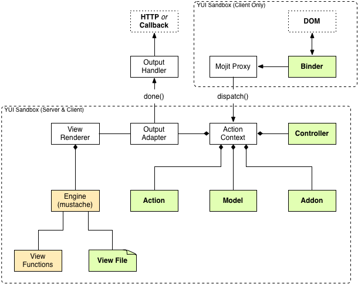

======
Mojits
======

The basic unit of composition and reuse in a Mojito application is a mojit.
Visually, you can think of a mojit as the rectangular area of a page that was 
constructed by a Mojito application. 

The following sections explain why we chose the name *mojit* and then examine 
the mojit's architecture and structure. This chapter is meant as an overview 
of mojits and does not show how to configure, create, or use mojits. For those 
implementation details, see the following:

- `Mojit Configuration <mojito_configuring.html#mojit-configuration>`_
- `Mojits <mojito_apps.html#mojits>`_ in the `Mojito Applications <mojito_apps.html>`_ 
  chapter
- `MVC in Mojito <mojito_mvc.html>`_
- `Mojito API Documentation <../../api>`_

.. _mojit-why:

Why Mojit?
----------

There are (at least) two very commonly used names given to the basic portions
of a page, site, or application, viz. module and widget. Depending upon
the context, each of these terms will be interpreted in different ways by
different people. In the hope of alleviating misinterpretation, we have chosen
to create our own word: mojit (derived from module + widget and pronounced 
"mod-jit").

.. _mojit-architecture:

Mojit Architecture
------------------

From the diagram below, you can see that the mojit has an MVC structure 
centered around the `Action Context <mojito_architecture.html#api-action-context>`_
and can be deployed to the client or run on the server. Also note that the Mojit Proxy
allows client-side code (binders) to communicate with server-side code through the
Action Context. The sections below describe the main components in the diagram that 
are shaded in green.

.. _mojit_arch-binders:

Binders
#######

Binders are mojit code only deployed to the browser that can
allow event handlers to attach to the DOM node, communicate with other mojits 
on the page, and execute actions on the mojit that the binder is attached to.

.. _binders-mojitProxy:

Mojit Proxy
***********

The Mojit Proxy is the conduit for communication between the binder and the 
mojit's ``ActionContext`` object and other mojits on the page. In code, the 
Mojit Proxy is represented by the 
`mojitProxy object <mojito_binders.html#mojitproxy-object>`_. 

See `Mojito Binders <mojito_binders.html>`_ to learn how binders 
use the ``mojitProxy`` object to communicate with server-side code.

.. _mojit_arch-controllers:

Controllers
###########

Controllers are the command centers for mojits. They can either do all of 
the work or delegate the work to models and/or views. 

See `Controllers <mojito_mvc.html#controllers>`_ in the
`MVC in Mojito <mojito_mvc.html>`_ chapter for implementation details.

.. _mojit_arch-models:

Models
######

Models are intended to closely represent business logic entities and contain code that 
accesses and persists data. Mojito lets you create one or more models at the 
application and mojit level that can be accessed from controllers.

See `Models <mojito_mvc.html#models>`_ in the
`MVC in Mojito <mojito_mvc.html>`_ chapter for implementation details.

.. _mojit_arch-addons:

Addons
######

Addons are extensions of the Action Context that provide additional functionality 
that lives both on the server and client. 

See `Addons <../api_overview/mojito_addons.html>`_ in the 
`Mojito API Overview <../api_overview/>`_ chapter for more information. 

.. _mojit_arch-views:

View Files
##########

View files are called templates in Mojito. Templates can contain both HTML
and templating tags/expressions, such as Mustache or Handlebars, and are rendered into 
markup that is outputted to the client.

See `Views <mojito_mvc.html#views>`_ in the `MVC in Mojito <mojito_mvc.html>`_ chapter
for more information.

.. _mojit-structure:

Mojit Structure
---------------

One of the key characteristics of mojits is that portions of their code may run
in different environments, depending upon particular attributes of the client
runtime. Specifically, while the raw HTML rendering and event handlers always
run within the client, the remaining portions (such as template
processing) may run within the client, if it is sufficiently capable, or on the
back end, if it is not.

Mojits are built using a variant of the MVC pattern. The Controller
encapsulates the core functionality of the mojit, reacting to stimuli from the
Active View (see diagram above) and possibly from outside of the Mojit. The Model
centralizes the representation and management of the Mojit's data. The
Active View provides for presentation and user interaction. 

See `MVC in Mojito <mojito_mvc.html>`_ for a detailed explanation of how MVC works
in Mojito and `Mojits <mojito_apps.html#mojits>`_ in the 
`Mojito Applications <mojito_apps.html>`_ chapter for information about the 
directory structure and files of a mojit.

.. _structure-active_view:

Active View
###########

The combination of a mojit's view together with its user event handlers (as
distinct from system event handlers) is called its Active View. The Active View
is that portion of a mojit that always resides within the client, in order to
provide the actual presentation together with the immediate event handling that
makes the mojit responsive.

The event handlers within the Active View are intended to be very "thin"; they
perform translation of user gestures to mojit capabilities (e.g., button click
to "item select") and subsequently delegate to the mojit's controller. This
allows for the Active View itself to run in less capable environments.

.. _structure-mojit_def:

Mojit Definition
################

A mojit definition is a set of artifacts that collectively define a reusable
unit of functionality known as a mojit. A mojit definition includes the mojit
implementation (e.g., JavaScript code, template files, CSS, etc.)
and has the following characteristics:

- uniquely identified, and thus, capable of being referenced from and shared
  within multiple applications.
- versioned and immutable for a given version.

Metadata can be packaged as a unit (e.g., as a zip file) for:

- configuration schema
- data requirements
- mojit dependencies
- tooling support
- deployment support

.. _structure-mojit_instance:

Mojit Instance
##############

The term *mojit instance* actually has two distinct meanings. The
meaning though should be quite clear from the context within which the term is used.

Mojit instance can refer to a specification of all the information required
to create a running instance of mojit functionality within an application. This
is essentially a specification that comprises the identifier for a mojit
definition together with the concrete configuration parameters that will be
used to instantiate a particular instance at runtime. You can learn more about the 
specification for a mojit in `Mojit Configuration <mojito_configuring.html#mojit-configuration>`_.

Mojit instance can also refer to an in-memory runtime instance of a mojit |---| part
of the running application.

.. _structure-mojit_composite:

Composite Mojits
################

Mojits may be designed to be nested. That is, a mojit may be a "child" mojit, a
self-contained unit of presentation, or a "parent" mojit, one which may
itself incorporate other mojits in order to fulfill its role. Composite mojits
encapsulate their children, such that, for all intents and purposes, an
instance of a composite mojit cannot be distinguished from its child mojits.

See the chapter `Composite Mojits <../topics/mojito_composite_mojits.html>`_ for more 
information and to learn how to create composite mojits.

.. |---| unicode:: U+2014  .. em dash, trimming surrounding whitespace
   :trim:
