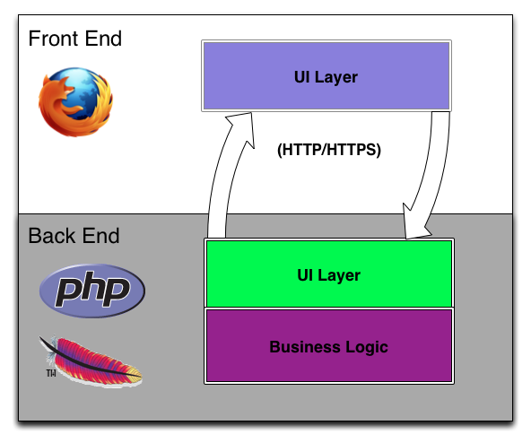
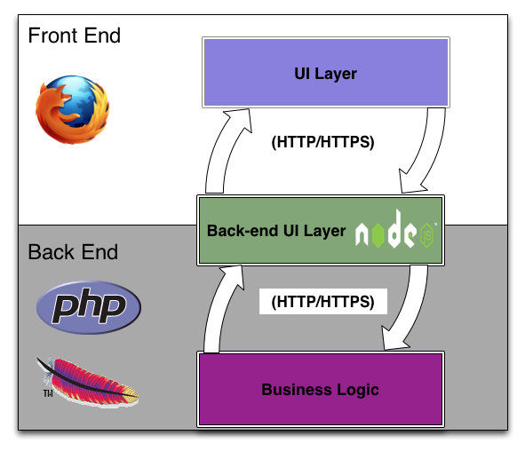

========
Overview
========

.. _mojito_overview-what:

What is Mojito?
===============

Mojito is a `model-view-controller (MVC) <http://en.wikipedia.org/wiki/Model%E2%80%93view%E2%80%93controller>`_ 
application framework built on YUI 3 that enables agile development of Web applications. 
Mojito allows developers to use a combination of configuration and an MVC architecture to 
create applications. Because client and server components are both written in JavaScript, 
Mojito can run on the client (browser) or the server (Node.js).

Mojito offers the following features, some of which are discussed in the next section:

- Local development environment and tools (Yahoo independent stack)
- Library for simplifying internationalization & localization
- Integrated unit testing
- Device specific presentation (Hero, Mobile, TV, Web, etc.)

.. _mojito_overview-why:

Why Mojito?
===========

The best way to illustrate why you should use Mojito for creating Web applications is to 
give an example. Suppose you wanted to create a slideboard application that 
lets users quickly view news articles from various sources. Your application needs to be 
available on a variety of devices and use the appropriate UI elements of the device. 
For example, the application on the Web should provide rich interaction using the mouse, 
whereas, the application on a tablet or phone should provide the same rich interaction 
using the touchscreen.

You also want people from all over to be able to use your slideboard application, so you 
will need to support internationalization and localization. Users should be able to see 
the application in their local language or choose their preferred language.

In the following, we will discuss how Mojito makes it easier to create the slideboard 
application.

.. _mojito_overview_why-one_lang:

One Language
------------

Your slideboard application will need to fetch articles either through some API or an RSS 
feed. Most conventional Web applications that need data have both server-side and 
client-side components. The server-side script, written in a language such as Python, 
Perl, Ruby, PHP, or Java, fetches data and then passes the data to client-side script 
written in JavaScript. The one Web application would have at least two languages and 
would need to make at least two network calls: one to the data source, and one between 
the server-side and client-side code to transmit data.

Because Mojito is written entirely in JavaScript, your application code can run on the
server or be deployed to the client. From the client, you can use the 
`YUI YQL Utility <http://yuilibrary.com/yui/docs/yql/>`_, to get all types of Web data, 
removing the need for the client to fetch data from your server.

.. _mojito_overview_why-two_runtimes:

Two Runtimes
------------

Your application code can be configured to run on the server or be deployed to the client. 
If your application is configured to deploy code to the client, Mojito will determine 
whether the client can execute JavaScript before deployment. If the client cannot execute 
JavaScript, your application code will instead execute on the server. You write one code 
base, configure where code should optimally run, and then let Mojito determine at runtime 
to either deploy the code or run it on the server. Whether running on the client or server, 
your code can use the `YUI YQL Utility <http://yuilibrary.com/yui/docs/yql/>`_ to get all 
types of Web data.

.. _mojito_overview_why-device_views:

Views for Different Devices
---------------------------

Your slideboard application is a Web application, but we want users to view it on tablets 
and smart phones as well. Do you create separate versions of your application? Do you 
write code logic that serves the correct version?

Mojito can identify the calling device by examining the HTTP header ``User-Agent``. You 
create custom views for different devices, and Mojito will render and serve the correct 
device-specific views.

.. _mojito_overview_why-prog_enhancement:

Progressive Enhancement
-----------------------

You want your users to be able to take advantage of the rich features of the device they 
are using. Users skimming through articles on an iPad should be able to use the touch 
screen, and Web users should have features such as mouseovers and right-clicks. Handling 
these UI events requires JavaScript, so how do you handle them when the client has 
disabled JavaScript?

Mojito allows you to serve code to the client, so that your users can use the rich 
interactive features of their devices, but Mojito also allows you to handle cases when the 
client has not enabled JavaScript. You can write HTML and CSS so your page functions 
without JavaScript sure that your application works with just HTML and CSS. Because Mojito 
runs on `Node.js <http://nodejs.org/>`_ the code intended to be deployed to the client can 
instead run on the server.

.. _mojito_overview_why-loc_intl:

Localization and Internationalization
-------------------------------------

Mojito is built on `YUI 3 <http://yuilibrary.com/>`_, which has an internationalization 
utility that allows you to handle monolingual and multilingual applications. Using the 
`YUI Internationalization utility <http://yuilibrary.com/yui/docs/intl/>`_ and 
`Yahoo Resource Bundles (YRB) <http://yuilibrary.com/yui/docs/intl/-yrb>`_, your 
slideboard application could use one language for the UI and serve the content in a 
different language.

.. _mojito_overview-differences:

How is it Different?
====================

The following sections looks at how Mojito is different from past Web development paradigms.
Much thanks goes to Nicholas C. Zakas who wrote the blog post 
`Node.js and the new web front-end <http://www.nczonline.net/blog/2013/10/07/node-js-and-the-new-web-front-end/>`_
from which much of the following content is based on.

.. _differences-control_be_ui:

Controlling the Back-End UI Layer 
---------------------------------

In the past, applications were often divided into two discrete parts (client/server) 
that were written by two groups of specialized engineers: front-end and back-end engineers. 
The front-end engineers wrote the code that was to be executed in the browser, and back-end 
engineers focused on the business logic and back-end UI layer. By back-end UI layer, we are 
referring to the payload (templates/data) that is generated by the server. 

This diagram reflects the separation of client and server code as well as the back-end
UI layer in typical Web application architectures.

In contrast, because Mojito runs on Node.js, the back-end UI layer now lies in the realm of 
the Mojito application developers, allowing you to control the payload:

.. _differences-existing_service:

Building on an Existing HTTP-Based Service
------------------------------------------

Frameworks such as Rails and Django allow you to connect directly to a database through
object-relational mapping (ORM) with no intermediate service layer. With Mojito, you
do not directly connect to databases, but instead make HTTP requests to an existing
service, thereby, the separating the application code completely from database queries.

Mojito applications can use `YQL <https://developer.yahoo.com/yql>`_ to make requests to 
other Web services to get data as well, which gives the application code more control over 
the requested data, but this again is not a direct database request as YQL is a RESTful 
proxy that will make HTTP requests to other Web services based on rules defined in XML tables. 

This is an important point to remember for those developers who are coming from Rails, Django,
and other frameworks that allow you to directly interact with a database. In general,
your Mojito applications will need to make HTTP requests to a service that handles 
database queries or to Web services. You can make HTTP requests with the 
`Y.mojito.lib.REST Class <https://developer.yahoo.com/cocktails/mojito/api/classes/Y.mojito.lib.REST.html>`_.

